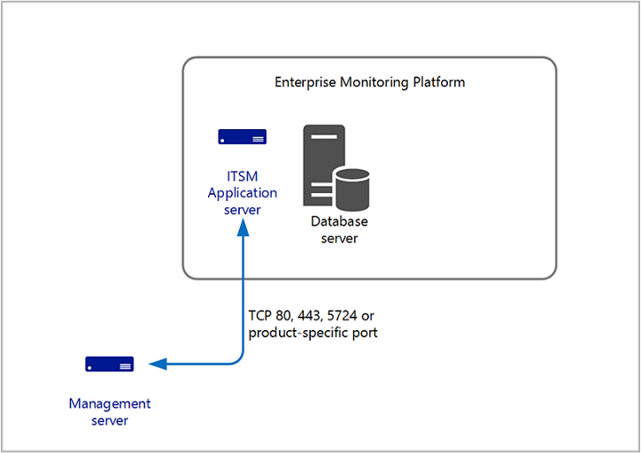

# Integration with other enterprise management products

>Applies To: System Center 2016 - Operations Manager

Many customers have one or more monitoring platforms, where one provides consolidated operational data across business infrastructure, data centers, complex networks and IT domains in the enterprise to correlate and forward to service management solution for incident recording and escalation, as well as analyze and visualize the data presented through different types of dashboards.  System Center 2016 - Operations Manager is included in that service operations framework to forward alert or alert and performance data, or is the primary monitoring platform that is extended to meet the business needs.  

Interoperability between Operations Manager and other products is accomplished by a number of methods depending on the technical and business requirements.  The following are common methods to interface with Operations Manager:

- System Center 2016 - Orchestrator with integration packs available from Microsoft, third parties, and the community.  Integration packs for Orchestrator contain additional activities that extend the functionality of Orchestrator to communicate and exchange data with other third party systems.
- Connectors built on the Operations Manager Connector Framework (OMCF). Connectors built on the OMCF, which are developed from the [Operations Manager SDK](https://msdn.microsoft.com/library/hh329086.aspx), provides methods and types that you can use to initialize and manage a connector and to get or send operations data.  Some examples of connectors used to integrate with Operations Manager are other System Center products like Service Manager and Virtual Machine Manager (VMM), and third-party products such as Nagios or IBM Netcool.  Connections to external systems are commonly performed using a web service.  
- Querying the SQL operational or data warehouse databases to extract certain datasets for custom reports or dashboards.

Other custom connectors are developed and implemented to support advanced scenarios such as alert enrichment with additional information before forwarding to incident management systems, perform alert correlation, or provide advanced notification functionality with Operations Manager.   

Operations Manager also integrates with [Microsoft Operations Management Suite](https://azure.microsoft.com/documentation/articles/operations-management-suite-overview/) (OMS) to forward collected events, alerts, and performance data for further analysis and provides greater visibility for the enterprise.  

## When separated by a firewall

The ports and communication between Operations Manager and the other management products depends on the method of integration used.  If you are using System Center 2016 - Orchestrator,   the Orchestrator runbook server connects to the Operations Manager management server over TCP port 5724.  This is a one-way directed communication.  

If you are using a connector provided by the vendor, please review their documentation in order to understand what ports and which direction the traffic flows.      

## Design considerations

Integration between Operations Manager and other monitoring and management products is commonly configured between a single management server and the other management product, or in other cases, between multiple management servers or specifying the Operations Manager management group name.  Support for multiple, connected management groups are not supported and each management group will need to install a separate instance of the connector for each management group.  This includes integration between System Center Orchestrator, VMM and Service Manager.     

You will need to evaluate and determine the risks, impact, and recovery options as it relates to the monitoring service supporting ongoing service operations based on the service levels defined in your SLAs and OLAs when planning for service continuity in the event of a unplanned outage or planned maintenance event.   

If a management server is supporting integration (via a connector hosted directly on the management server or from another System Center product such as VMM, Orchestrator or Service Manager) this will need to be planned for with manual or automatic recovery steps depending on the integration configuration and sequence of steps required to return to normal functionality. 

