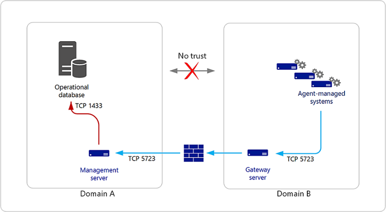
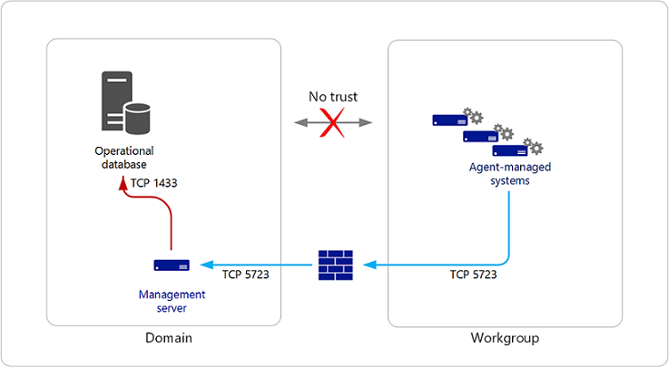

# Authentication and Data Encryption in Operations Manager

>Applies To: System Center 2016 - Operations Manager

System Center 2016 – Operations Manager consists of features such as the management server, gateway server, Reporting server, Operational database, Reporting data warehouse, agent, web console, and Operations console. This section explains how authentication is performed and identifies connection channels where the data is encrypted.

## Certificate-Based Authentication

When an Operations Manager agent and management server are separated by either an untrusted forest or workgroup boundary, certificate-based authentication will need to be implemented. The following sections provide information about these situations and specific procedures for obtaining and installing certificates from Windows-based certification authorities.
Setting Up Communication Between Agents and Management Servers Within the Same Trust Boundary

An agent and the management server use Windows authentication to mutually authenticate with each other before the management server accepts data from the agent. The Kerberos version 5 protocol is the default method for providing authentication. In order for Kerberos-based mutual authentication to function, the agents and management server must be installed in an Active Directory domain. If an agent and a management server are in separate domains, full trust must exist between the domains. In this scenario, after mutual authentication has taken place, the data channel between the agent and the management server is encrypted. No user intervention is required for authentication and encryption to take place.

### Setting Up Communication Between Agents and Management Servers Across Trust Boundaries

An agent (or agents) might be deployed into a domain (domain B) separate from the management server (domain A), and no two-way trust might exist between the domains. Because there is no trust between the two domains, the agents in one domain cannot authenticate with the management server in the other domain using the Kerberos protocol. Mutual authentication between the Operations Manager features within each domain still occurs. 
A solution to this situation is to install a gateway server in the same domain where the agents reside, and then install certificates on the gateway server and the management server to achieve mutual authentication and data encryption. The use of the gateway server means you need only one certificate in domain B and only one port through the firewall, as shown in the following illustration.

### Setting Up Communication Across a Domain – Workgroup Boundary

In your environment, you may have one or two agents deployed to a workgroup inside your firewall. The agent in the workgroup cannot authenticate with the management server in the domain using the Kerberos protocol. A solution to this situation is to install certificates on both the computer hosting the agent and the management server that the agent connects to, as shown in the following illustration.

> [!NOTE]
> In this scenario, the agent must be manually installed.

Perform the following steps on both the computer hosting the agent and the management server using the same certification authority (CA) for each:

1. Request certificates from the CA.
2. Approve the certificate requests on the CA.
3. Install the approved certificates in the computer certificate stores.
4. Use the MOMCertImport tool to configure Operations Manager.

These are the same steps for installing certificates on a gateway server, except you do not install or run the gateway approval tool

#### Confirming Certificate Installation

If you have properly installed the certificate, the following event is written into the Operations Manager event log.

Type | Source | Event ID | General |
----------|----------|----------|----------|
Information | OpsMgr Connector | 20053 | The OpsMgr Connector has loaded the specified authentication certificate successfully.|

During the setup of a certificate, you run the MOMCertImport tool. When the MOMCertImport tool has finished, the serial number of the certificate that you imported is written to the registry at the following subkey.

`HKEY_LOCAL_MACHINE\SOFTWARE\Microsoft\Microsoft Operations Manager\3.0\Machine Settings`

> [!CAUTION]
> Incorrectly editing the registry can severely damage your system. Before making changes to the registry, you should back up any valued data on the computer.

## Authentication and data encryption between management server, Gateway server, and agents

Communication among these Operations Manager features begins with mutual authentication. If certificates are present on both ends of the communications channel, then certificates will be used for mutual authentication; otherwise, the Kerberos version 5 protocol is used. If any two features are separated across an untrusted domain, mutual authentication must be performed using certificates. 
Normal communications, such as events, alerts, and deployment of a management pack, occur over this channel. The previous illustration shows an example of an alert being generated on one of the agents that is routed to the management server. From the agent to the gateway server, the Kerberos security package is used to encrypt the data, because the gateway server and the agent are in the same domain. The alert is decrypted by the gateway server and re-encrypted using certificates for the management server. After the management server receives the alert, the management server decrypts the message, re-encrypts it using the Kerberos protocol, and sends it to the management server where the management server decrypts the alert. 
Some communication between the management server and the agent may include credential information; for example, configuration data and tasks. The data channel between the agent and the management server adds another layer of encryption in addition to the normal channel encryption. No user intervention is required.

## Management server and Operations console, Web console server, and Reporting server

Authentication and data encryption between the management server and the Operations console, Web console server, or Reporting server is accomplished by using Windows Communication Foundation (WCF) technology. The initial attempt at authentication is made by using the user's credentials. The Kerberos protocol is attempted first. If the Kerberos protocol does not work, another attempt is made using NTLM. If authentication still fails, the user is prompted to provide credentials. After authentication has taken place, the data stream is encrypted as a function of either the Kerberos protocol or SSL, if NTLM is used.

In the case of a Reporting server and a management server, after authentication has occurred, a data connection is established between the management server and SQL Server Reporting Server. This is accomplished by strictly using the Kerberos protocol; therefore, the management server and Reporting Server must reside in trusted domains. For more information about WCF, see the MSDN article [What Is Windows Communication Foundation](https://msdn.microsoft.com/library/ms731082%28v=vs.110%29.aspx).

## Management server and Reporting data warehouse

Two communication channels exist between a management server and the Reporting data warehouse:

- The monitoring host process spawned by the health service (System Center Management service) in a management server
- The System Center Data Access services in the management server

### Monitoring Host Process and Reporting Data Warehouse

By default, the monitoring host process spawned by the Health Service, which is responsible for writing collected events and performance counters to the data warehouse, achieves Windows Integrated Authentication by running as the Data Writer Account specified during Reporting Setup. The account credential is securely stored in a Run As Account called Data Warehouse Action Account. This Run As Account is a member of a Run As Profile called Data Warehouse Account (which is associated with the actual collection rules). 

If the Reporting data warehouse and the management server are separated by a trust boundary (for example, each resides in different domains with no trust), then Windows Integrated Authentication will not work. To work around this situation, the monitoring host process can connect to the Reporting data warehouse using SQL Server Authentication. To do this, create a new Run As Account (of Simple Account type) with the SQL account credential and make it a member of the Run As Profile called Data Warehouse SQL Server Authentication Account, with the management server as the target computer. 

> [!IMPORTANT]
> By default, the Run As Profile, Data Warehouse SQL Server Authentication Account was assigned a special account through the use of the Run As Account of the same name. Never make any changes to the account that is associated with the Run As Profile, Data Warehouse SQL Server Authentication Account. Instead, create your own account and your own Run As Account and make the Run As Account a member of the Run As Profile, Data Warehouse SQL Server Authentication Account when configuring SQL Server Authentication.

The following outlines the relationship of the various account credentials, Run As Accounts, and Run As Profiles for both Windows Integrated Authentication and SQL Server Authentication.

#### Default: Windows Integrated Authentication

1. Run As Profile: Data Warehouse Account  
 - Run As Account: Data Warehouse Action 
 - Account credentials: Data Writer Account (specified during setup)

2. Run As Profile: Data Warehouse SQL Server Authentication Account
 - Run As Account: Data Warehouse SQL Server Authentication 
 - Account credentials: Special account created by Operations Manager (do not change)

#### Optional: SQL Server Authentication

1. Run As Profile: Data Warehouse SQL Server Authentication Account
 - Run As Account: A Run As Account you specified during setup.
 - Account credentials: An account you specified during setup.

### The System Center Data Access service and Reporting data warehouse

By default, the System Center Data Access service, which is responsible for reading data from the Reporting data warehouse and making it available in the Report Parameter Area, achieves Windows Integrated Authentication by running as the Data Access Service and Config Service account that was defined during setup of Operations Manager.

If the Reporting data warehouse and the management server are separated by a trust boundary (for example, each resides in different domains with no trust), then Windows Integrated Authentication would not work. To work around this situation, the System Center Data Access service can connect to the Reporting data warehouse using SQL Server Authentication. To do this, create a new Run As Account (of Simple Account type) with the SQL account credential and make it a member of the Run As Profile called Reporting SDK SQL Server Authentication Account with the management server as the target computer.

> [!IMPORTANT]
> By default, the Run As Profile, Reporting SDK SQL Server Authentication Account was assigned a special account through the use of the Run As Account of the same name. Never make any changes to the account that is associated with the Run As Profile, Reporting SDK SQL Server Authentication Account. Instead, create your own account and your own Run As Account, and make the Run As Account a member of the Run As Profile, Reporting SDK SQL Server Authentication Account when configuring SQL Server Authentication.

The following outlines the relationship of the various account credentials, Run As Accounts, and Run As Profiles for both Windows Integrated Authentication and SQL Server Authentication.

Default: Windows Integrated Authentication

1. Data Access Service and Config Service Account (defined during setup of Operations Manager)
 - Run As Profile: Reporting SDK SQL Server Authentication Account
 - Run As Account: Reporting SDK SQL Server Authentication Account
 - Account credentials: Special account created by Operations Manager (do not change)

2. Optional: SQL Server Authentication
 - Run As Profile: Data Warehouse SQL Server Authentication Account
 - Run As Account: A Run As Account you specified during setup.
 - Account credentials: An account you specified during setup.

## Operations console and Reporting server

The Operations console connects to Reporting Server on port 80 using HTTP. Authentication is performed by using Windows Authentication. Data can be encrypted by using the SSL channel. 

## Reporting server and Reporting data warehouse

Authentication between Reporting Server and the Reporting data warehouse is accomplished using Windows Authentication. The account that was specified as the Data Reader Account during setup of Reporting becomes the Execution Account on Reporting Server. If the password for the account should change, you will need to make the same password change using the Reporting Services Configuration Manager in SQL Server. The data between the Reporting Server and the Reporting data warehouse is not encrypted.

