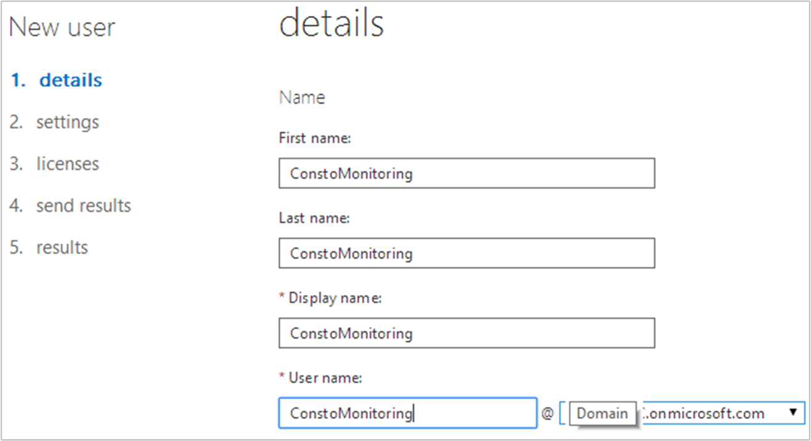
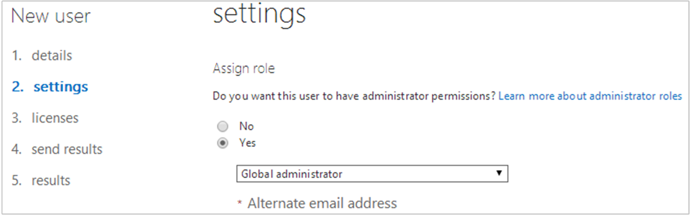

# Security Considerations for Microsoft Azure and Office 365

>Applies To: System Center 2016 - Operations Manager

## Integration with Azure

The Azure monitoring pack runs on a specified agent and uses various Windows Azure APIs to remotely discover and collect instrumentation information about a specified Windows Azure application.  Secure communication and authentication with Azure is performed by certificate authentication, which is required in order to successfully monitor workloads hosted in Azure with Operations Manager.  

If you don’t have a management certificate already, begin here by reviewing [Certificates overview for Azure Cloud Services](http://msdn.microsoft.com/library/windowsazure/gg551722.aspx).

For more information, see [Introducing the Windows Azure Service Management API](http://go.microsoft.com/fwlink/?LinkId=201016) on the Windows Azure team blog.

The Monitoring Pack for Windows Azure Applications creates three Run As profiles:

- Windows Azure Run As Profile Blob
- Windows Azure Run As Profile Password
- Windows Azure Run As Profile Proxy

You must create Run As accounts for Windows Azure Run As Profile Blob and Windows Azure Run As Profile Password. The account for Windows Azure Run As Profile Blob stores the certificate with the private key for the Windows Azure application. The account for Windows Azure Run As Profile Password stores the password for the private key. 

Creating an account for Windows Azure Run As Profile Proxy is optional. The account for Windows Azure Run As Profile Proxy stores credentials for access to the HTTP proxy server that is used to make API calls to Windows Azure.

You must associate the Run As Account with an appropriate Run As profile. The Add Monitoring Wizard will associate the Windows Azure Run As Profile Blob and Windows Azure Run As Profile Password profiles with the accounts that you specify. If you create a Run As account for Windows Azure Run As Profile Proxy, you must manually associate the Windows Azure Run As Profile Proxy profile with the account that you create.

## Integration with Office 365

Office 365 management pack uses agentless monitoring approach. All monitoring workflows that communicate with Office 365 Monitoring API are being executed on management servers only.  An Office 365 user account with Global Administrator permissions for the subscription is required for monitoring of an O365 subscription.  It is highly recommended to add a new dedicated user account to each Office 365 subscription you want to monitor.
To create a new user with Global Administrator permissions using Office 365 admin center:
1.	Go to https://portal.office.com/UserManagement/ActiveUsers.aspx to open Office 365 admin center. Log in as Subscription Global Administrator.
2.	On Users and Groups tab: click Add button
3.	Enter First name, Last name, Display name and User name and select a domain linked to the subscription. Note that First and Last names are required for account with Global Administrator role.    
4.	On setting tab: select Global administrator role to be assigned to account. Specify alternate email address and user location.   
5.	You are not required to assign Office 365 services licenses to the monitoring account
6.	Specify an email address to receive a temporary password. Log out from Office 365 admin center and log in again using new credentials received in the email.
7.	Login to the Office 365 management portal using newly created credentials and set the password for the account. Remember to use strong complex password because this account has Global administrator permissions. 
  > [!NOTE] 
  > Management Pack workflows are unable to obtain monitoring data, Connection State monitor sets Subscription health to “Critical” state and generates “(401) Unauthorized” Alert until new Global Administrator account is used to login to the Office 365 management portal at least once. 

### Configure Run As profiles

The Office 365 management pack creates two Run As Profiles:

- Office 365 Subscription Password secure reference

      Office 365 Subscription Password secure reference Run As Profile is used to store Office 365 subscription credentials and shouldn’t be edited manually

- Office 365 Subscription Proxy secure reference

    Office 365 Subscription Proxy secure reference Run As Profile should be configured manually. This profile is used by all rules and monitors defined in this Management Pack. All Run As Accounts mapped to this profile should have following permissions:
     - Be a member of “Operations Manager Operators” System Center Operations Manager user role.
     - Be able to establish an HTTPS connection from the Management Server to the Office 365 portal endpoint. Please check firewall and proxy settings within your environment to ensure that aforementioned connection is allowed.
