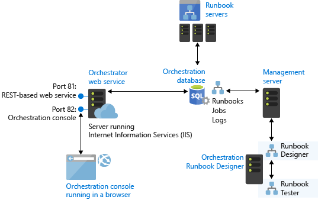
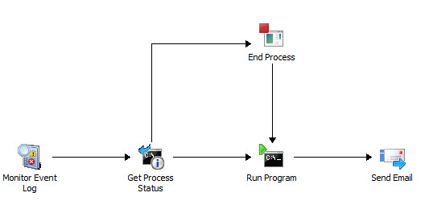

# Learn about System Center 2016 - Orchestrator

>Applies To: System Center 2016 - Orchestrator

As an IT administrator, you probably perform a lot of tasks and procedures to keep your computing environment healthy. You may have automated individual tasks, but typically, not the whole process. 
With System Center 2016 ‑ Orchestrator you tie disparate tasks and procedures together using a graphical user‑interface Runbook Designer to create reliable, flexible, and efficient end‑to‑end solutions in your IT environment.
Using Orchestrator, you can:

- Automate processes in your data center, regardless of hardware or platform.
- Standardize best practices to improve operational efficiency.
- Connect systems from different vendors without having to know how to use scripting and programming languages.

## Orchestrator Architecure 

The following diagram illustrates each of the Orchestrator features and the communication between each.

The orchestration database is the center of the Orchestrator installation containing all runbooks, configuration settings, and logs. The management server is required as a communication layer between the Runbook Designer and the orchestration database. One or more runbook servers communicate directly with the database to retrieve runbooks to run and store information about the jobs created from the runbooks. The web service also communicates directly with the orchestration database and provides a web browser connection for the Orchestration console.

## Automation by using runbooks
To automate a task or process in Orchestrator, you use the Runbook Designer to create a runbook. You add activities to the runbook by dragging them from the **Activities** pane, and then link activities in the required order to create a workflow.

The following illustration shows a simple runbook.

This runbook monitors an event log. When it detects the specified event, the runbook checks the status of a particular process in Windows on a specific computer. If the process is found to be running, it is stopped. The runbook then starts the process and sends an email as a notification of the change of process state.

Each runbook activity finishes before proceeding to the next, and activities are available that provide complex logic such as requiring that multiple activities are completed before the runbook proceeds. By using a combination of logic on activities and smart links, you can implement whatever logic your particular automation scenario requires.

## How Orchestrator processes a Runbook
After you have created a runbook, you commit it to the orchestration database by checking it in. You can then use either the Runbook Designer or the Orchestration console to start and stop the runbook.

A request to run a runbook creates a *job* that is stored in the orchestration database. Each runbook can define a primary runbook server and one or more standbys that process the runbook if the primary is unavailable. A service on each runbook server continuously monitors the orchestration database for jobs that it can process. When a runbook server detects a job, it logs that it is working on the job, copies the runbook locally, logs that it is running an instance of the runbook, and then begins processing the runbook. For any runbook not containing a monitor, you can create multiple runbook requests meaning that a single runbook can have multiple jobs.

When a runbook server processes a job, it creates an *instance* of the runbook by making a copy of it locally, and then performing the actions defined within the runbook according to the included workflow logic. Status information, activity results, and data are recorded in the orchestration database so that you can monitor the real\-time and historical status of the runbook.

## Extending Orchestrator 
The following table shows multiple strategies available for extending the functionality provided by a standard installation of Orchestrator. For additional information, see Deploying System Center 2016 - Orchestrator.

|Orchestrator feature|Description|
|-----------------------------------------------------------|---------------|
|integration pack \(IP\)|An integration pack is a collection of custom activities specific to a product or technology. Microsoft and other companies provide integration packs with activities to interact with their product from an Orchestrator runbook.|
|Orchestrator Integration Toolkit|The Orchestrator Integration Toolkit lets you extend your library of activities beyond the collection of standard activities and integration packs. The Integration Toolkit has wizard\-based tools to create new activities and integration packs for Orchestrator. Developers can also use the Integration Toolkit to create integration packs from custom activities that they build by using the Orchestrator SDK.|

