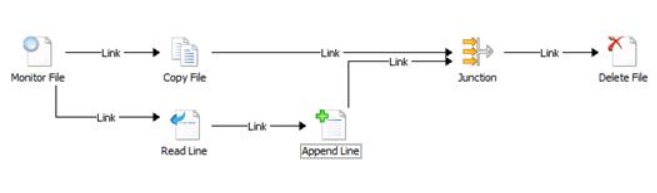

# Create and test a sample Runbook

The following article describes how to create and test a sample runbook. The purpose of this runbook is to detect when a text file is added to a particular folder, copy that file to another folder, read the contents of the file, append a line from the copied file to another file, and then delete the original file.  

The runbook starts with a **Monitor File** activity to wait for the text file to be created. It then uses the **Copy File**, **Read Line**, **Append Line**, and **Delete File** activities to perform the other functions. A **Junction** activity is used to coordinate the activities so that the **Copy File** and **Append Line** activities are both completed before the source file is deleted.  

## Create the runbook

Use the following procedures to create the runbook by using the required activities.  

::: moniker range="<=sc-orch-2022"

1. Select **Start**, point to  **All Programs**, select **Microsoft System Center 2016**, select **Orchestrator**, and then select **Runbook Designer**.  

::: moniker-end

::: moniker range="sc-orch-2025"

1. Select **Start**, point to  **All Programs**, select **Microsoft System Center 2025**, select **Orchestrator**, and then select **Runbook Designer**.  

::: moniker-end

2. In the **Connections** pane, right-click **Runbooks** to select **New**, and then select **Runbook**.  

    A **New Runbook** tab appears at the top of the **Runbook Designer** Design workspace with the name **New Runbook**.  

3. Right-click the **New Runbook** tab to select **Rename**.  

    In the **Confirm Check out** dialog, select **Yes**.  

4. Enter **Append and Copy Workflow** in the **Input** box, and then press Enter.  

You've created a new runbook and are ready to begin adding and configuring activities.  

### Add and configure a Monitor File activity  

Follow these steps to add and configure a Monitor File activity:

1. With the newly created **Append and Copy Workflow** runbook open, in the **Activities** pane, expand the **File Management** category.  

2. Select and drag the **Monitor File** activity to the **Runbook Designer** Design workspace.  

3. Double-click the **Monitor File** activity to open its **Properties** dialog.  

4. In the **In folder** box, enter **C:\\Drop**.  

5. In the **Filters** section, select the **Add** button.  

6. In the **Filter Settings** dialog, in the **Name** list, select **File Name**.  

7. In the **Relation** list, select **Matches Pattern**.  

8. In the **Value** box, enter **\*.txt**.  

9. Select **OK**.  

10. Select the **Triggers** tab.  

11. In the **Trigger if one of the files was** section, select the **Created** check box, and then select **Finish**.  

The **Monitor File** activity is created and configured to watch for any new text files that are created in the C:\\Drop folder.  

### Add additional activities to the runbook

Follow these steps to add additional activities to the runbook:

1. In the **Activities** pane, expand the **File Management** category.  

2. Select and drag the **Copy File** activity to the **Runbook Designer** Design workspace.  

3. Expand the **Text File Management** category.  

4. Select and drag the **Read Line** activity to the **Runbook Designer** Design workspace.  

5. To create a link between the **Monitor File** activity and the **Copy File** activity, select and drag the right arrow of the **Monitor File** activity to the **Copy File** activity.  

6. To create a link between the **Monitor File** activity and the **Read Line** activity, select and drag the right arrow of the **Monitor File** activity to the **Read Line** activity.  

By adding both the **Read Line** activity and the **Copy File** activity, you've created a workflow.  

### Configure the Copy File activity  

Follow these steps to configure the Copy File activity:

1. In the **Append and Copy Workflow** runbook, right-click the **Copy File** activity to select **Properties**.  

2. On the **Details** tab, right-click the **File** box to select **Subscribe**, and then select **Published Data** to open the **Published Data** dialog.  

    The **Monitor File** activity is listed at the top of the **Published Data** dialog because this is the activity just before the selected activity.  

3. In the **Name** column, select **Name and path of the file**, and then select **OK**. This populates the **File** property of the **Copy File** activity with the name of and path to the file from the **Monitor File** activity.  

4. In the destination **Folder** box, enter **C:\\Copy**.  

5. Select **Finish**.  

The **Copy File** activity is now configured to copy files from the source folder to the destination folder.  

### Configure the Read Line activity  

Follow these steps to configure the Read Line activity:

1. In the **Append and Copy Workflow** runbook, right-click the **Read Line** activity to select **Properties**.  

2. On the **Details** tab, right-click the **File** box to select **Subscribe**, and then select **Published Data** to open the **Published Data** dialog.  

3. In the **Activities** list, select **Monitor File**.  

4. In the **Name** column, select **Name and path of the file**, and then select **OK**.  

5. Select the ellipsis button (**...**) to the right of the **File encoding** box, and then select **auto**.  

6. In the **Line numbers** box, enter **1\-END**, and then select **OK**.  

7. Select **Finish**.  

The Read Line activity is now configured.  

### Add an Append Line activity

Follow these steps to add an Append Line activity: 

1. In the **Activities** pane, expand the **Text File Management** category.  

2. Select and drag the **Append Line** activity to the **Runbook Designer** Design workspace to the right of the **Read Line** activity.  

3. To create a link from the **Read Line** activity to the **Append Line** activity, select and drag the right arrow of the **Read Line** activity to the **Append Line** activity.  

4. Right-click the **Append Line** activity to select **Properties**.  

5. On the **Details** tab in the **File** box, enter **C:\\Copy\\Masterlog.txt**.  

6. Select the ellipsis button (**...**) to the right of the **File encoding** box, and then select **auto**.  

7. Right-click the **Text** box to select **Subscribe**, and then select **Published Data** to open the **Published Data** dialog.  

8. In the **Name** column for the **Read Line** activity, select **Line text**, and then select **OK**.  

9. Select **Finish**.  

The **Append File** activity is now configured to append files to the **Masterlog.txt** file.  

### Synchronize branches of a runbook  

Follow these steps to synchronize the branches of a runbook:

1. In the **Activities** pane, expand the **Runbook Control** category.  

2. Select and drag the **Junction** icon to the **Runbook Designer** Design workspace.  

3. To create a link from the **Append Line** activity to the **Junction** activity, select and drag the right arrow of the **Append Line** activity to the **Junction** activity.  

4. To create a link from the **Copy File** activity to the **Junction** activity, select and drag the right arrow of the **Copy File** activity to the **Junction** activity.  

5. Right-click the **Junction** activity to select **Properties**.  

6. Select the ellipsis button (**...**) next to the **Return data from** box, and then select **Copy File**. Select **OK**. This action configures the activity to return the same Published Data as the **Copy File** activity.  

7. Select **Finish**.  

The **Junction** activity is configured to coordinate the workflow so that no further activities run until both the **Copy File** activity and **Append Line** activity finish.  

### Add and configure the Delete File activity  

Follow these steps to add and configure the Delete File activity

1. In the **Activities** pane, expand the **File Management** category.  

2. Select and drag the **Delete File** icon to the **Runbook Designer** Design workspace.  

3. To create a link from the **Junction** activity to the **Delete File** activity, select and drag the right arrow of the **Junction** activity to the **Delete File** activity.  

4. Right-click the **Delete File** activity to select **Properties**.  

5. Right-click the **Path** box to select **Subscribe**, and then select **Published Data** to open the **Published Data** dialog.  

    In the **Activity** list, select **Copy File**.  

6. In the **Name** column, select **Name and path of the original file**, and then select **OK**.  

7. Select **Finish**.  

The **Append and Copy Workflow** runbook is now completed. It should look similar to the following illustration.  

## Test the runbook

You can test the runbook by using the Runbook Tester. This tool lets you run the entire runbook and inspect the completion status and output of each activity. The Runbook Tester runs the activities, so you must first create the folders specified for the runbook.  

Follow these steps to test the runbook:

1. Create a folder on the runbook server called C:\\Drop.  

2. Create a folder on the runbook server called C:\\Copy.  

3. With the **Append and Copy Workflow** runbook selected in the Runbook Designer, on the toolbar, select **Runbook Tester**.  

4. Select **Run To Breakpoint**. The **Monitor File** activity is loaded and waits for a text file to be created in the C:\\Drop folder.  

5. Open **Notepad** and enter a few lines of text. Save the file as C:\\Drop\\File1.txt.  

6. Wait a few moments for the other activities to run. Ensure that each of the activities is completed successfully.  

7. To view the Published Data and other details of an activity, select **Show Details** for the activity.  

8. Open the C:\\Drop folder and ensure that the file has been removed.  

9. Open the C:\\Copy folder and ensure that the file has been copied. Also verify that the MasterLog.txt file has the contents of the original file.  

## Next steps

See the [Example Runbook: Monitor a folder with a runbook](monitor-a-folder-within-a-runbook.md).
