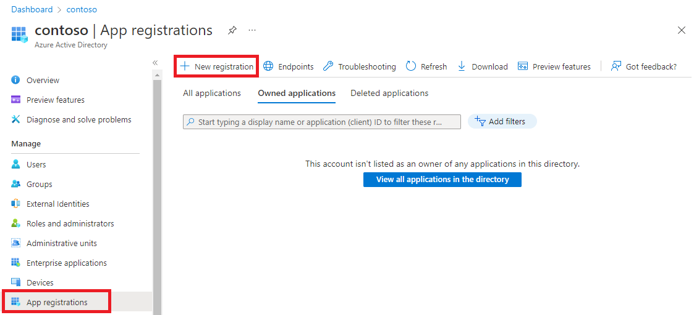
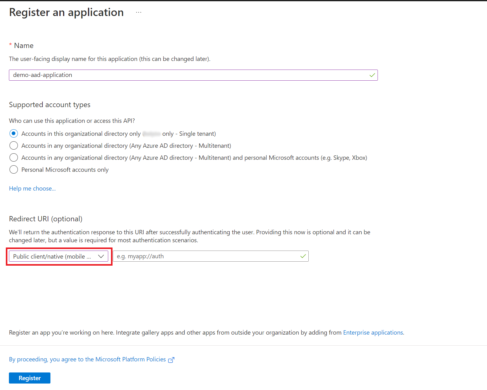
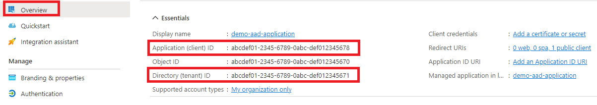
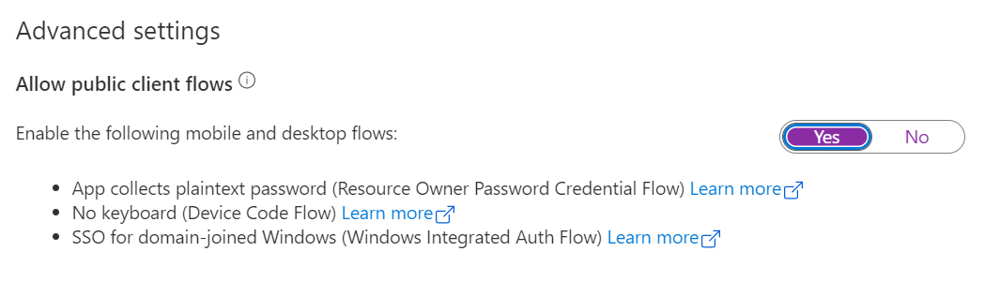
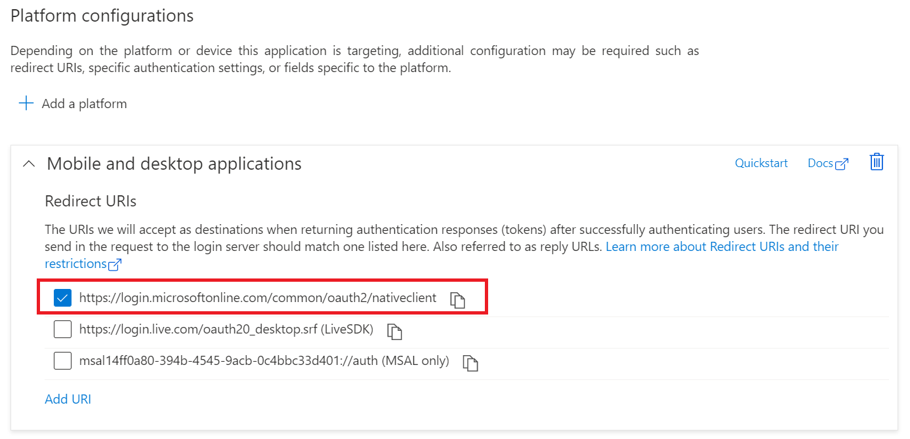
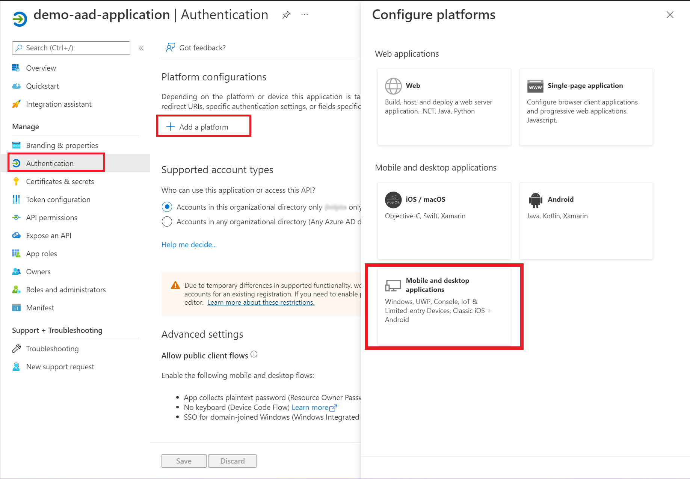
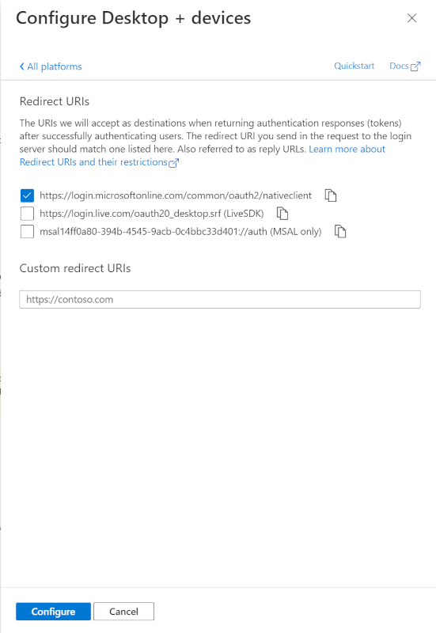
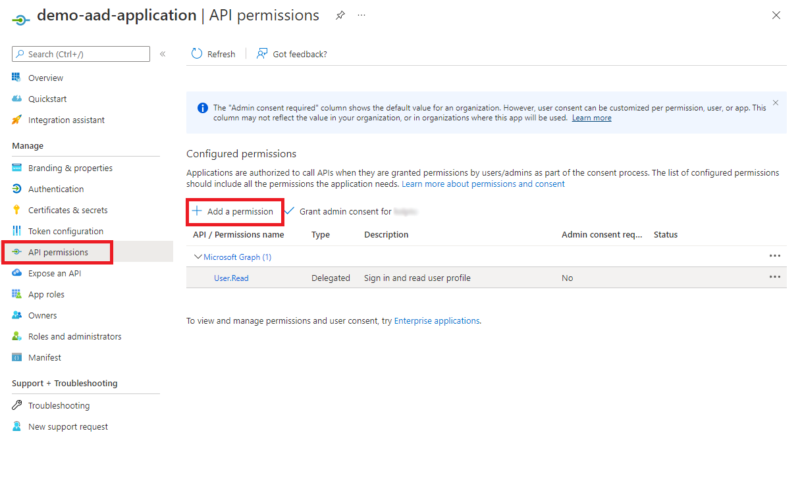
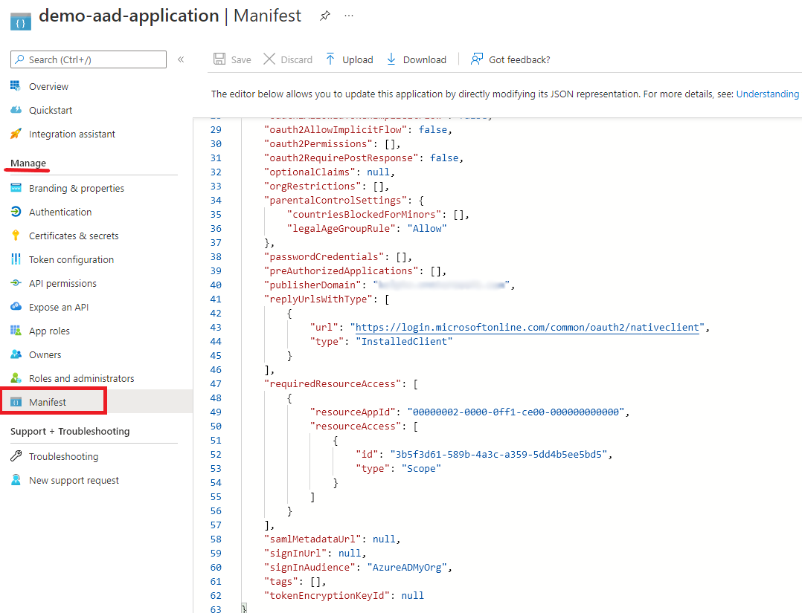
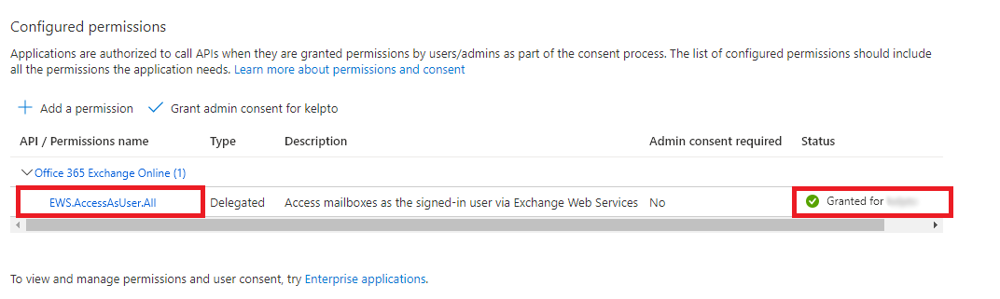

# Exchange Users integration pack

::: moniker range=">= sc-orch-1801 <= sc-orch-1807"

[!INCLUDE [eos-notes-orchestrator.md](../includes/eos-notes-orchestrator.md)]

::: moniker-end

Integration packs are add-ons for Orchestrator, a component of System Center. Integration packs
optimize IT operations across various environments. They enable you to design runbooks in
Orchestrator that use activities performed by other System Center components, other Microsoft
products, and third party products.

The Integration Pack for Exchange Users facilitates the automation of user-centric tasks, such as
actions to read and send email messages, create appointments, or update tasks and contacts. The
operation is carried over HTTP and the connection can be authenticated by the methods enabled on the
Exchange Server. Consult with your tenant administrator about the available methods on your On-prem
Exchange Server.

::: moniker range>="sc-orch-2019"
> Microsoft has [announced that deprecation of Basic Auth][basic-auth-announce] will begin in most
> Exchange Online instances from **October 2022** in favour of more secure methods like OAuth.
::: moniker-end

This integration pack can be used to connect to both On-prem or Online Exchange servers using their
respective [Exchange Web Services][ews] (EWS) endpoint. This integration pack operates in the method
shown below:

| Server kind               | Supported auth mode | Default    |
| ------------------------- | ------------------- | ---------- |
| Exchange Server (On-prem) | Basic Auth          | Basic Auth |
| Exchange Online           | OAuth               | OAuth      |
| Office 365 Exchange       | OAuth               | OAuth      |

[ews]: /exchange/client-developer/exchange-web-services/explore-the-ews-managed-api-ews-and-web-services-in-exchange
[basic-auth-announce]: https://techcommunity.microsoft.com/t5/exchange-team-blog/basic-authentication-deprecation-in-exchange-online-may-2022/ba-p/3301866

Microsoft is committed to protecting your privacy while delivering software that brings you the
performance, power, and convenience you want. For more information about Orchestrator-related
privacy, see the [System Center Orchestrator Privacy Statement](https://www.microsoft.com/privacystatement/EnterpriseDev/default.aspx).

## System requirements

Prior to implementing the Exchange Users Integration Pack, the following listed software must be
installed and configured. For more information about installing and configuring Orchestrator and the Exchange Users Integration Pack, see the respective product documentation.

::: moniker range="<=sc-orch-2019"
-   System Center 2016 integration packs require System Center 2016 - Orchestrator
-   System Center 2019 integration packs require System Center 2019 - Orchestrator
-   Microsoft .NET Framework 3.5
-   Microsoft Exchange 2010 Service Pack 1 or Microsoft Exchange 2013 or Microsoft Exchange
    Online/Microsoft 365

::: moniker-end

::: moniker range="sc-orch-2022"
-   System Center 2022 integration packs require System Center 2022 - Orchestrator
-   Microsoft .NET Framework 4.7
-   Exchange accounts on,
    -   (On-premises Exchange Server) Microsoft Exchange 2010 Service Pack 1 or Microsoft Exchange 2013
    -   Or (Exchange Online) Microsoft Exchange Online/Microsoft Office365 Exchange.

::: moniker-end

## Downloading the integration pack

::: moniker range="<=sc-orch-2019"

- To download the Exchange Users Integration Pack for Orchestrator 2016, go to the [Download Center space for 2016](https://www.microsoft.com/download/details.aspx?id=54098).

- To download the Exchange Users Integration Pack for Orchestrator 2019, go to the [Download Center space for 2019](https://www.microsoft.com/download/details.aspx?id=58111&WT.mc_id=rss_alldownloads_all).

::: moniker-end

::: moniker range="sc-orch-2022"

- To download the Exchange Users Integration Pack for Orchestrator 2022, go to the [Download Center space for 2022](https://www.microsoft.com/download/details.aspx?id=104336).

::: moniker-end

## Registering and deploying the integration pack

Download the integration pack file and register it with the Orchestrator management server using the
Deployment Manager. You may then deploy it to runbook servers and Runbook Designers. For the
procedures on installing integration packs, see [How to Install an Integration Pack](how-to-add-an-integration-pack.md).

::: moniker range>="sc-orch-2019"
## Configuring OAuth

Microsoft Azure Active Directory (Azure AD) implements the OAuth protocol for secure authentication
of its users and applications.

### What is an Azure AD client application?
The integration pack requires a [Public Client Application][pca] on Azure AD that will operate in
_delegated authentication_ mode (that is, impersonating the user).

Here's how the connection will be established when the activity runs:
1.  User credentials will be obtained from the IP configuration.
2.  The credentials will be used to authenticate with Azure AD using OAuth.
3.  Once authenticated, an OAuth token will be received from Azure AD.
4.  Activity will perform operations on the EWS endpoint using the OAuth token.

> The alternative of _delegated permissions_ is _app-only authentication_ where app secrets
> (credential or secret certificate) are used instead of a user's credentials. The IP does not
> support these kind of Azure AD applications.

[pca]: /azure/active-directory/develop/msal-client-applications
::: moniker-end

::: moniker range="sc-orch-2022"
### Register an Azure AD client application in your tenant
1.  Open a browser and navigate to the [Azure Active Directory admin center][aad-admin].
2.  Select Azure Active Directory in the left-hand navigation, then select **App registrations** under
    Manage.
    
3.  Select **New registration**. On the Register an application page, set the values as follows.
    
    -  Set Name to a friendly name for your app.
    -  Set Supported account types to the choice that makes sense for your scenario.
    -  For Redirect URI, change the dropdown to "Public client (mobile & desktop)" and set the URI
       to `https://login.microsoftonline.com/common/oauth2/nativeclient`
4.  Note down the Application ID and Tenant ID.
    
5.  Go to **Authentication** tab and,
    1.  Under "Advanced settings" set **Allow public client flows** to yes.
        
    2.  Confirm that the Platform configuration is set to "Mobile and Desktop applications" with at
        least `https://login.microsoftonline.com/common/oauth2/nativeclient` as one of the Redirect
        URI.
        
    3.  You may add other platforms for this app:
        1.  Choose the platform (like "Mobile and Desktop applications")
            
        2.  Set the Redirect URI of your choice:

            

[aad-admin]: https://entra.microsoft.com/
::: moniker-end

::: moniker range>="sc-orch-2019"

### Granting EWS permissions
Generally, Public Client Apps that operate in _delegated authentication_ mode require explicit
consent from the user who wants to use the application. The explicit consent is granted
interactively through an embedded browser window.

However, the IP doesn't support the consent grant flow, instead the tenant admin must grant consent
on behalf of all users in the tenant.
You can view and update the permissions granted to the app on the API permissions tab on the portal.

1.  First we add the permissions to the app by editing the app **Manifest**.
    1.  On the Azure AD portal, select the Azure AD application.
    2.  Follow the [steps to grant EWS permissions][ews-reg] by editing the app **Manifest**.
        
2.  Request your tenant admin to grant "Admin consent" (on the API permissions tab) to this application for
    `EWS.AccessAsUser.All` permission.

In practice, "Admin consent" implies that any user in the tenant can configure the IP with their
credentials and execute Exchange activities under their account.
Once the Admin consent is granted, the Status column will show a green check mark:

[ews-reg]: /exchange/client-developer/exchange-web-services/how-to-authenticate-an-ews-application-by-using-oauth#register-your-application

::: moniker-end

## Configuring the Exchange Users integration pack connections

A connection describes the recipe to make HTTP requests from Orchestrator to an Exchange server. You
can specify as many connections as necessary to create links to multiple servers using different
accounts or options. You can also create multiple connections to the same server to allow for
differences in security permissions for different user accounts.

The integration pack supports two types of Exchange configurations: the basic **Exchange
Configuration** connection and the **Exchange Configuration (Item)** configuration.

The basic **Exchange Configuration** contains connection information that is used by activities
where the item type is either implicit or not required:

-  Create and Send E-Mail
-  Reply to E-Mail
-  Send E-Mail
-  Delete Item
-  Find Appointments

The **Exchange Configuration (Item)** configuration is used for the remaining activities that
operate on a single Exchange Item (an Appointment, Task, Email or Contact).

### To set up a basic Exchange Configuration connection

1.  In the **Orchestrator Runbook Designer**, select **Options**, and then select **Exchange User**.
    The **Exchange User** dialog box appears.
2.  On the **Configurations** tab, select **Add** to begin the connection setup. The **Add Configuration** dialog box appears.
3.  In the **Name** box, enter a friendly display name for the connection.
4.  In the **Type** box, select **Exchange Configuration**.
5.  In the **Exchange Server Address** box, type the name or IP address of the Exchange server. If
    you're using the computer name, you can type the NetBIOS name or the fully qualified domain name
    (FQDN). You may leave the **Exchange Server Address** box empty if you enable the **Use
    [Autodiscover][ex-auto-discover]** option.
    > Usually this is of the form `your-domain-name.com/EWS/Exchange.asmx`.
6.  In the **Username** and **Password** boxes, type the credentials that Orchestrator will use to
    connect to the Exchange server.
7.  In the **Domain** box, type the name of the (tenant) domain that will authorize access.
    > If your email account is of the form `johndoe@contoso.onmicrosoft.com`, then your domain is `contoso.onmicrosoft.com`

::: moniker range="sc-orch-2022"

1.  Set **Server is Exchange Online or Office365** to `True` if you're connecting to a managed
    Exchange Online or Office365 Exchange instance. If so, follow these further steps (ignore
    otherwise):
    1.  In **Azure AD application (client) ID**, specify the Azure AD client app ID created for this purpose.
    2.  In **Azure AD Tenant (directory) ID**, specify your Azure AD Tenant ID seen on the AD portal.
    3.  In **Azure AD Cloud Instance URL**, type the URL of your Active directory instance or use
        the default value. Refer [Azure AD Authority][ad-authority] to confirm the authentication endpoint.
    4.  Set **Log OAuth request/response** to `True` if you wish to inspect authentication failures
        in detail. The logs will be generated on the path
        `%windir%\Temp\sc-orchestrator\exchange_user\{date-time-stamp}.msal.txt`. One file will be
        generated for each execution of an Exchange User activity.
2.  Set **Trace EWS request/response** to `True` if you wish to inspect EWS failures in
    detail. The logs will be generated on the path
    `%windir%\Temp\sc-orchestrator\exchange_user\{date-time-stamp}.ews-trace.xml.log`. One file will be
    generated for each execution of an Exchange User activity. We recommend using [SOAPe][soape] to visually inspect the traces.

::: moniker-end

::: moniker range="sc-orch-2019"

1.  Set **ExchangeOnline** to `True` if you're connecting to a managed
    Exchange Online or Office365 Exchange instance. If so, follow these further steps (ignore
    otherwise):
    1.  In **Application ID**, specify the Azure AD client app ID created for this purpose.
    2.  In **Tenant ID**, specify your Azure AD Tenant ID seen on the AD portal.
::: moniker-end

1.  In the **Timeout** box, enter a timeout value or leave the default.
2.  Select **OK**.
3.  Add any more connections if needed, and then select **Finish**.

[soape]: https://github.com/David-Barrett-MS/SOAPe
[ex-auto-discover]: /exchange/client-developer/exchange-web-services/autodiscover-for-exchange
[ad-authority]: /azure/active-directory/develop/authentication-national-cloud#azure-ad-authentication-endpoints

::: moniker range<"sc-orch-2019"

### To set up an Exchange Configuration (Item) connection

1.  In the **Orchestrator Runbook Designer**, select **Options**, and then select **Exchange User**.
    The **Exchange User** dialog box appears.
2.  On the **Configurations** tab, select **Add** to begin the connection setup. The **Add
    Configuration** dialog box appears.
3.  In the **Name** box, enter a friendly display name for the connection.
4.  In the Type box, select **Exchange Configuration (Item Activity)**.
5.  In the **Exchange Server Address** box, type the name or IP address of the Exchange server. If
    you're using the computer name, you can type the NetBIOS name or the fully qualified domain name
    (FQDN). You may leave the **Exchange Server Address** box empty if you enable the **Use
    Autodiscover** option.
6.  In the **Username** and **Password** boxes, type the credentials that Orchestrator will use to
    connect to the Exchange server.
7.  In the **Domain** box, type the name of the domain that will authorize access.
8.  In the **Timeout** box, enter a timeout value or leave the default.
9.  In the **Item Type** box, enter a valid Exchange Item Type.
10.  Add any more connections if applicable, and then select **Finish**.

::: moniker-end

::: moniker range>="sc-orch-2019"
### To set up an Exchange Configuration (Item) connection

1.  In the **Orchestrator Runbook Designer**, select **Options**, and then select **Exchange User**.
    The **Exchange User** dialog box appears.
2.  On the **Configurations** tab, select **Add** to begin the connection setup. The **Add
    Configuration** dialog box appears.
3.  In the **Name** box, enter a friendly display name for the connection.
4.  In the Type box, select **Exchange Configuration (Item Activity)**.
5.  In the **Item Type** box, enter a valid Exchange Item Type.
6.  For remaining parameters, follow the same guidance mentioned above for [basic Exchange Configuration](#to-set-up-a-basic-exchange-configuration-connection).

::: moniker-end
