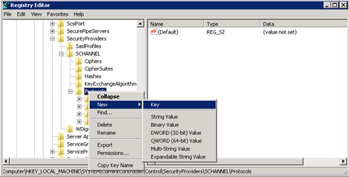

---
ms.assetid:
title: Set up TLS 1.3 for Orchestrator
description: This article provides instructions for setting up TLS 1.3 with Orchestrator
author: jyothisuri
ms.author: jsuri
ms.date: 11/01/2024
ms.topic: article
ms.service: system-center
ms.subservice: orchestrator
moniker range: sc-orch-2025
---

# Set up TLS 1.3 for Orchestrator

This article describes how to set up Transport Security Layer (TLS) protocol version 1.3 with System Center - Orchestrator.

## Before you start

- Orchestrator should be running version 2022 or 2025.
- Security fixes should be up-to-date on the Orchestrator.
- System Center updates should be up-to-date.
- SQL Server 2012 Native client 11.0 or later should be installed on the Orchestrator management server. To download and install Microsoft SQL Server 2012 Native Client 11.0, see [this Microsoft Download Center webpage](https://www.microsoft.com/download/details.aspx?id=50402&751be11f-ede8-5a0c-058c-2ee190a24fa6=True).
- Orchestrator should be running .NET version 4.6. Follow [these instructions](/dotnet/framework/migration-guide/how-to-determine-which-versions-are-installed) to determine which version of .NET is installed.
- To work with TLS 1.3, System Center components generate SHA1 or SHA2 self-signed certificates. If SSL certificates from a certificate authority (CA) are used, they should use SHA1 or SHA2.
- Install the SQL server version that supports TLS 1.3. SQL Server 2022 or later supports TLS 1.3.

## Install a SQL Server update for TLS 1.3 support

>[!Important]
>Even with TLS 1.3 support for TDS connections, TLS 1.2 is still required for starting up SQL Server satellite services. Don't disable TLS 1.2 on the machine.

[Download and install](/sql/relational-databases/security/networking/connect-with-tls-1-3?view=sql-server-ver16) the update for your SQL Server version.

>[!Note]
>- SQL Server 2019 (15.x) and earlier versions doesn't support TLS 1.3.

## Configure and use TLS 1.3

1. Configure Orchestrator to use TLS 1.3

    a. Start the registry editor on the Orchestrator. To do this, right-click **Start**, enter **regedit** in the Run box, and then select **OK**.

    b.Locate the following registry subkey: `HKEY_LOCAL_MACHINE\SOFTWARE\Microsoft\.NETFramework\v4.0.30319`.

    c. Create the DWORD  **SchUseStrongCrypto** [Value=1] under this key.

    d. Locate the following registry subkey:   `HKEY_LOCAL_MACHINE\SOFTWARE\WOW6432Node\Microsoft\.NetFramework\v4.0.30319`.

    e. Create the DWORD  **SchUseStrongCrypto** [Value=1] under this key.

    f. Set System Center to use only TLS 1.3.

      Before you change the registry in this step, back up the registry in case you need to restore it later. Then set the following registry key values.

    **Values for 64-bit operating systems**

      | Path | Registry key | Value |
      | --- | --- | --- |
      |`HKEY\_LOCAL\_MACHINE\SOFTWARE\Microsoft\.NETFramework\v2.0.50727` | SystemDefaultTlsVersions | dword:00000001 |
      |`HKEY\_LOCAL\_MACHINE\SOFTWARE\Wow6432Node\Microsoft\.NETFramework\v2.0.50727` | SystemDefaultTlsVersions | dword:00000001 |
      | `HKEY\_LOCAL\_MACHINE\SOFTWARE\Microsoft\.NETFramework\v4.0.30319` | SystemDefaultTlsVersions | dword:00000001 |
      | `HKEY\_LOCAL\_MACHINE\SOFTWARE\Wow6432Node\Microsoft\.NETFramework\v4.0.30319` | SystemDefaultTlsVersions | dword:00000001 |

2. Set Windows to use only TLS 1.3.

   **Method 1: Manually modify the registry**

   >[!Important]
   >You could cause serious problems if you modify the registry incorrectly. Before you begin, back up the registry so you can restore it if a problems occurs.

   Use the following steps to enable or disable all SCHANNEL protocols across the system.

   >[!NOTE]
   >We recommend that you enable the TLS 1.3 protocol for incoming communications. Enable the TLS 1.3, TLS 1.2, TLS 1.1, and TLS 1.0 protocols for all outgoing communications. Registry changes don't affect the use of the Kerberos protocol or NTLM protocol.

   a. Start Registry Editor. To do this, right-click **Start**, type **regedit** in the Run box, and then select **OK**.

   b. Locate the following registry subkey:
    `HKEY_LOCAL_MACHINE\System\CurrentControlSet\Control\SecurityProviders\SCHANNEL\Protocols`

   c. Right-click  **Protocol**, and point to **New** > **Key**.

      [](./media/integration-pack-for-om/new-registry-key.png#lightbox)

   d. Enter **SSL 3.0**.

   e. Repeat the previous two steps to create keys for TLS 0, TLS 1.1, TLS 1.2, and TLS 1.3. These keys resemble directories.

   f. Create a client key and a server key under each of the SSL 3.0, TLS 1.0, TLS 1.1, TLS 1.2 and TLS 1.3 keys.

   g. To enable a protocol, create the DWORD value under each client and server key, as follows:

   - DisabledByDefault [Value = 0]
   - Enabled [Value = 1]

   h. To disable a protocol, change the DWORD value under each client and server key, as follows:

   - DisabledByDefault [Value = 1]
   - Enabled [Value = 0]

   i. Select **File** > **Exit**.

   **Method 2: Automatically modify the registry**

   Run the following Windows PowerShell script in administrator mode to automatically configure Windows to use only the TLS 1.3 protocol:

   ```powershell
      $ProtocolList       = @("SSL 2.0", "SSL 3.0", "TLS 1.0", "TLS 1.1", "TLS 1.2", “TLS 1.3”) 

      $ProtocolSubKeyList = @("Client", "Server") 

      $DisabledByDefault  = "DisabledByDefault" 

      $registryPath       = "HKLM:\SYSTEM\CurrentControlSet\Control\SecurityProviders\SCHANNEL\Protocols\" 

      foreach ($Protocol in $ProtocolList) 

      { 

       foreach ($key in $ProtocolSubKeyList) 

       { 

           $currentRegPath = $registryPath + $Protocol + "\" + $key 

           Write-Output "Current Registry Path: `"$currentRegPath`"" 

 

           if (!(Test-Path $currentRegPath)) 

           { 

               Write-Output " `'$key`' not found: Creating new Registry Key" 
 
               New-Item -Path $currentRegPath -Force | out-Null 

           } 

           if ($Protocol -eq "TLS 1.3") 

           { 

               Write-Output " Enabling - TLS 1.3" 

               New-ItemProperty -Path $currentRegPath -Name $DisabledByDefault -Value "0" -PropertyType DWORD -Force | Out-Null 

               New-ItemProperty -Path $currentRegPath -Name 'Enabled' -Value "1" -PropertyType DWORD -Force | Out-Null 

           } 

           else 

           { 

               Write-Output " Disabling - $Protocol" 

               New-ItemProperty -Path $currentRegPath -Name $DisabledByDefault -Value "1" -PropertyType DWORD -Force | Out-Null 

               New-ItemProperty -Path $currentRegPath -Name 'Enabled' -Value "0" -PropertyType DWORD -Force | Out-Null 

           } 

           Write-Output " " 

       } 

   } 
   ```

3. Install the following updates on all Service Manager roles. Update roles on management servers, Azure Data Warehouse servers, the Self-Service portal, and Analyst consoles (including the Analyst consoles installed on the Orchestrator Runbook servers).

   | Operating system | Required update |
   | --- | --- |
   | Windows 8.1 and Windows Server 2012 R2 | [3154520](https://support.microsoft.com/kb/3154520) Support for TLS System Default Versions included in the .NET Framework 3.5 on Windows 8.1 and Windows Server 2012 R2 |
   | Windows Server 2012 | [3154519](https://support.microsoft.com/kb/3154519) Support for TLS System Default Versions included in the .NET Framework 3.5 on Windows Server 2012 |
   | Windows 7 SP1 and Windows Server 2008 R2 SP1 | [3154518](https://support.microsoft.com/kb/3154518) Support for TLS System Default Versions included in the .NET Framework 3.5.1 on Windows 7 SP1 and Server 2008 R2 SP1 |
   | Windows 10 and Windows Server 2016 | [3154521](https://support.microsoft.com/kb/3154521) Hotfix rollup 3154521 for the .NET Framework 4.5.2 and 4.5.1 on Windows<br><br>[3156421](https://support.microsoft.com/kb/3156421) Cumulative Update for Windows 10 Version 1511 and Windows Server 2016 Technical Preview 4: May 10, 2016 |

4. Restart the computer.

>[!Note]
>After you set Microsoft System Center Orchestrator to use only the TLS 1.3 protocol for connections, the Integration Packs stop working.
To fix this issue, follow these steps:
>1.	Start Registry Editor.
>2.	Locate the following registry subkey:
 `HKEY_LOCAL_MACHINE\SOFTWARE\Wow6432Node\Microsoft\.NETFramework\v4.0.30319`
>3.	Check whether the SystemDefaultTlsVersions value exists.
    -   If the value exists, make sure that its data is set to 1.
    -   If the value does not exist, create a DWORD (32-bit) value, and specify the following values:
        Name: SystemDefaultTlsVersions
        Value data: 1
>4.	Select **OK**.

For detailed information, see [this KB article](https://support.microsoft.com/help/4494803/orchestrator-integration-packs-stop-working-with-tls-1-2-connections).

## Next steps

[Learn more](https://tools.ietf.org/html/rfc5246) about the TLS 1.2 protocol.
