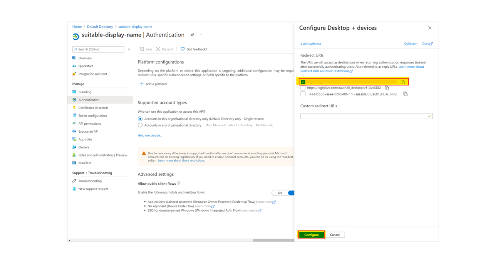
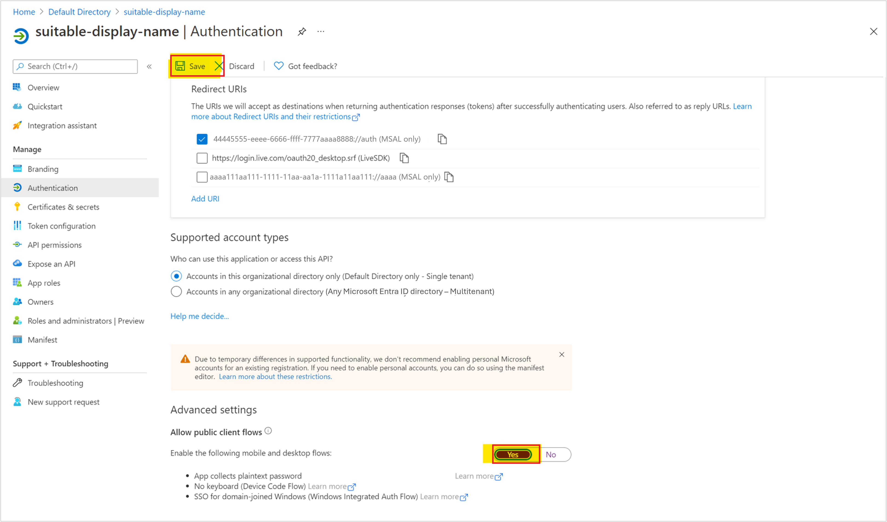

# Integration pack for SharePoint

::: moniker range=">= sc-orch-1801 <= sc-orch-1807"

[!INCLUDE [eos-notes-orchestrator.md](../includes/eos-notes-orchestrator.md)]

::: moniker-end

Integration packs are add-ons for System Center - Orchestrator. They help you to optimize the IT operations across heterogeneous environments. Using integration packs, you can design runbooks in Orchestrator that use activities performed by other System Center components, other Microsoft products, and by non-Microsoft products.

[Learn more](https://www.microsoft.com/privacystatement/EnterpriseDev/default.aspx) about Orchestrator privacy.

This article provides information about System Center integration pack for Microsoft SharePoint.

The System Center Integration Pack for Microsoft SharePoint enables the automation of common tasks in SharePoint. For example, to create list items, to upload and download documents, and to monitor a list for changes.

## System requirements

The integration pack for SharePoint requires the following software to be installed and configured before you implement the integration.

-   System Center - Orchestrator
-   Microsoft .NET Framework 4
-   Microsoft SharePoint

## Download the pack

::: moniker range="sc-orch-2022"
- Download the pack for 2022
::: moniker-end

::: moniker range="<=sc-orch-2019"
- [Download the pack for 2019](https://www.microsoft.com/download/details.aspx?id=58111&WT.mc_id=rss_alldownloads_all)
- [Download the pack for 1801](https://www.microsoft.com/download/details.aspx?id=56605)
- [Download the pack for 2016](https://www.microsoft.com/download/details.aspx?id=54098)
::: moniker-end

## Register and deploy the integration pack

After you download the integration pack file, you must register it with the Orchestrator management server and then deploy it to runbook servers and Runbook Designers. Learn about [installing the pack](how-to-add-an-integration-pack.md).

The SharePoint Integration Pack performs actions on behalf of a user who can access your SharePoint domain. The IP authenticates with SharePoint as this user in two modes:

- Basic Auth (default, supports both SharePoint Online and SharePoint OnPrem).
- Modern Auth (also known as OAuth) using Azure AD (applicable only for SharePoint Online).

## Configure the pack connections for Basic Auth

A connection establishes a reusable link between Orchestrator and a SharePoint site. You can create as many connections as you require to specify links to multiple sites. You can also create multiple connections to the same server to allow for differences in security permissions for different user accounts.

1.  In the **Orchestrator Runbook Designer**, click **Options**, and then click **Microsoft SharePoint.**
2. The **Microsoft SharePoint** dialog box appears.
3.  On the **Configurations** tab, click **Add** to begin the connection setup. The **Add Configuration** dialog box appears.
4.  In the **Name** box, enter a name for the connection. This name can be the name of the SharePoint site or a descriptive name to distinguish the type of connection.
5.  In the **Type** box, select **SharePoint Configuration.**
6.  In the **SharePoint Site** box, enter the URL of the SharePoint site that you want to integrate with.
7.  In the **User Name** and **Password** boxes, enter the credentials that Orchestrator will use to connect to the SharePoint site.
8.  In the **Domain** box, enter the name of the domain to authorize access.
9.  In the **SharePoint Online** box, enter **False**, if the SharePoint instance is OnPrem.
10. Set **Utilize OAuth** box to **False**.
11.  In the **Default Monitor Interval (seconds)** box, enter a time-out value, in seconds, or keep the default value.
12. In the **Default Maximum Items** box, enter a maximum value, or keep the default value.
13. Click **OK**.
14. Add additional connections, if applicable, and then click **Finish**.

## Configure the pack connections for Modern Auth (SharePoint Online)

Register an AD Client Application on your Azure Active Directory (AD Instance) and configure the IP to use this client. The IP authenticates on your behalf, hence your credentials are required in the IP configuration pane.

Note that this authentication mode is supported only for SharePoint Online.

### Register a Client application on Azure AD
To register a client application on Azure AD, follow these steps:

1. Go to [Azure portal](https://aad.portal.azure.com/).

2. Navigate to **Azure Active Directory** > **App registrations** and click **New registration** to register.

3. Set an applicable name for the application and choose the indicated Redirect URI (Public Client/native app) from the drop-down menu.

   

4. Choose the account type depending on your AD setup and whether you use both on-prem and online products.

5. Click **Register**.

#### App overview
The **ApplicationID** and **TenantID** are displayed under **Overview**, note them down.

#### Redirect URI
Set the OAuth redirection URI. Choose the Public client (Mobile/Desktop app) platform:

1. Under **Platform configurations**, click **Add a platform.**

   

2. Select `https://login.microsoftonline.com/common/oauth2/nativeclient` as the Redirect URI and click **Configure**.

   

3. Under **Advanced Setting**, set **Allow Public Client flows** to **Yes**, and then click **Save**.

   

#### API permissions
SharePoint offers different API scopes/permissions.

Follow these steps to set API permissions:

1. Under **Configured permissions**, click **Add a permission**, and then select **SharePoint**.

   

2. Grant the **AllSites.Write** permission to the app, or higher and then select **Add permissions**. **AllSites.Write** is required for all the SharePoint IP activities to work and you can choose narrower scope depending on activities that your runbooks use.  

   

### Configure the SharePoint IP for Modern Auth

Use the following steps to configure the SharePoint IP for OAuth authentication:

1. In the **Orchestrator Runbook Designer**, click **Options**, and then click **Microsoft SharePoint**.
2. The **Microsoft SharePoint** dialog box appears.

3. On the **Configurations** tab, click **Add** to begin the connection setup. The **Add Configuration** dialog box appears.

4. In the **Name** box, enter a name for the connection. This name can be the name of the SharePoint site or a descriptive name to distinguish the type of connection.

5. In the **Type** box, select **SharePoint Configuration**.

6. In the **SharePoint Site**  box, enter the URL of the SharePoint site that you want to integrate with.

7. In the **User Name** and **Password** boxes, enter the (user) credentials that Orchestrator will use to connect to the SharePoint site when runbooks are executed.

8. In the **Domain box**, enter the name of the domain to authorize access.

9. In the **SharePoint Online** box, enter **True**.

10. Set **Utilize OAuth** box to **True**.

11. Set the **Application ID** to the application ID seen on the portal.

12. Set the **Directory ID** to the directory (tenant) ID seen on the portal. This is also referred to as Microsot365 Tenant ID.

13. Set the **AAD Instance URI** to your AD URL (or leave it to default value).

14. Click **OK**.

15. Add additional connections, if applicable, and then click **Finish**.

### Get data from SharePoint
After performing the above steps, create a new runbook and use the **Get List Items** SharePoint activity. When you set the desired configuration in the activity's settings, the **Runbook Designer** will exercise your connection options to fetch some data from SharePoint.

A pop-up appears in case there's some problem with the credentials or other settings.
