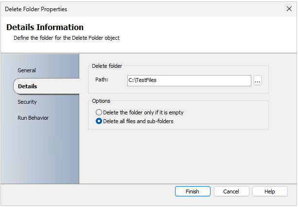

# Delete Folder

This article describes the Delete Folder activity. The Delete Folder activity deletes a folder, subfolders, or the entire folder tree of a directory on the local file system or a network location specified using a UNC path. You can delete temporary folders that were created when a runbook runs or you can use this activity to purge data that has been recently archived.  

## Configure the Delete Folder Activity

 Before you configure the Delete Folder activity, you need to determine the following:  

- The folder name you're targeting.  

- Whether you're going to delete the entire tree; delete the subfolders only; or delete just the directory.  

Use the following information to configure the Delete Folder activity.  

### Details Tab  

|Settings|Configuration Instructions|  
|--------------|--------------------------------|  
|**Path**|Enter the path of the folder that you're targeting.|  
|**Delete the folder only if it is empty**|Select this option to delete the folder only if there are no files or subfolders in it.|  
|**Delete all files and subfolders**|Select this option to delete the specified folder and all subfolders and files contained in that folder.|  

### Published Data

 The following table lists the published data items.  

|Item|Description|  
|----------|-----------------|  
|Folder path|The path of the folder that was deleted.|  
|Folder pattern to match|The pattern used to find the sub-folder that was deleted.|  
|Base Folder to start deletion from|The **Path** that was specified on the **Details** tab.|  
|Delete folder options|The options that you selected for the delete folder operation.|  
|Name and path of the folder|The name and path of the folder that was deleted.|

## Delete subfolder

On the **Delete Folder Properties** window, under **Details**, enter the path to subfolder and select **Delete all files and sub-folders**.

