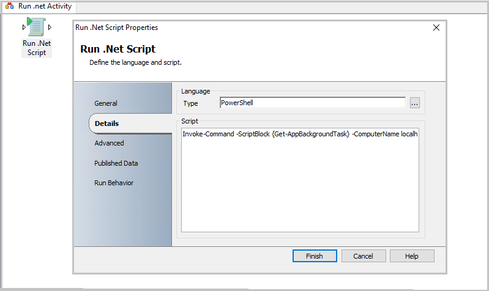

# Run .NET Script

The Run .NET Script activity runs scripts written in VB.NET, JScript, C#, and Windows PowerShell. This activity is compatible with .NET CLR version 2.0 and later. Use the Microsoft System Center - Orchestrator Run .NET Script activity to run scripts that parse data or run functions against available APIs.  

## Configure the Run .NET Script Activity

 Before you configure the Run .NET Script activity, you need to determine the following:  

- The code you want to run.  

- The libraries you want to use.  

- The data you want to publish.  

  Use the following information to configure the Run .NET Script activity.  

> [!NOTE]
> You can't set individual security credentials for this activity. It will run under the service account configured for the Runbook Service on the Runbook server where the instance of the activity is running. This account must have the authority to access the resources and perform the actions required by this activity.  

### Details Tab  

|Settings|Configuration Instructions|  
|--------------|--------------------------------|  
|**Type**|Select the script language. Use the ellipsis button **(...)** to browse for the language.|  
|**Script**|Enter the code that will run when the activity runs.|  

### Advanced Tab  

|Settings|Configuration Instructions|  
|--------------|--------------------------------|  
|**Namespace**|Add a Namespace for each .NET namespace that will be used within your code. This allows you to call the code without using fully qualified names for each of the classes. Orchestrator recommends adding System namespace to every Run .NET Script activity.|  
|**References**|Add each of the Assembly (DLL) references that contain the libraries that you want to use. Add the **System.dll** located in the **Windows\Microsoft.NET\Framework\\<.NET Version>** directory.|  

###  <a name="BKMK_PublishedData"></a> Published Data

 Add the published data items that you want this activity to publish. Every published data item that you add will be available on the Data bus. It's important to determine if a published data item will be multi-valued. The Run .NET Script activity automatically correlates multi-valued data from different items by aligning them. For example, if you choose to publish two items labeled **Name** and **Email** as Collections, the Run .NET script will try to line up each item in the Name collection with each item in the Email collection. If the collections aren't equally sized, then the Run .NET Script activity will create blank values for the collection that has fewer items. The following Published Data table lists the data items and the corresponding description published by this activity.  

### Published Data Tab  

|Settings|Configuration Instructions|  
|--------------|--------------------------------|  
|**Name**|Enter the **Name** of the published data. This will be the name that appears when other activities subscribe to the data published by the Run .NET Script activity.|  
|**Type**|You can select **Date/Time**, **Integer**, or **String**. If the type you want isn't available, select **String**. Use the **ToString** method of the activity to assign a value to this published data.|  
|**Collection**|If your data is multi-valued data, select **Collection**. When using a collection, you must use the **Add** method to add items to the collection. If you aren't using the collection, you can use the assignment operator **(=)** to assign the value.|  
|**Variable name**|Use unique naming to ensure that your variable name does not collide with existing variables within your script or with classes and keywords available in .NET. We recommend prefixing variables with **OPD_**. For example, if you want to name your variable **myString**, you would name it **OPD_myString**.<br /><br /> The Run .NET Script activity will automatically create a .NET Property for this item. If this variable is a collection, it will be created using a List\<T>, where T is the **Type** that you selected. However, if it isn't a collection, the property will be created using a **String**, **Integer**, or **Date/Time** based on the **Type** that you selected.|  

### Published Data  

|Item|Description|  
|----------|-----------------|  
|Standard Error|Any standard error output published by the Run .NET Script activity.|  
|Namespaces|The namespaces used.|  
|Standard Output|The standard output published by the Run .NET Script activity.|  
|References|The Assemblies used in the activity.|  
|Script Body|The script that was run.|  
|Script Language|The language that was selected for the script.|

## Execute 64-bit PowerShell cmdlets with Run .NET Script activity

You can run 64-bit Windows PowerShell in Orchestrator *Run.Net Script* activity. Use the following steps:

1. Create a Run .NET Script activity from the **System activities group**.
2. In **Details** > **Type**, select **PowerShell** as the language.
3. In  **Script**, enclose your PowerShell commands in the following code:  

    ```
    Invoke-Command -ScriptBlock {YOUR CODE} -ComputerName localhost

    ```

4. Select **Finish**.

    

>[!NOTE]
>To verify the PowerShell version, use the following script in *Run .NET Script* activity and publish the 64 bit and PowerShell version variable.

```powershell
$Result = Invoke-Command -ComputerName localhost {
$Is64BitProcess = [Environment]::Is64BitProcess
$PSVersion = $PSVersionTable.PSVersion
RETURN $Is64BitProcess, $PSVersion
}

$64bit = $Result[0]
$PSVersion = $Result[1]
```


