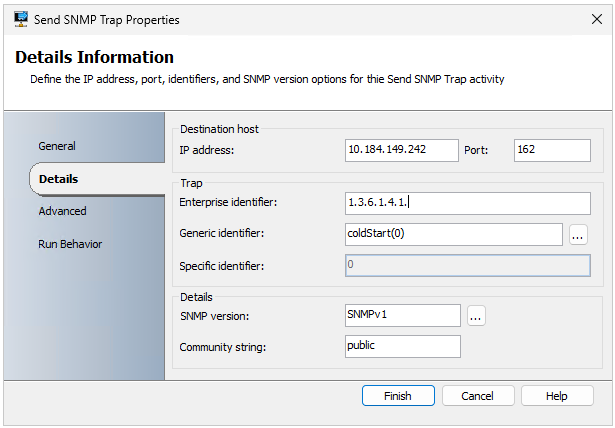

# Send SNMP Trap

The Send SNMP Trap activity will raise an SNMP event that can be detected by a network systems manager application. By using an enterprise identifier of a known network device, you can send SNMP Traps on behalf of a network device in your system. Use the Send SNMP Trap to create events for runbooks that need to be tracked using an SNMP monitoring product.  

## Configure the Send SNMP Trap Activity

 Before you configure the Send SNMP Trap activity you need to determine the following:  

- IP address of the device where you will send your SNMP trap  

- Identifiers of the trap  

- The SNMP version you will use  

- The agent address you want to identify as the sender of the SNMP trap information 

> [!NOTE]
> You can't set individual security credentials for this activity. It will run under the service account configured for the Runbook Service on the Runbook server where the instance of the activity is running. This account must have the authority to access the resources and perform the actions required by this activity.  

The following screenshot shows all the tabs on **Send SNMP Trap Properties** page:

Use the following information to configure the Send SNMP Trap activity.  

You can also add more information to the SNMP trap. Each item that you add becomes a published data item.  

### Details Tab  

|Settings|Configuration Instructions|  
|--------------|--------------------------------|  
|**IP address**|Type the name of the computer or IP address where you are sending the SNMP trap.|  
|**Port**|Type the port to use to send the SNMP trap.|  
|**Enterprise identifier**|Specify the enterprise identifier of the event being raised by the Send SNMP Trap activity.|  
|**Generic identifier**|Specify the generic identifier of the SNMP trap. There are six options available:   **coldStart(0)**: Select to signify a cold start of the network device. This option has a numerical value of 0.   **warmStart(1)**: Select to signify a warm start of the network device. This option has a numerical value of 1.   **linkDown(2)**: Select to signify a severed connection to the network device. This option has a numerical value of 2.   **linkUp(3)**: Select to signify a re-established connection to the network device. This option has a numerical value of 3.   **authenticationFailure(4)**: Select to signify a failed SNMP authentications to the network device. This option has a numerical value of 4.   **egpNeighborLoss(5)**: Select to signify a lost EGP peer connection to the network device. This option has a numerical value of 5.   **enterpriseSpecific(6)**: Select to specify an enterprise-specific id. This option has a numerical value of 6. You must specify this option to specify a specific identifier.|  
|**Specific identifier**|Type the enterprise-specific identifier for the SNMP trap. This setting becomes active when you select the **enterpriseSpecific(6)** option of the **Generic identifier** box.|  
|**SNMP Version**|Select the SNMP version to use when generating the SNMP trap.|  
|**Community string**|Type the community string that will be used to authenticate against the network device. This field is case-sensitive and supports only alphanumeric characters.   The Send SNMP Trap activity does not verify the content of community strings, nor whether the strings are received. It sends whatever data you provide, whether it is valid or not. The activity returns a status of Success if it was able to send the data, regardless of whether the data were correct or readable.|  

### Advanced Tab

|Settings|Configuration Instructions|  
|--------------|--------------------------------|  
|**Address**|If you want to identify another computer as the agent that sends the SNMP trap information, type the agent address in the box. Otherwise, leave the box blank. The activity will use the agent address of the runbook server that runs the runbook. This setting can only be used with version SNMPv1.|  

### Published Data

 The following table lists the published data items.  

|Item|Description|  
|----------|-----------------|  
|Destination IP address|The IP address of the device where the trap is sent.|  
|Enterprise Id|The enterprise ID of the trap.|  
|Generic Id|The generic ID of the trap.|  
|Trap port|The port where the trap was sent.|  
|SNMP Version|The SNMP version that was specified for this trap. This value can be SNMPv1 or SNMPv2c.|  
|Community string|The community string that will be needed to retrieve this SNMP trap.|  
|Origin address|The address of the device that generated the trap.|  
|Specific Id|The specific ID of the trap.|
