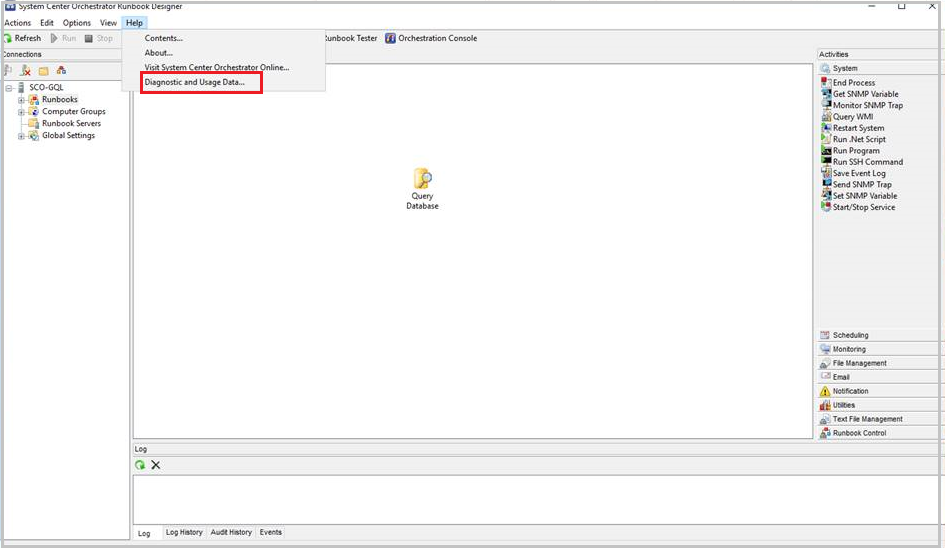
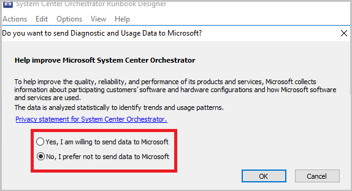

# Manage telemetry settings in Orchestrator

This article provides information about how to manage the telemetry (Diagnostics and utility data) settings in System Center - Orchestrator.

By default, Orchestrator sends diagnostic and connectivity data to Microsoft. Microsoft uses this data to provide and improve the quality, security, and integrity of Microsoft products and services.

Administrators can turn off this feature at any point of time.

## Turn on/off telemetry from console

1. In the Orchestration console > toolbar, select **Help**.

2. In the **Help** menu, select **Send diagnostic and usage data to Microsoft**.

   

3. Select the  diagnostic and usage data sharing preference from the options displayed, and select **OK**.

   

   >[!NOTE]
   >We recommend that you read the Privacy Statement before you select the option.

   -  To turn on telemetry, select **Yes, I am willing to send data to Microsoft**.
   - 	To turn off telemetry, select **No, I prefer not to send data to Microsoft**.

## Telemetry data collected

| Data related To | Data collected |
| --- | --- |
| **Installation and other configuration information** | DataBase name     Database authentication type|
| **Usage** | Number of Runbook designers    Number of folders    Number of variables    Number of schedules    Number of runbooks   Number of computer groups    	Number of integration packs      Average load per minute on runbook server    Names of integration packs    Activity name in use    Run script types |

## Next steps

[Work with runbooks in Orchestrator console](console-overview.md).
