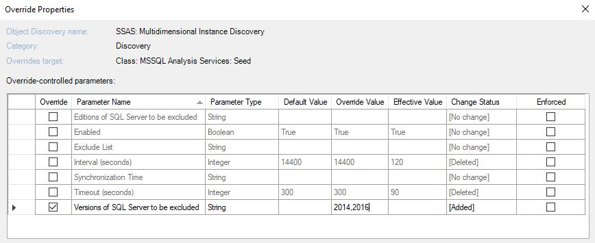
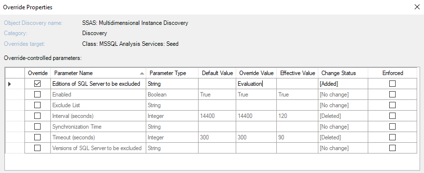

# Disable monitoring of specified SQL Servers and databases in Management Pack SQL Server Analysis Services

This section explains how to disable monitoring of SQL Servers Analysis Services and Databases.

## Disable Monitoring of Specified SQL Server Analysis Services Versions

Management Pack for SQL Server Analysis Services allows you to exclude certain versions of SQL Server Analysis Services from monitoring.

To exclude versions that you don't want to monitor, override the **Versions of SQL Server to be excluded** parameter in the **SSAS: Multidimensional Instance Discovery**, **SSAS: PowerPivot Instance Discovery**, or **SSAS: Tabular Instance Discovery** discovery with the versions that you want to exclude. Use commas to specify multiple versions.

For example, an override "2014,2016" instructs the management pack to skip instances of SQL Server Analysis Services 2014 and 2016.

## Disable Monitoring of Specified SQL Server Analysis Services Editions

Management Pack for SQL Server Analysis Services allows you to exclude certain editions of SQL Server Analysis Services instances from monitoring.

To exclude editions that you don't want to monitor, override the **Editions of SQL Server to be excluded** parameter in the **SSAS: Multidimensional Instance Discovery**, **SSAS: PowerPivot Instance Discovery**, or **SSAS: Tabular Instance Discovery** discovery with the editions that you want to exclude. Use commas to specify multiple editions.

The following table lists short names that you can use to override the **Editions of SQL Server to be excluded** parameter.

|Short Name|Covered Editions|
|-|-|
|Enterprise|Enterprise Edition, Enterprise Edition: Core-based Licensing|
|Standard|Standard Edition, Business Intelligence Edition|
|Web|Web Edition|
|Developer|Developer Edition|
|Express|Express Edition, Express Edition with Advanced Services|
|Evaluation|Enterprise Evaluation Edition|

## Disable Monitoring of Specified Databases by Name

You can disable discovery and monitoring of databases by specifying database names in the **Exclude list** parameter available in the following discoveries:

- Multidimensional DB Discovery

- Tabular DB Discovery

Use commas to separate database names and asterisks to replace one or more characters. For example, when setting the **Exclude list** parameter to dev*, \*test*, *stage, dbnotmon, the monitoring behavior would be as follows:

|DB Name|Monitored/Not monitored|
|-|-|
|dev|Not monitored|
|dev_sales|Not monitored|
|sales_dev|Monitored|
|test|Not monitored|
|test_sales|Not monitored|
|sales_test|Not monitored|
|stage|Not monitored|
|stage_dev|Monitored|
|dev_stage|Not monitored|
|dbnotmon|Not monitored|
|dbnotmon_sales|Monitored|
|sales_dbnotmon|Monitored|

If you've \* (asterisk) in the list as a database name (for example, \*temp*, \*, \*dev* or \*temp,*), it disables the monitoring of any database.
