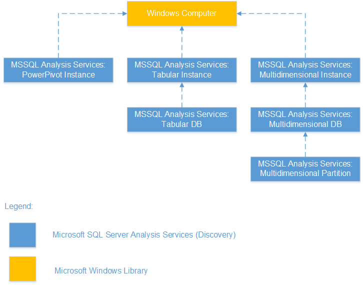

# Monitor Configuration in Management Pack for SQL Server Analysis Services

This article explains monitoring configurations in Management Pack for SQL Server Analysis Services.

A server instance of Analysis Services is a copy of the msmdsrv.exe executable that runs as an operating system service. Each instance is fully independent of other instances on the same server, having its own configuration settings, permissions, ports, startup accounts, file storage, and server mode properties.

Management Pack for SQL Server Analysis Services automatically discovers instances of SQL Server Analysis Services by implementing the following workflows:

- Reading the registry to detect if SQL Server Analysis Services is installed on the server. If installed, the management pack creates a seed object.

- If the seed object is discovered, the management pack reads such data sources as the registry, WMI, SQL Server Analysis Services configuration file, and so on, to discover instance properties and the **Seed** object.

## Discovery of SQL Server Analysis Services Instance

Analysis Services Instance includes the following server modes:

- Multidimensional mode
- Tabular mode
- Power Pivot for SharePoint mode

For comparing model features, see the [determine the Server Mode of an Analysis Services Instance](/analysis-services/instances/determine-the-server-mode-of-an-analysis-services-instance) article.

## Discovery of SQL Server Analysis Services Database

Analysis Services Database includes the following server modes:

- Multidimensional Database
  - Partition
- Tabular Database

## Instance Monitoring

The following monitors are available for the monitoring of SQL Server Analysis Services instances.

|Monitor|Description
|-|-|
|Service State|This monitor reports an alert when the Windows service for the SQL Server Analysis Services instance isn't in the running state for a period that exceeds the specified threshold.     **NOTE:** This monitor doesn't work on a clustered SQL Server Analysis Services instance.|
|Memory Configuration Conflict with SQL Server|This monitor reports an alert if there's a SQL Server relational database engine process running on the server, and the **TotalMemoryLimit** configuration for the SQL Server Analysis Services instance is higher than the specified threshold.|
|Total Memory Limit Configuration|This monitor reports an alert when the configured **TotalMemoryLimit** setting for the SQL Server Analysis Services instance exceeds the specified threshold, risking allocation of physical memory that is required for the operating system to perform basic functions (at least 2 GB).|
|Memory Usage| This monitor reports a Warning alert when memory allocations by the SQL Server Analysis Services instance exceed the configured warning threshold expressed as a percentage of the **TotalMemoryLimit** setting for the SQL Server Analysis Services instance. The monitor reports a Critical alert when these allocations exceed the configured critical threshold.|
|Memory Usage on the Server|This monitor observes the memory usage by non-SSAS processes on the server to ensure that **TotalMemoryLimit** for Analysis Services is always available.|
|Processing Pool I/O Job Queue length|This monitor reports an alert when the processing pool I/O job queue for the SQL Server Analysis Services instance exceeds the configured threshold.|
|Processing Pool Job Queue length|This monitor reports an alert when the processing pool job queue for the SQL Server Analysis Services instance exceeds the configured threshold.|
|Default Storage Free Space|This monitor reports a Warning alert when the available free space for the instance default storage drops below the **Warning Threshold** setting expressed as a percentage of the sum of estimated default storage folder (DataDir) size and free disk space. The monitor reports a Critical alert when the available space drops below **Critical Threshold**. The monitor doesn't take into account databases and partitions located in folders other than the default storage folder (DataDir).|
|CPU utilization|This monitor reports an alert if the CPU usage by the SQL Server Analysis Services process is high.|
|VertiPaq memory consumed by SSAS Instance|This monitor reports a warning when Vertipaq memory allocations by SSAS instance surpass the configured **Warning Threshold** expressed as either an absolute value in GB or a percentage of the physical memory. The monitor issues a critical alert when these allocations surpass the configured **Critical Threshold**.|
|VertiPaq memory paging indication|This monitor reports a warning when the Vertipaq memory paging usage by SSAS instance surpass the configured **Warning Threshold**, expressed as a percentage of the Vertipaq memory limit. The monitor issues a critical alert when these allocations surpass the configured **Critical Threshold** thus warning you that paging is soon to occur.|

## Database Monitoring

The following monitors are available for monitoring of SQL Server Analysis Services databases.

|Monitor|Description
|-|-|
|Database Status|This monitor checks the status of the Microsoft SQL Server Analysis Services database. Status check is done by running a query against the SQL Server Analysis Services instance database which returns the current database state.
|Database Free Space|This monitor reports a Warning alert when the available disk space for the SQL Server Analysis Services database storage folder drops below the **Warning Threshold** setting expressed as a percentage of the sum of the estimated database storage folder size and disk free space. The monitor reports a Critical alert when the available space drops below the **Critical Threshold** setting.|
|Blocking Duration|This monitor report an alert if at least one session is blocked longer than the configured threshold.|
|Blocking Session Count|This monitor alerts when the number of sessions that are blocked for a period longer than the **WaitMinutes** setting exceeds the threshold.|
|Database VertiPaq Size|This monitor reports a warning when the amount of VertiPaq memory consumed by SQL Server Analysis Services tabular databases exceeds the 'Warning Threshold' override (specified in GB). In cases when tabular databases consume more VertiPaq memory than it's allowed by the 'Critical Threshold' override, the monitor throws a critical alert.|

## Partition Monitoring

The following monitors are available for monitoring of health aspects of SQL Server Analysis Services Multidimensional Databases partitions.

|Monitor|Description
|-|-|
|Partition Storage Free Space|This monitor reports a Warning alert when the available free space for the partition storage location drops below the **Critical Threshold** setting expressed as a percentage of the sum of the total size of the folder plus disk free space. The monitor reports a Critical alert when the available space drops below the Warning threshold. The monitor doesn't monitor available space for the default storage location for the SQL Server Analysis Services instance.|

## Performance Collection Rules

Performance collection rules collect the following metrics:

- Database Disk Free Space (GB)
- Database Drive Space Used By Others (GB)
- Database Blocking Duration (minutes)
- Database Free Space (%)
- Database Free Space (GB)
- Number of Database Blocked Sessions
- Database Size (GB)
- Database Storage Folder Size (GB)
- Partition Size (GB)
- Partition Free Space (GB)
- Partition Used by Others (GB)
- Partition Free Space (%)
- Total Drive Size (GB)
- Drive Used Space (GB)
- Actual System Cache (GB)
- Instance Free Space (%)
- Instance Free Space (GB)
- Cache Evictions/sec
- Cache Inserts/sec
- Cache KB added/sec
- CPU utilization (%)
- Default Storage Folder Size (GB)
- Low Memory Limit (GB)
- Cleaner Current Price
- Memory Usage on the Server (GB)
- Memory Usage on the Server (%)
- Memory Usage by AS Non-shrinkable (GB)
- Processing Pool I/O Job Queue Length
- Processing Pool Job Queue Length
- Processing Rows read/sec
- Instance Memory (GB)
- Instance Memory (%)
- Query Pool Job Queue Length
- Storage Engine Query Rows sent/sec
- Total Memory Limit (GB)
- Total Memory on the Server (GB)
- Used Space on Drive (GB)
- Database VertiPaq Memory Size (GB)
- MDX Number of calculation covers
- MDX Total cells calculated
- MDX Total NON EMPTY for calculated members
- MDX Total NON EMPTY unoptimized
- MDX Total Recomputes
- MDX Total Sonar subcubes
- Processing Aggreagations Rows created/sec
- Indexes Processing Rows/sec
- Processing Rows written/sec
- VertiPaq Memory Limit(GB)
- VertiPaq Memory Paged (GB)
- VertiPq Nonpaged Memory (GB)

## How Health Rolls Up

The following diagram shows the rollup of the object health states.

