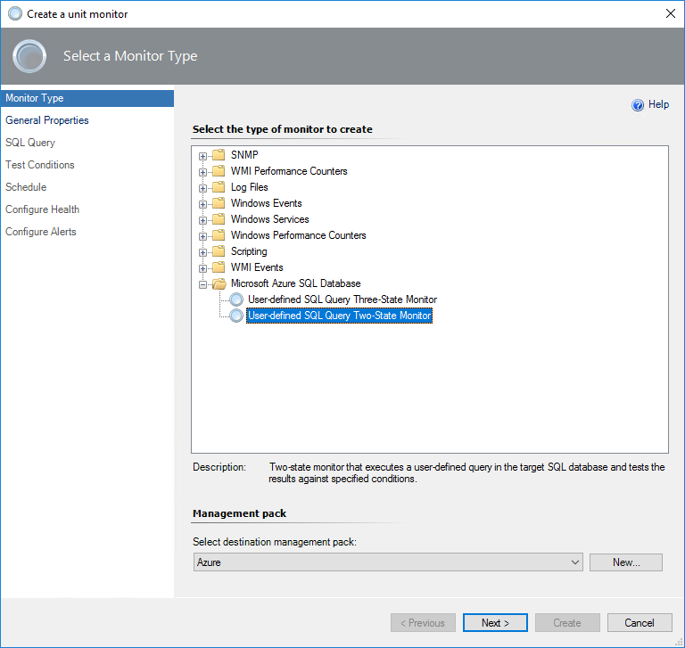
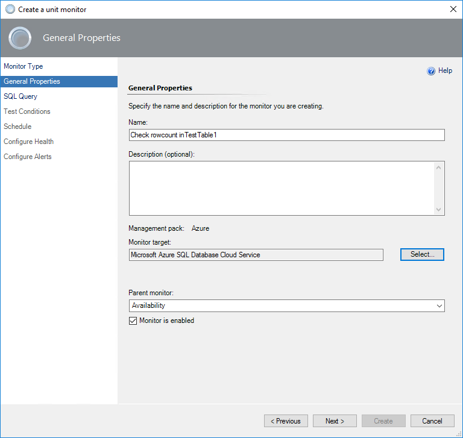
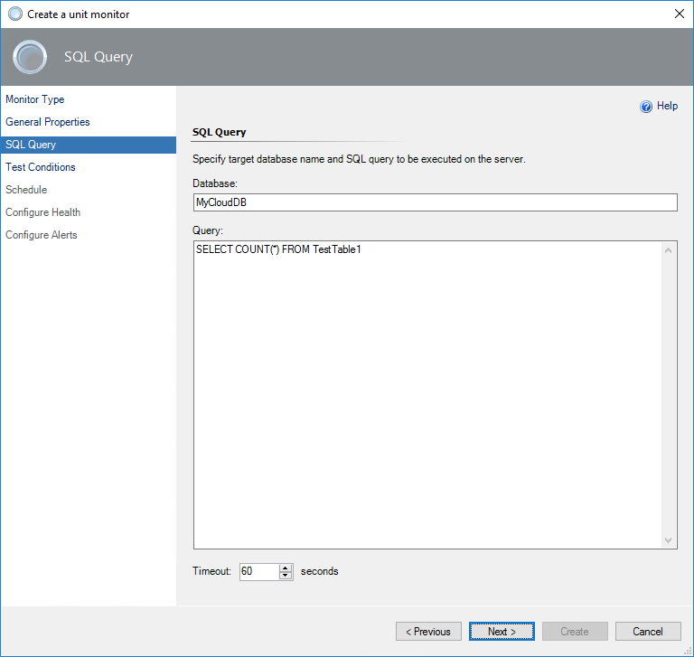
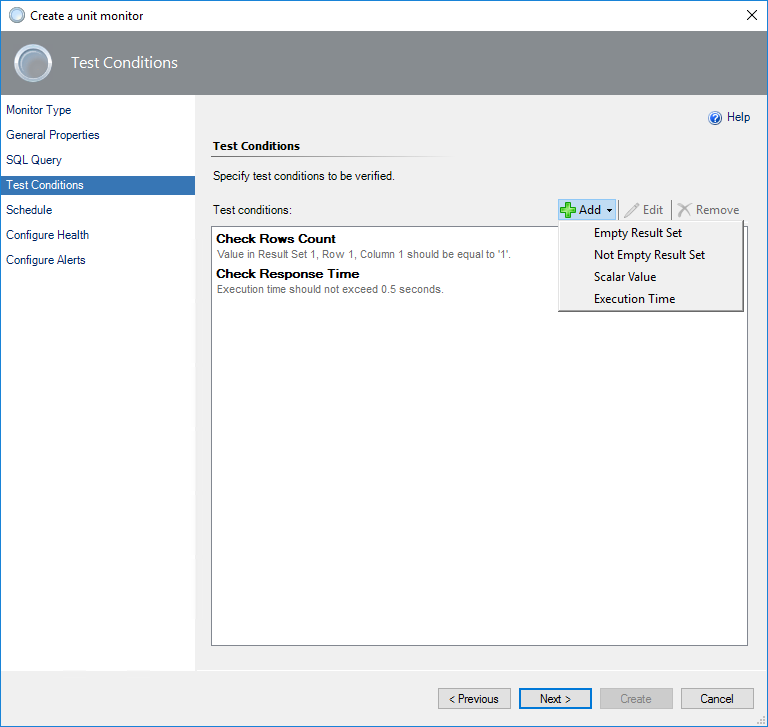
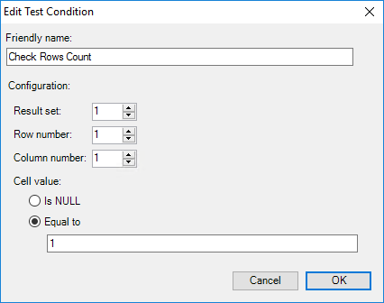
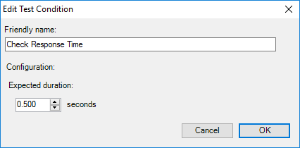
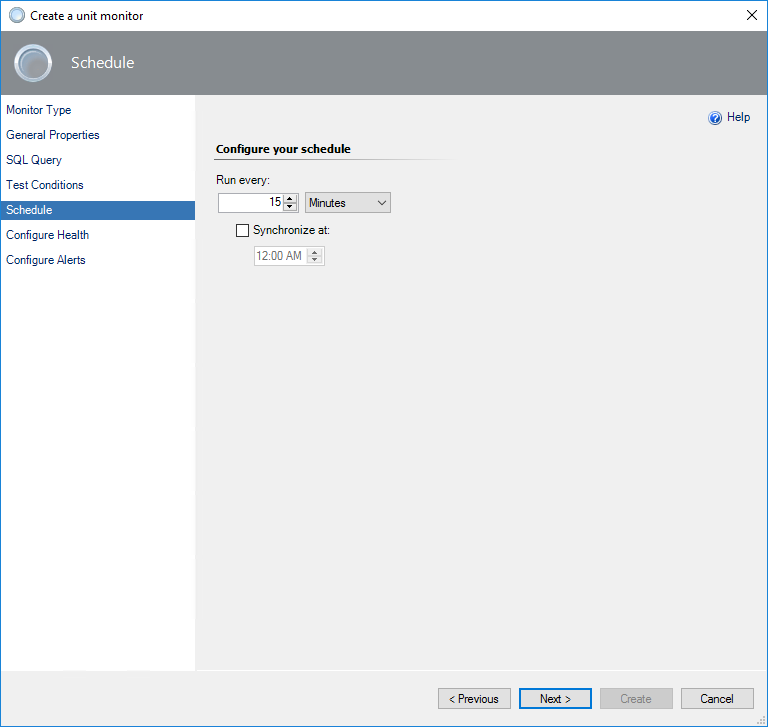
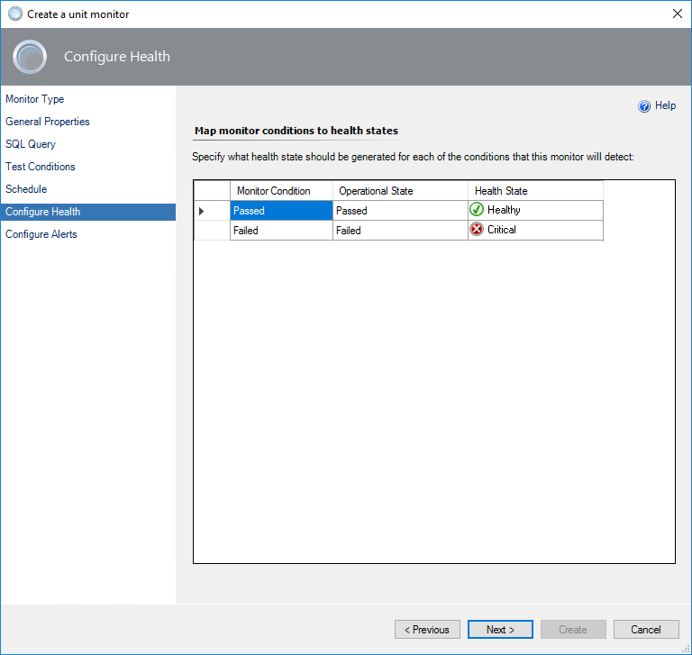
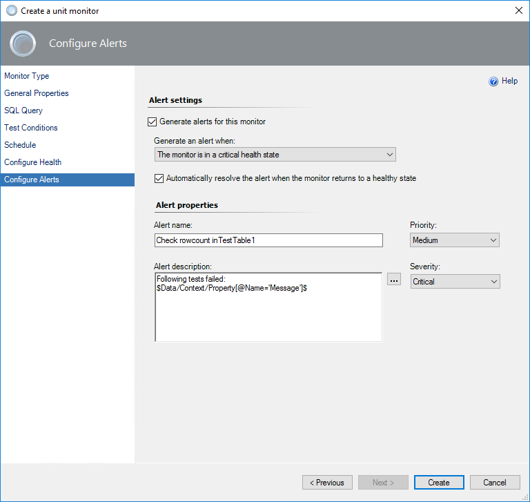
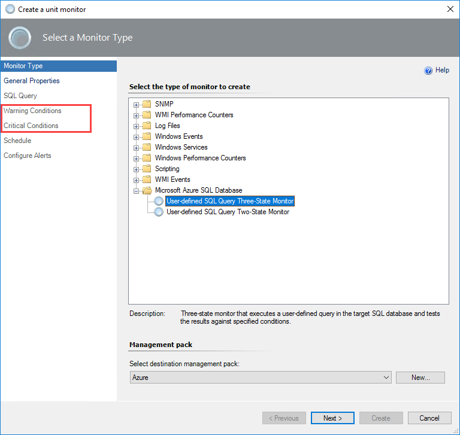

# Custom Query-Based Monitoring

In addition to standard [health and performance monitoring](asdmp-monitoring-types.md), you can configure custom query-based monitors for application-specific health states monitoring.

Management Pack for Azure SQL Database supports the following query-based monitors:

- [Two-State Query Monitor](#two-state-query-monitor)
- [Three-State Query Monitor](#three-state-query-monitor)

>[!NOTE]
>Before using custom query-based monitors, grant required permissions to your monitoring accounts. For more information, see [Azure SQL Database Run As Accounts](asdmp-run-as-accounts.md).

## Two-State Query Monitor

To add a new two-state custom query-based monitor, perform the following steps:

1. In the System Center Operations Manager console, navigate to **Authoring | Management Pack Objects**, right-click **Monitors**, and select **Create a Monitor | Unit Monitor**.

    

2. At the **Monitor Type** step, select **Microsoft Azure SQL Database | User-defined SQL Query Two State Monitor**. 

3. From the **Select destination management pack** drop-down list, select a management pack that you want to use and click **Next**.

    To create a custom query monitor for specific Azure SQL Databases, select a management pack with the template used to monitor this service. If you want to add a query to all Azure SQL Database services, you can store the monitor in any management pack.

    

4. At the **General** step, enter the monitor name and optional description, select **Monitor target** and **Parent monitor**, and click **Next**.

    If you select to save a new monitor to the management pack that contains one or more Azure SQL Database templates, you will be able to pick one of the Azure SQL Database services monitored by the templates. Otherwise, only the base **Microsoft Azure SQL Database** will be available as a target. Selecting **Microsoft Azure SQL Database Cloud Server** means that all cloud services will be using your query.

    

5. At the **SQL Query** step, enter the database name, query text, and timeout (in seconds).

    

6. At the **Test Conditions** step, add one or more **Test conditions** to verify query results.

    To add a new condition, click **Add** and select one of the available conditions:

    - **Empty Result Set**
  
      Checks if the specified result set that was returned by the query is empty.

    - **Not Empty Result Set**

      Checks if the specified result set that was returned by the query is not empty.

    - **Scalar Value**

      Checks the scalar value in the specified cell of the result set. Only equal comparison is available at this moment. If you need complex logic, you must cover that by the query.  

    - **Execution Time**

      Checks query execution duration.

    

    When you add a condition, you must specify **Friendly name** and **Configuration** required for a specific check to be performed.

    

    You can have more than one condition. It is useful to add the **Execution Time** condition to all tests to check the performance of the Azure SQL Database service. After all required conditions are set, click **Next**.

    

7. At the **Schedule** page, configure a query execution schedule.

    

8. At the **Configure Health** step, select the health state that should be generated by the monitor.

      

9. At the **Configure Alerts** step, set up an alert name and description to be shown in cases if one or more test conditions fail and click **Create**.

    Use the $Data/Context/Property[@Name=’Message’]$ placeholder to show the list of failed tests in the alert description.

    

## Three-State Query Monitor

Adding a three-state custom query-based monitor is similar to a two-state monitor. The main difference is that you must specify the **Warning** and **Critical** conditions.

Critical conditions are verified first. If one or more critical conditions fail, the monitor will switch to the critical state and warning conditions will not be verified.

