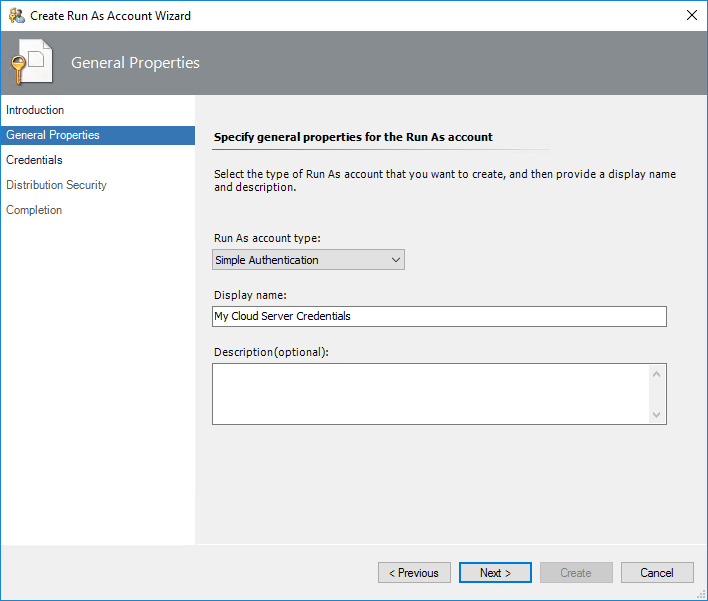
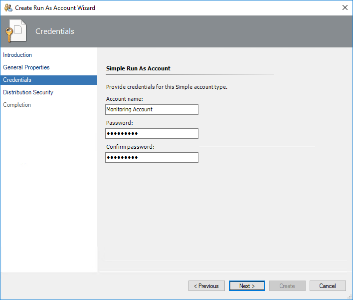
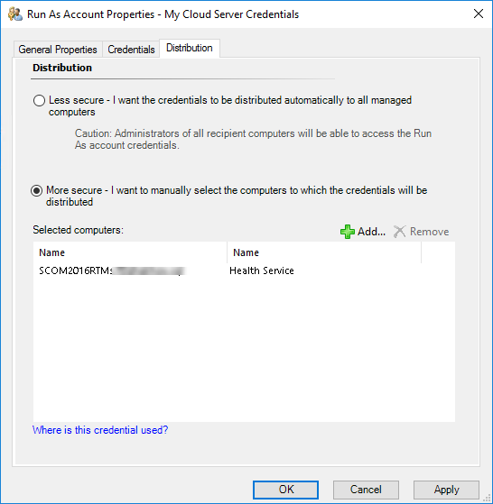

# Azure SQL Database Run As Accounts

To monitor Azure SQL Database servers, create one or more **Simple** or **Basic** Run As accounts. For more information about Run As accounts, see [Managing Run As accounts and profiles](manage-security-maintain-runas-profiles.md).

To create Run As accounts, perform the following steps:

1. In the System Center Operations Manager console, right-click the **Administration | Run As Configuration | Accounts** node, and select **Create Run As Account**.

    

2. At the **Introduction** step, click **Next**.

3. At the **General Properties** step, from the **Run As account type** drop-down list, select **Simple Authentication**, enter a display name and optional description, and click **Next**.

    

4. At the **Credentials** step, specify credentials that you want to use to connect to Azure SQL Database and click **Next**. For more information, see [Low-Privilege Configuration](asdmp-low-privilege-configuration.md).

    

5. At the **Distribution Security** step, select the **More secure** option and click **Create**.

    You can use the **Less secure** option and skip steps 7 – 8 if your environment is secure.

6. Click **Close** to close the window.

7. Right-click the newly created account and select **Properties**.

    

8. Open the **Distribution** tab and add a System Center Operations Manager agent that you want to use as a watcher node to monitor Azure SQL Database.

    

For more information about Run As accounts, see [Managing Run As Accounts and Profiles](https://docs.microsoft.com/previous-versions/system-center/system-center-2012-R2/hh212714(v=sc.12)?redirectedfrom=MSDN).
 