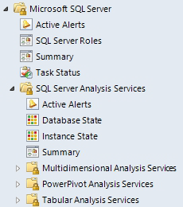

# Views and Dashboards in Management Pack for SQL Server Analysis Services

Management Pack for SQL Server Analysis Services introduces a common folder structure that will be used in future releases of management packs for different components of SQL Server.

For more information about the common folder structure, see [Views and Dashboards in Management Pack for SQL Server](ssmp-views-and-dashboards.md).

## Analysis Services Views and Dashboards

The following figure shows an example of views that are available in Management Pack for SQL Server Analysis Services.

Some of these views may consist of a very long list of objects and metrics. To find specific objects, you can use the **Scope**, **Search**, and **Find** buttons on the Operations Manager toolbar. For more information, see [Finding data and objects in the Operations Manager consoles](manage-console-finding-data.md).