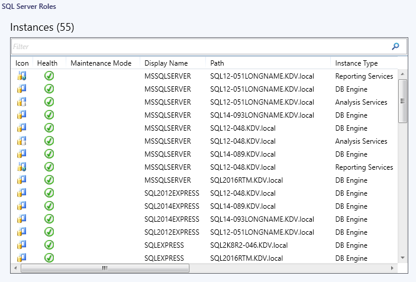

# Views and Dashboards in Management Pack for SQL Server Analysis Services

Management Pack for SQL Server Analysis Services introduces a common folder structure that will be used in future releases of management packs for different components of SQL Server.

The following views and dashboards are version-independent and show information about all versions of SQL Server.

The **Computers** view displays computers on which agents are installed and management pack discovery is running. Note that this view does not display computers configured for agentless monitoring.

The **SQL Server Roles** dashboard provides information about instances of SQL Server Database Engine, SQL Server Reporting Services, SQL Server Analysis Services and SQL Server Integration Services.

### Analysis Services Views and Dashboards

Management Pack for Microsoft SQL Server Analysis Services introduces a comprehensive set of state, performance, and alert views that can be found in the dedicated folder.

Some views may contain a very long list of objects or metrics.

To find a specific object or group of objects, you can use the **Scope**, **Search**, and **Find** buttons on the Operations Manager toolbar. For more information, see [Finding Data and Objects in the Operations Manager Consoles](https://go.microsoft.com/fwlink/?LinkId=717825).

This management pack includes a set of rich dashboards that provide detailed information about SQL Server Analysis Services (Instances) and Databases.
