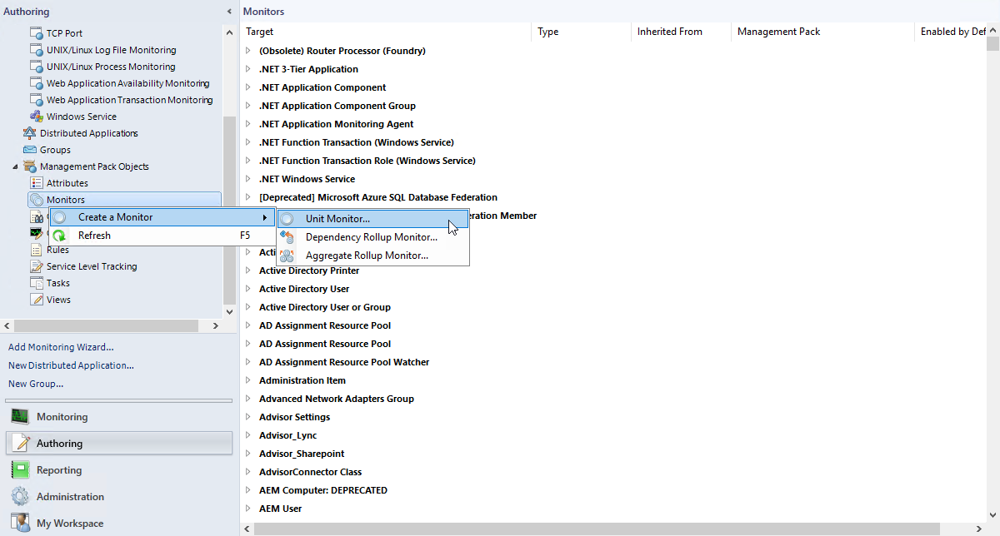
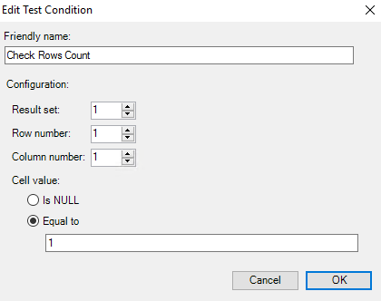
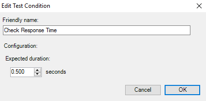
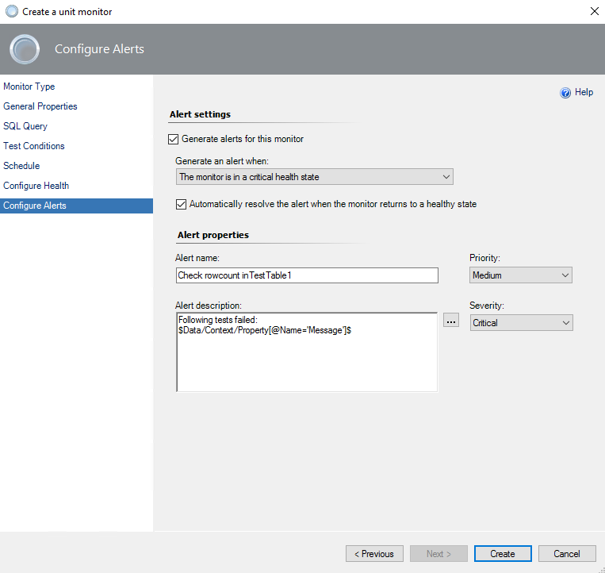
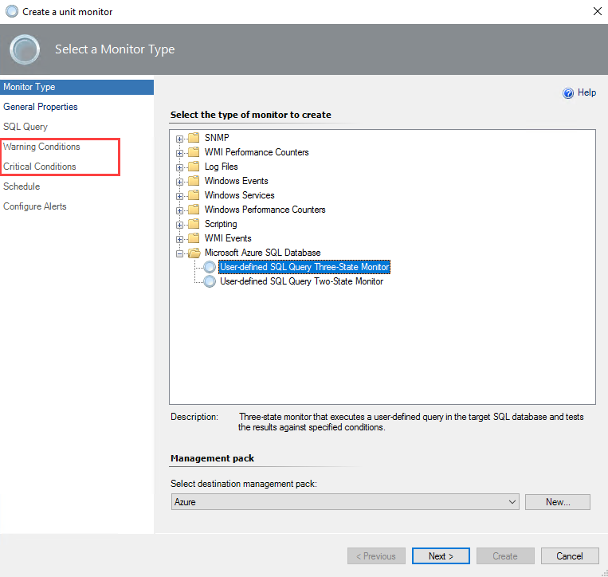

# Custom Query-Based Monitoring

In addition to the standard [health and performance monitoring](azure-sql-management-pack-monitoring-types.md), you can configure custom query-based monitors for application-specific health state monitoring.

> [!NOTE]
> Before using custom query-based monitors, grant the required permissions to your monitoring accounts. For more information, see [Azure SQL Database Run As Accounts](azure-sql-management-pack-run-as-accounts.md).

## Two-State Monitor

To add a new two-state custom query-based monitor, perform the following steps:

1. In the System Center Operations Manager console, navigate to **Authoring | Management Pack Objects**, right-click **Monitors**, and select **Create a Monitor | Unit Monitor**.

    

2. At the **Monitor Type** step, select **Microsoft Azure SQL Database | User-defined SQL Query Two State Monitor**.

3. From the **Select destination management pack** dropdown list, select a management pack that you want to use and select **Next**.

    To create a custom query monitor for specific Azure SQL Databases, select a management pack with the template used to monitor this service. If you want to add a query to all Azure SQL Database services, you can store the monitor in any management pack.

    

4. At the **General** step, enter the monitor name and optional description, select **Monitor target** and **Parent monitor**, and select **Next**.

    If you select to save a new monitor to the management pack that contains one or more Azure SQL Database templates, you'll be able to pick one of the Azure SQL Database services monitored by the templates. Otherwise, only the base **Microsoft Azure SQL Database** will be available as a target. Selecting **Microsoft Azure SQL Database Cloud Server** means that all the cloud services will be using your query.

    

5. At the **SQL Query** step, enter the database name, query text, and timeout (in seconds).

    

6. At the **Test Conditions** step, add one or more **Test conditions** to verify query results.

    To add a new condition, select **Add** and select one of the available conditions:

    - **Empty Result Set**

      Checks if the specified result set that was returned by the query is empty.

    - **Not Empty Result Set**

      Checks if the specified result set that was returned by the query isn't empty.

    - **Scalar Value**

      Checks the scalar value in the specified cell of the result set. Only equal comparison is available at this moment. If you need complex logic, you must cover that by the query.  

    - **Execution Time**

      Checks query execution duration.

    

    When you add a condition, you must specify **Friendly name** and **Configuration** required for a specific check to be performed.

    

    You can have more than one condition. It's useful to add the **Execution Time** condition to all the tests to check the performance of the Azure SQL Database service. After all the required conditions are set, select **Next**.

    

7. At the **Schedule** page, configure a query execution schedule.

    

8. At the **Configure Health** step, select the health state that should be generated by the monitor.

      

9. At the **Configure Alerts** step, set up an alert name and description to be shown in cases if one or more test conditions fail and select **Create**.

    Use the `$Data/Context/Property[@Name=’Message’]$` placeholder to show the list of failed conditions in the alert description.

    

## Three-State Monitor

Adding a three-state custom query-based monitor is similar to a two-state monitor. The main difference is that you must specify the **Warning** and **Critical** conditions.

Critical conditions are verified first. If one or more critical conditions fail, the monitor will switch to the critical state and the warning conditions won't be verified.

