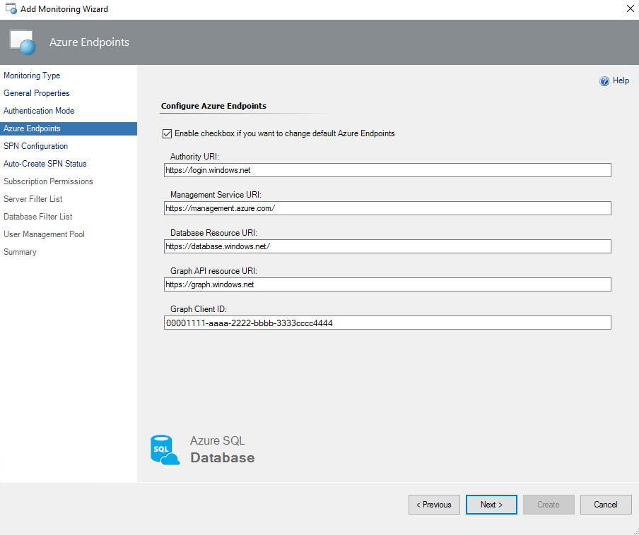
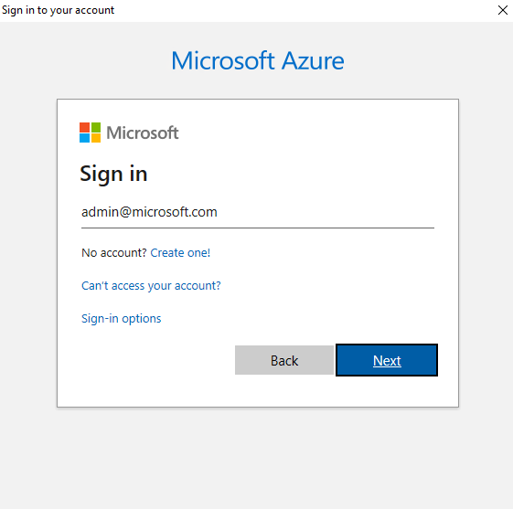
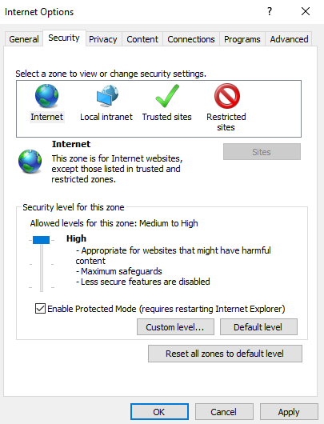
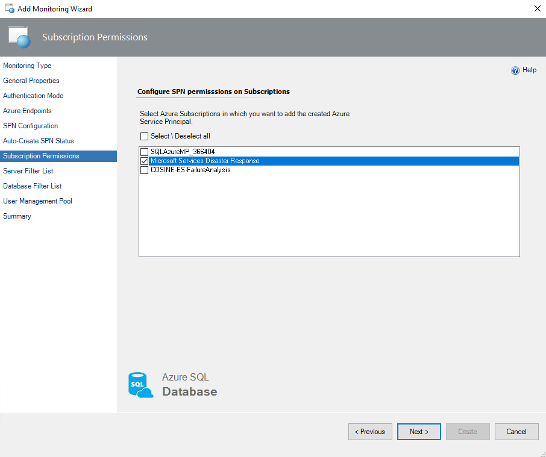
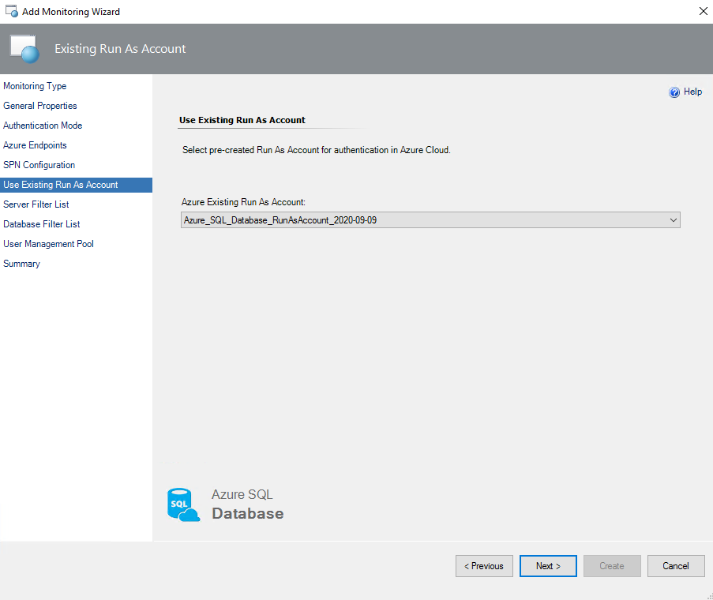
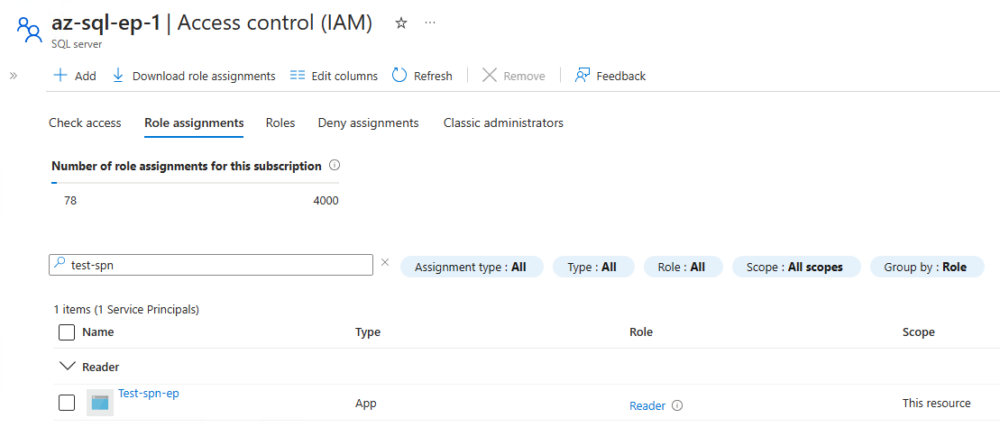
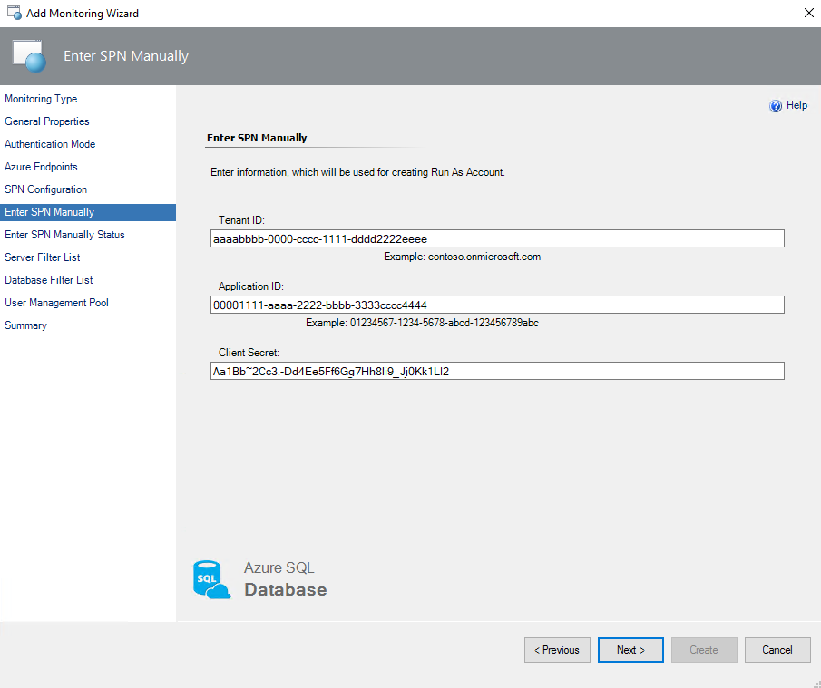
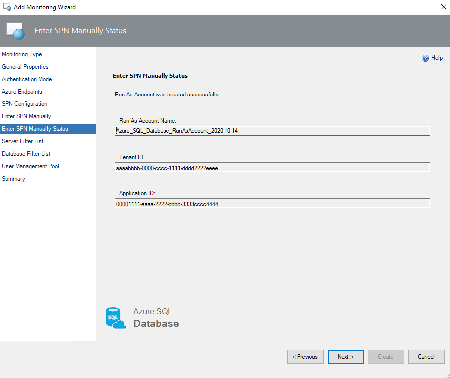
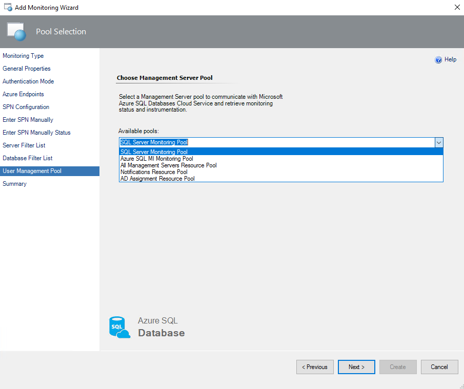

# Monitoring types

This article explains the monitoring types that are available in Management Pack for Azure SQL Database.

## Differences between Azure REST API monitoring and T-SQL monitoring

The main difference between [Azure REST API](/rest/api/azure/) monitoring and T-SQL monitoring is that in T-SQL, the entire set of workflows is available. In Azure REST API, the following workflows are not available due to API limitations:

- Rules
  - Azure SQL DB: DB Transactions Locks Count
  - Azure SQL DB: DB Sessions Count
  - Azure SQL DB: DB Sessions Average Memory Consumption (MB)
  - Azure SQL DB: DB Sessions Rows Returned
  - Azure SQL DB: DB Sessions Total CPU Time (ms)
  - Azure SQL DB: DB Sessions Total Read/Write Operations
  - Azure SQL DB: DB Sessions Total Memory Consumption (MB)
  - Azure SQL DB: DB Transactions Max Log Usage (MB)
  - Azure SQL DB: DB Transactions Max Running Time (minutes)
  - Azure SQL DB: DB Blocked by Firewall Count
  - Azure SQL DB: DB Failed Connections Count
  - Azure SQL DB: DB Successful Connections Count
  - Azure SQL DB: DB Deadlocks Count
- Monitors
  - Transaction Locks Count
  - Sessions Count
  - Sessions Average Memory
  - Sessions Rows Returned
  - Sessions Total CPU Time
  - Sessions Total I/O
  - Sessions Total Memory
  - Transaction Log Space Used
  - Transaction Execution Time
  - Count of Failed Connection
  - Count of connections blocked by the Firewall

To make these workflows available in Azure REST API, select the **Use T-SQL monitoring** checkbox and run the required T-SQL scripts that are described in [Configure Azure REST API monitoring](#configure-azure-rest-api-monitoring).

> [!NOTE]
> To connect System Center Operations Manager to Azure resources, your server must have TLS 1.2 enabled. Check the protocol status by using [TLS 1.2 enforcement for Azure AD Connect](/azure/active-directory/hybrid/reference-connect-tls-enforcement#powershell-script-to-check-tls-12).

## Configure Azure REST API monitoring

Azure REST API monitoring provides a wide range of monitoring targets.

When you use the Azure REST API, the Azure SQL Database Management Pack uses an Azure AD application (that is, a service principal name) for authentication in Azure AD. The service principal name (SPN) gives access to the Azure Resource Management API. The account that you use must have either the Owner role (or greater) or any of the following roles:

- Active Directory Administrator
- Service Administrator or Co-Administrator

For more information, see [Use the portal to create an Azure AD application and service principal that can access resources](/azure/active-directory/develop/howto-create-service-principal-portal).

To monitor Azure SQL Database instances by using the Azure REST API:

1. In the System Center Operations Manager console, go to **Authoring** > **Management Pack Templates**. Rght-click **Azure SQL Database Monitoring** and select **Add Monitoring Wizard**.

     

1. For **Monitoring Type**, select **Azure SQL Database Monitoring**, and then select **Next**.

   

1. For **General Properties**, enter a new name and description. For **Select destination management pack**, select a management pack to use to store the template.  

   To create a new management pack, select **New**, and follow the instructions in the wizard.

   

1. For **Authentication Mode**, select **Azure Service Principal Name**.

   

1. For **Azure Endpoints**, select the **Enable checkbox if you want to change default Azure Endpoints** checkbox and modify the default Azure endpoints if required.

   Here are the default endpoints for creating the Azure SPN:

   - Authority URI: `https://login.windows.net`

   - Management Service URI: `https://management.azure.com`

     As described in [Ports beyond 1433 for ADO.NET 4.5](/azure/sql-database/sql-database-develop-direct-route-ports-adonet-v12), the firewall port should be port 1433. This endpoint is also used for Azure REST API.

   - Database Resource URI: `https://database.windows.net`

   - Graph API Resource URI: `https://graph.windows.net`

   

1. For **SPN Configuration**, select the **Auto-Create SPN** SPN configuration:

   - **Auto-Create SPN**: Select this option if you want the Azure SPN to be created automatically by the Azure SQL MP library by using the Azure REST API. With this option selected, a new Run As account is created that uses the specified Azure SPN.

   - **Use Existing Run As Profile**: Select this option if you want to use your own Azure SPN.

   - **Enter SPN Manually**: Select this option if you already configured a Run As profile (for example, by using PowerShell) that has Azure SPN credentials.

   For more information about any of these options and to learn how to neutralize Azure subscription throttling effects, select the **Use T-SQL for monitoring** checkbox and see [Differences between Azure REST API monitoring and T-SQL monitoring](#differences-between-azure-rest-api-monitoring-and-t-sql-monitoring).

### Auto-create an SPN


If you select the **Auto-Create SPN** option, the **Microsoft Azure sign-in** panen appears. In this window, enter your work, school, or personal Microsoft account credentials, select **Next**, and complete the form.



At this step, you might receive internet security alerts. To resolve the alerts, go to **Internet Properties**, select the **Security** tab, and then set a lower internet zone security level.



When the Azure AD application is successfully created, authentication information appears at the **Auto-Create SPN Status** step.

> [!TIP]
> This information is available only once. Be sure to save this information to a secure location to use it later.


At the **Subscription Permissions** step, select Azure subscriptions to which you want to add the created Azure SPN.



### Use an existing Run As profile

To use an existing Run As profile, at the **SPN Configuration** step, select the **Use Existing Run As Profile** option, select **Next**, and then select an existing Run As account that's associated with an Azure SPN. This account is used for authentication in Azure Cloud Services.



### Enter the SPN manually

To register the application and create the SPN manually by using the Azure portal, see [Create an Azure AD application and service principal that can access resources](/azure/active-directory/develop/howto-create-service-principal-portal).

> [!TIP]
> You can skip the web URI redirection. The parameter is not needed for monitoring.

In the Azure portal, on the **IAM Access** pane, assign the Reader role to the SPN for the respective Azure SQL DB server. The role assignment flow is similar to the flow that is described in [Grant a user access to Azure resources by using the Azure portal](/azure/role-based-access-control/quickstart-assign-role-user-portal#grant-access).



For **SPN Configuration**, select the **Enter SPN Manually** option, and then select **Next**. Enter this information for your Azure SPN:

- **Tenant ID**: The directory (tenant) ID from the SPN overview section.
- **Application ID**: The application (client) ID from the SPN overview section.
- **Client Secret**: The client secret value for the specific SPN.

> [!NOTE]
> The client secret value is visible only once after you create it. Copy the value to a secure location for reuse.

The information is used to create a new Run As account for authentication in Azure Cloud Services.



If necessary, you can create and configure a new Microsoft Entra ID application and Azure SPN by using [Azure PowerShell](/powershell/azure/?preserve-view=true&view=azps-2.8.0). For more information, see [Use Azure PowerShell to create a service principal with a certificate](/azure/active-directory/develop/howto-authenticate-service-principal-powershell).

When you create a Run As account at the **Enter SPN Manually Status** step, review the status, and then select **Next**.



1. *Optionally* At the **Server Filter List** step, select the filtering mode, which can be either **Exclude** or **Include**. Select the filtering masks type, which can be either **Wildcard** or **Regular Expression**. Enter filtering masks, which should match SQL Server names that you want to exclude from or include in the monitoring list. Then select **Add** > **Next**.

   The **Wildcard** filtering mask type can contain only a server name. The value can contain only lowercase letters, numbers, and the `-` character, but it can't start with or end with the `\` character, and it can't contain more than 63 characters. A server exclude list filter mask ignores whitespaces.

   

   The **Regular Expression** filtering mask type supports .NET regular expression patterns.

   

   If you want to remove an existing mask, select the mask type, and then select **Delete**.  

1. *Optionally* At the **Database Filter List** step, select the filtering mode, which can be either **Exclude** or **Include**. Select the filtering masks type, which can be either **Wildcard** or **Regular Expression**. Enter filtering masks, which should match database names that you want to exclude from or include in the monitoring list. Then select **Add** > **Next**.

   The **Wildcard** filtering mask type can't end with `.` or space characters, can't contain `<`, `>`, `%`, `&`, `:`, `\`, `/`, `?' or control characters, and can't have more than 128 characters.

   

   For example, if you select the **Exclude** option and set the *dev**, *\*test\**,**stage*, and *dbnotmon* masks, the monitoring behavior is as described in the following table:

   |DB name|Monitored or Not monitored|
   |-|-|
   |dev|Not monitored|
   |dev_sales|Not monitored|
   |sales_dev|Monitored|
   |test|Not monitored|
   |test_sales|Not monitored|
   |sales_test|Not monitored|
   |stage|Not monitored|
   |stage_dev|Monitored|
   |dev_stage|Not monitored|
   |dbnotmon|Not monitored|
   |dbnotmon_sales|Monitored|
   |sales_dbnotmon|Monitored|

   **Regular Expression** filtering mask type supports .NET regular expression patterns.

   

   To remove an existing mask, select the mark, and then select **Delete**.

1. For **User Management Pool**, select a pool that has management servers, and then select **Next**.

   

1. For **Summary**, review the connection settings, and then select **Create**.

   

1. To perform T-SQL monitoring when you use Azure SPN, create a separate user for every monitored database. Grant the user the dbmanager role by executing the following queries:

   ```SQL
   /*Run this on [master] database.
   Replace the 'ApplicationName' parameter with that specified in the Application Name field. See figure above.*/
   CREATE USER [ApplicationName] FROM EXTERNAL PROVIDER;
   exec sp_addrolemember 'dbmanager', 'ApplicationName';

   /*Run this on all [user] databases.
   Replace the 'ApplicationName' parameter with that specified in the Application Name field. See figure above.*/
   CREATE USER [ApplicationName] FROM EXTERNAL PROVIDER;
   GRANT VIEW DATABASE STATE TO [ApplicationName];
   ```

   To run these queries in SQL Server Management Studio, connect to the Azure SQL Server instance as Active Directory Administrator.

   After you assign permissions to the Azure SPN on each database, T-SQL monitoring should work properly in REST and T-SQL mode.

   For proper T-SQL monitoring of georeplicas, grant the SQL Administrator right on each replica server.

## Configure T-SQL monitoring

T-SQL is intended to monitor specific Azure SQL Database servers. When you select this mode, the monitoring workflows, including discoveries, rules, and monitors, use T-SQL queries in data sources.

> [!NOTE]
> Each workflow data source creates a new SQL connection for every pair of SQL Server credentials (username and password). SQL connections are counted for database transaction units and affect billing. For more information, see [Resource limits for Azure SQL Database and Azure Synapse Analytics servers](/azure/sql-database/sql-database-resource-limits-database-server).

To begin monitoring Azure SQL Database instances by using T-SQL queries:

1. In the System Center Operations Manager console, go to **Authoring** > **Management Pack Templates**. Right-click **Azure SQL Database Monitoring** and select **Add Monitoring Wizard**.

   

1. On **Select Monitoring Type**, select **Azure SQL Database Monitoring**, and then select **Next**.

   

1. On **General Properties**, enter a new name and description. For **Select destination management pack**, select a management pack to store the template.  

   For **Management pack**, to create a new management pack, select **New** and follow the instructions in the wizard.

   

1. On **Authentication Mode**, select **SQL Server**.

   

1. On **What to Monitor**, select **Add Server**.

   

1. On **Server Configuration**, for **Server Name**, enter the name of the Azure SQL Database server that you want to monitor, select a Run As account that's associated with the SQL Server credentials, and then select **OK**. The [serveradmin](/sql/relational-databases/security/authentication-access/server-level-roles#fixed-server-level-roles) role is required.

   

   If you want to create a new Run As account, select **New**, and then enter a new Run As account name and credentials for the SQL Server instance that you want to monitor.

   For more information on how to create a new SQL Server authentication login, see [Authorize database access to SQL Database, SQL Managed Instance, and Azure Synapse Analytics](/azure/sql-database/sql-database-manage-logins).

1. Select **Next**.

1. *Optionally* At the **Database Filter List** step, select the filtering mode, which can be either **Exclude** or **Include**. Select a filtering mask type, which can be either **Wildcard** or **Regular Expression**. Enter filtering masks, which should match database names that you want to exclude from or include in the monitoring list. Select **Add**, and then select **Next**.

   **Wildcard** filtering mask type can't end with `.` or space characters, can't contain `<`, `>`, `%`, `&`, `:`, `\`, `/`, `?' or control characters, and can't have more than 128 characters.

   

   For example, if you select the **Exclude** option and set the *dev**, *\*test\**,**stage*, and *dbnotmon* masks, the monitoring behavior is as described in the following table:

   |DB name|Monitored or Not monitored|
   |-|-|
   |dev|Not monitored|
   |dev_sales|Not monitored|
   |sales_dev|Monitored|
   |test|Not monitored|
   |test_sales|Not monitored|
   |sales_test|Not monitored|
   |stage|Not monitored|
   |stage_dev|Monitored|
   |dev_stage|Not monitored|
   |dbnotmon|Not monitored|
   |dbnotmon_sales|Monitored|
   |sales_dbnotmon|Monitored|

   The **Regular Expression** filtering mask type supports .NET regular expression patterns.

   

   If you want to remove an existing mask, select the mask name, and then select **Delete**.

1. For **User Management Pool**, select a pool that has management servers, and then select **Next**.

   

1. For **Summary**, review the connection settings, and then select **Create**.

## Related content

- [Custom query-based monitoring](azure-sql-management-pack-custom-query-monitoring.md)
