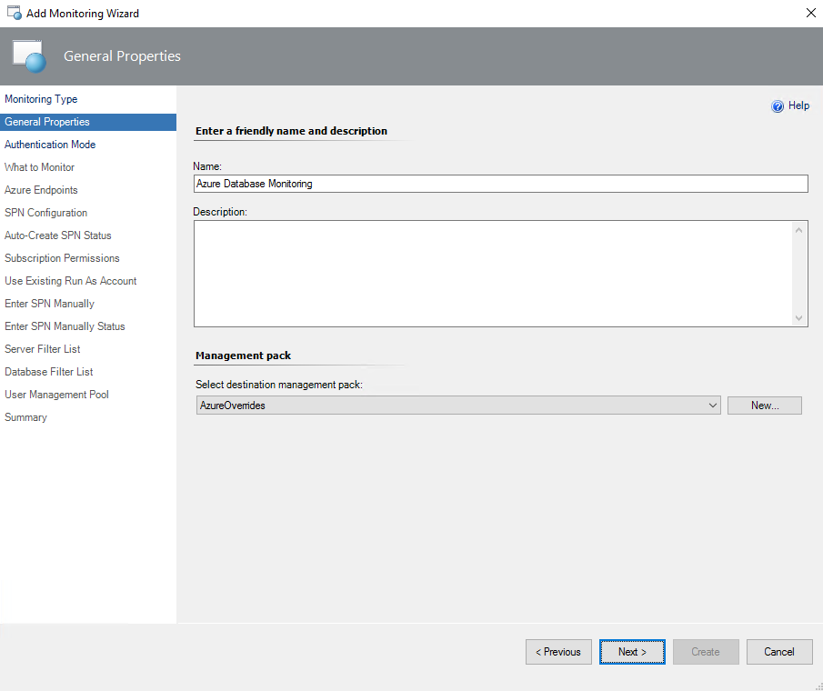
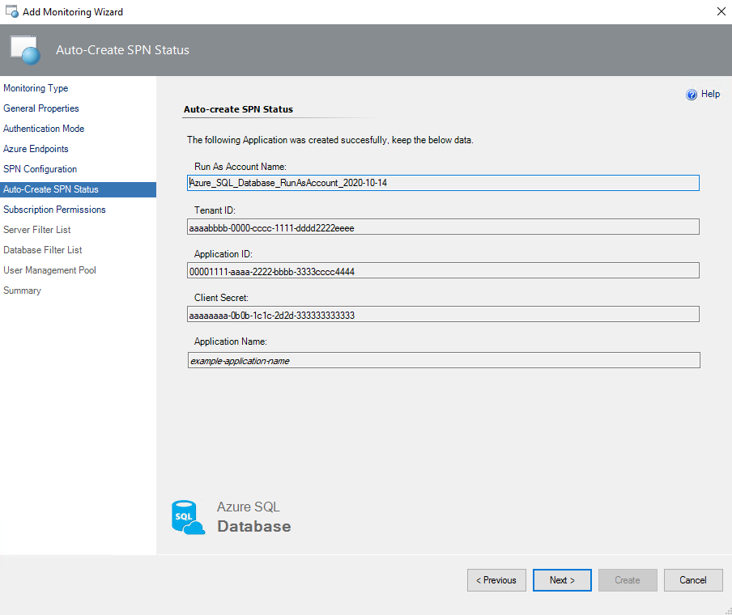
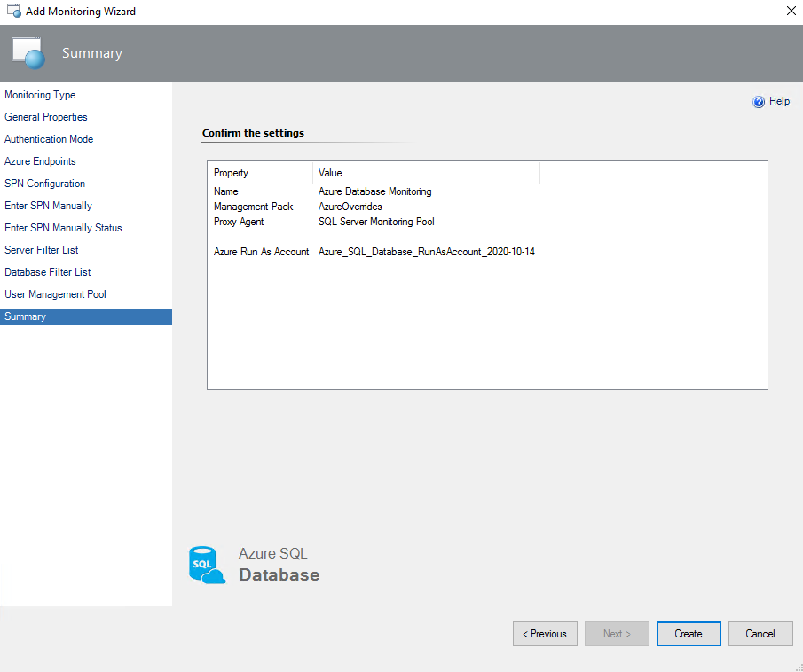
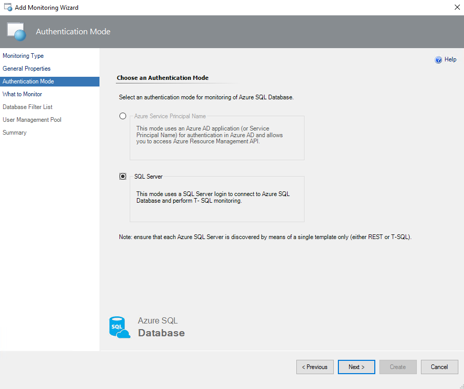
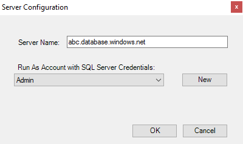
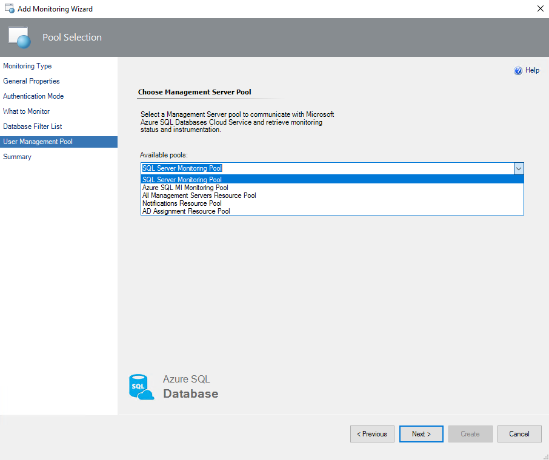

# Monitoring types

This article explains monitoring types that are available in Management Pack for Azure SQL Database.

## Differences between Azure REST API monitoring and T-SQL monitoring

The main difference between [Azure REST API](/rest/api/azure/) monitoring and T-SQL monitoring is that in T-SQL, the entire set of workflows is available. In Azure REST API, the following workflows are not available due to API limitations:

- Rules
  - Azure SQL DB: DB Transactions Locks Count
  - Azure SQL DB: DB Sessions Count
  - Azure SQL DB: DB Sessions Average Memory Consumption (MB)
  - Azure SQL DB: DB Sessions Rows Returned
  - Azure SQL DB: DB Sessions Total CPU Time (ms)
  - Azure SQL DB: DB Sessions Total Read/Write Operations
  - Azure SQL DB: DB Sessions Total Memory Consumption (MB)
  - Azure SQL DB: DB Transactions Max Log Usage (MB)
  - Azure SQL DB: DB Transactions Max Running Time (minutes)
  - Azure SQL DB: DB Blocked by Firewall Count
  - Azure SQL DB: DB Failed Connections Count
  - Azure SQL DB: DB Successful Connections Count
  - Azure SQL DB: DB Deadlocks Count
- Monitors
  - Transaction Locks Count
  - Sessions Count
  - Sessions Average Memory
  - Sessions Rows Returned
  - Sessions Total CPU Time
  - Sessions Total I/O
  - Sessions Total Memory
  - Transaction Log Space Used
  - Transaction Execution Time
  - Count of Failed Connection
  - Count of connections blocked by the Firewall

To make these workflows available in Azure REST API, select the **Use T-SQL monitoring** checkbox and run the required T-SQL scripts that are described in [Configure Azure REST API monitoring](#configure-azure-rest-api-monitoring).

> [!NOTE]
> To connect System Center Operations Manager to Azure resources, your server must have TLS 1.2 enabled. Check the protocol status by using [TLS 1.2 enforcement for Azure AD Connect](/azure/active-directory/hybrid/reference-connect-tls-enforcement#powershell-script-to-check-tls-12).

## Configure Azure REST API monitoring

Azure REST API monitoring provides a wide range of monitoring targets.

When you use the Azure REST API, the Azure SQL Database Management Pack utilizes an Azure AD application (that is, Service Principal Name) for authentication in Azure AD, which gives access to the Azure Resource Management API. The account that you use must have either the **Owner** role (or higher) or any of the following roles:

- **Active Directory Administrator**
- **Service Administrator** or **Co-Administrator**

For more information, see [Use the portal to create an Azure AD application and service principal that can access resources](/azure/active-directory/develop/howto-create-service-principal-portal).

To monitor Azure SQL Database instances by using the Azure REST API:

1. In the System Center Operations Manager console, go to **Authoring** > **Management Pack Templates**. Rght-click **Azure SQL Database Monitoring** and select **Add Monitoring Wizard**.

     

1. On **Monitoring Type**, select **Azure SQL Database Monitoring**, and then select **Next**.

   

1. At the **General Properties** step, enter a new name and description, and from the **Select destination management pack** dropdown list, select a management pack that you want to use to store the template.  

   To create a new management pack, select **New**, and follow the instructions of the wizard.

   

1. At the **Authentication Mode** step, select **Azure Service Principal Name**.

   

1. At the **Azure Endpoints** step, select the **Enable checkbox if you want to change default Azure Endpoints** checkbox and modify the default Azure endpoints if required.

   The default endpoints for creating Azure Service Principal Name are as follows:

   - Authority URI: `https://login.windows.net`

   - Management Service URI: `https://management.azure.com`

     According to [Ports beyond 1433 for ADO.NET 4.5](/azure/sql-database/sql-database-develop-direct-route-ports-adonet-v12), should be used the Firewall port 1433. This endpoint is also used for Azure REST API.

   - Database Resource URI: `https://database.windows.net`

   - Graph API Resource URI: `https://graph.windows.net`

   

1. At the **SPN Configuration** step, select the **Auto-Create SPN** SPN configuration:

   - **Auto-Create SPN**

     Select this option if you want Azure Service Principal Name to be created automatically by the Azure SQL MP library using the Azure REST API. With this option selected, a new Run As Account is created with the specified Azure Service Principal Name.

   - **Use Existing Run As Profile**

     Select this option if you want to use your own Azure Service Principal Name.

   - **Enter SPN Manually**

     Select this option if you've already configured a Run As Profile (for example, in PowerShell) with the appropriate Azure Service Principal Name credentials.

     For more information about any of these options and to learn how to neutralize Azure subscription throttling effects, select the **Use T-SQL for monitoring** checkbox and see [Differences between Azure REST API monitoring and T-SQL monitoring](#differences-between-azure-rest-api-monitoring-and-t-sql-monitoring).

### Auto-Create SPN


If you select the **Auto-Create SPN** option, the **Microsoft Azure sign-in** window appears. In this window, enter your work, school, or personal Microsoft account credentials, select **Next**, and complete the form.


At this step, you might receive internet security alerts. To solve this, open **Internet Properties**, go to the **Security** tab, and lower the internet zone security level.


Upon the successful creation of the Azure AD application, at the **Auto-Create SPN Status** step, authentication information will be displayed.

> [!TIP]
> This information is available only once. Ensure to save this information to a secure location for reuse.



At the **Subscription Permissions** step, select Azure subscriptions to which you want to add the created Azure Service Principal Name.


### Use existing Run As Profile

To use an existing Run As Profile, at the **SPN Configuration** step, select the **Use Existing Run As Profile** option, select **Next**, and select an existing Run As Account associated with Azure Service Principal Name. This account will be used for authentication in Azure Cloud.


### Enter SPN manually

Follow the steps to register the application and create SPN manually using the Azure portal to [create an Azure AD application and service principal that can access resources](/azure/active-directory/develop/howto-create-service-principal-portal).

> [!TIP]
> You can skip the Web URI redirection. The parameter is not needed for monitoring.

Assign the **Reader** role to SPN in the IAM Access pane for the respective Azure SQL DB server in the Azure portal. Role assignment flow is like [Grant a user access to Azure resources using the Azure portal](/azure/role-based-access-control/quickstart-assign-role-user-portal#grant-access).


At the **SPN Configuration** step, select the **Enter SPN Manually** option for this case, select **Next**, and provide the required information about your Azure Service Principal Name:

- Tenant ID – Directory (tenant) ID from SPN overview section.
- Application ID – Application (client) ID from SPN overview section.
- Client Secret – Client Secret Value for the specific SPN.

> [!NOTE]
> The Client Secret Value is available only once after creation. Copy this information to a secure location for reuse.

This information is used to create a new Run As Account for authentication in Azure Cloud.


If necessary, you can create and configure a new Microsoft Entra ID application and Azure Service Principal Name by using [Azure PowerShell](/powershell/azure/?preserve-view=true&view=azps-2.8.0). For more information, see [How to: Use Azure PowerShell to create a service principal with a certificate](/azure/active-directory/develop/howto-authenticate-service-principal-powershell).

After a new Run As Account is created, at the **Enter SPN Manually Status** step, review the status and select **Next**.


1. [Optionally] At the **Server Filter List** step, select filtering mode, which can be either **Exclude** or **Include**, and select filtering masks type, which can be either **Wildcard** or **Regular Expression**, enter filtering masks that should match SQL Server names that you want to exclude from or include to the monitoring list, select **Add**, and select **Next**.

   **Wildcard** filtering mask type can contain a server name only lowercase letters, numbers, and the '-' character, but can't start from or end with the '\\' character or contain more than 63 characters. A server exclude list filter mask ignores whitespaces.

   

   **Regular Expression** filtering mask type supports .NET regular expression patterns.

   

   If you want to remove an existing mask, select it and select **Delete**.  

1. [Optionally] At the **Database Filter List** step, select filtering mode, which can be either **Exclude** or **Include**, and select filtering masks type, which can be either **Wildcard** or **Regular Expression**, enter filtering masks that should match database names that you want to exclude from or include to the monitoring list, select **Add**, and select **Next**.

   **Wildcard** filtering mask type can't end with '.' or ' ' characters, contain '<,>,%,&,:,\\,/,?' or control characters, and can't have more than 128 characters.

   

   For example, if you select the **Exclude** option and set the *dev**, *\*test\**,**stageand*, *dbnotmon* masks, the monitoring behavior would be as follows:

   |DB Name|Monitored or Not monitored|
   |-|-|
   |dev|Not monitored|
   |dev_sales|Not monitored|
   |sales_dev|Monitored|
   |test|Not monitored|
   |test_sales|Not monitored|
   |sales_test|Not monitored|
   |stage|Not monitored|
   |stage_dev|Monitored|
   |dev_stage|Not monitored|
   |dbnotmon|Not monitored|
   |dbnotmon_sales|Monitored|
   |sales_dbnotmon|Monitored|

   **Regular Expression** filtering mask type supports .NET regular expression patterns.

   

   If you want to remove an existing mask, select the mark, and then select **Delete**.

1. At the **User Management Pool** step, select a pool with management servers and select **Next**.

   

1. At the **Summary** step, review connection settings and select **Create**.

   

1. To perform T-SQL monitoring when you use Azure Service Principal Name, create a separate user for every monitored database and grant this user the **dbmanager** role by executing the following queries:

   ```SQL
   /*Run this on [master] database.
   Replace the 'ApplicationName' parameter with that specified in the Application Name field. See figure above.*/
   CREATE USER [ApplicationName] FROM EXTERNAL PROVIDER;
   exec sp_addrolemember 'dbmanager', 'ApplicationName';

   /*Run this on all [user] databases.
   Replace the 'ApplicationName' parameter with that specified in the Application Name field. See figure above.*/
   CREATE USER [ApplicationName] FROM EXTERNAL PROVIDER;
   GRANT VIEW DATABASE STATE TO [ApplicationName];
   ```

   To run these queries in SQL Server Management Studio, connect to the Azure SQL Server as **Active Directory Administrator**.

   After you assign permissions to Azure Service Principal Name on each database, T-SQL monitoring should work properly in REST+T-SQL mode.

   For proper T-SQL monitoring of geo replicas, grant the **SQL Administrator** right on each replica server.

## Configure T-SQL monitoring

T-SQL is intended to monitor specific Azure SQL Database servers. When you select this mode, the monitoring workflows, including discoveries, rules, and monitors, use T-SQL queries in data sources.

> [!NOTE]
> Each workflow data source creates a new SQL connection for every pair of SQL Server credentials (username and password). SQL connections are counted for database transaction units and affect billing. For more information, see [Resource limits for Azure SQL Database and Azure Synapse Analytics servers](/azure/sql-database/sql-database-resource-limits-database-server).

To begin monitoring of Azure SQL Database instances by using T-SQL queries:

1. In the System Center Operations Manager console, go to **Authoring** > **Management Pack Templates**. Right-click **Azure SQL Database Monitoring** and select **Add Monitoring Wizard**.

   

1. On **Select Monitoring Type**, select **Azure SQL Database Monitoring**, and then select **Next**.

   

1. On **General Properties**, enter a new name and description. For **Select destination management pack**, select a management pack to store the template.  

   For **Management pack**, to create a new management pack, select **New** and follow the instructions in the wizard.

   

1. On **Authentication Mode**, select **SQL Server**.

   

1. On **What to Monitor**, select **Add Server**.

   

1. On **Server Configuration**, for **Server Name**, enter a name of the Azure SQL Database server that you want to monitor, select a Run As Account associated with the SQL Server credentials, and select **OK**. The [serveradmin](/sql/relational-databases/security/authentication-access/server-level-roles#fixed-server-level-roles) role is required.

   

   If you want to create a new Run As Account, select **New** and enter a new Run As Account name and credentials for the SQL server that you want to monitor.

   For more information on how to create a new SQL Server authentication login, see [Authorize database access to SQL Database, SQL Managed Instance, and Azure Synapse Analytics](/azure/sql-database/sql-database-manage-logins).

1. Select **Next**.

1. [Optionally] At the **Database Filter List** step, select filtering mode, which can be either **Exclude** or **Include**, and select filtering masks type, which can be either **Wildcard** or **Regular Expression**, enter filtering masks that should match database names that you want to exclude from or include to the monitoring list, select **Add**, and select **Next**.

   **Wildcard** filtering mask type can't end with '.' or ' ' characters, contain '<,>,%,&,:,\\,/,?' or control characters, and can't have more than 128 characters.

   

   For example, if you select the **Exclude** option and set the *dev**, *\*test\**,**stageand*, *dbnotmon* masks, the monitoring behavior would be as follows:

   |DB Name|Monitored or Not monitored|
   |-|-|
   |dev|Not monitored|
   |dev_sales|Not monitored|
   |sales_dev|Monitored|
   |test|Not monitored|
   |test_sales|Not monitored|
   |sales_test|Not monitored|
   |stage|Not monitored|
   |stage_dev|Monitored|
   |dev_stage|Not monitored|
   |dbnotmon|Not monitored|
   |dbnotmon_sales|Monitored|
   |sales_dbnotmon|Monitored|

   **Regular Expression** filtering mask type supports .NET regular expression patterns.

   

   If you want to remove an existing mask, select it and select **Delete**.

1. At the **User Management Pool** step, select a pool that has management servers, and then select **Next**.

   

1. At the **Summary** step, review connection settings, and then select **Create**.

## Related content

- [Custom query-based monitoring](azure-sql-management-pack-custom-query-monitoring.md)
