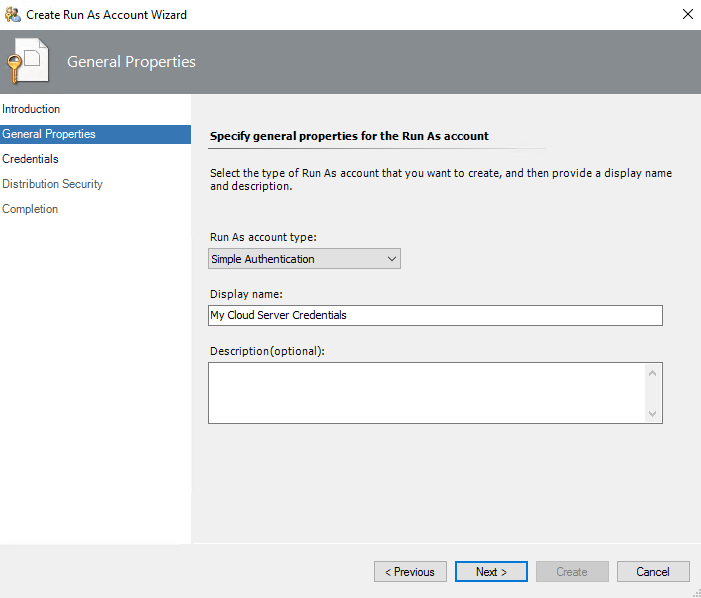
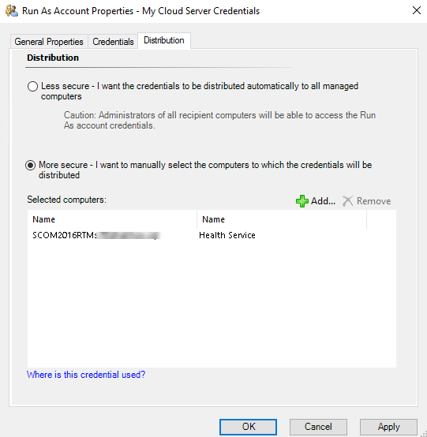

# Azure SQL Database Run As Accounts

This article describes how to configure Azure SQL Database run as accounts in Management Pack for Azure SQL Database.

To monitor Azure SQL Database servers, create one or more **Simple** or **Basic** Run As accounts. For more information about Run As accounts, see [Manage Run As accounts and profiles](manage-security-maintain-runas-profiles.md).

To create Run As accounts, follow these steps:

1. In the System Center Operations Manager console, right-click the **Administration | Run As Configuration | Accounts** node, and select **Create Run As Account**.

    

2. At the **Introduction** step, select **Next**.

3. At the **General Properties** step, from the **Run As account type** dropdown list, select **Simple Authentication**, enter a display name and optional description, and select **Next**.

    

4. At the **Credentials** step, specify the credentials that you want to use to connect to Azure SQL Database and select **Next**. For more information, see [Low-Privilege Configuration](azure-sql-management-pack-low-privilege-configuration.md).

    

5. At the **Distribution Security** step, select the **More secure** option and select **Create**.

    You can use the **Less secure** option and skip steps 7 – 8 if your environment is secure.

6. Select **Close** to close the window.

7. Right-click the newly created account and select **Properties**.

    

8. Open the **Distribution** tab and add a System Center Operations Manager agent that you want to use as a watcher node to monitor Azure SQL Database.

    
