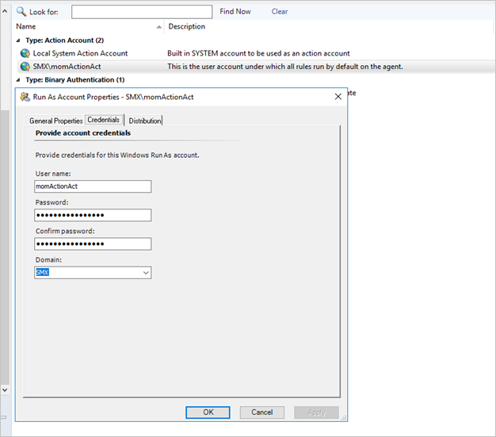
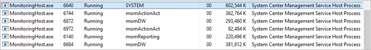
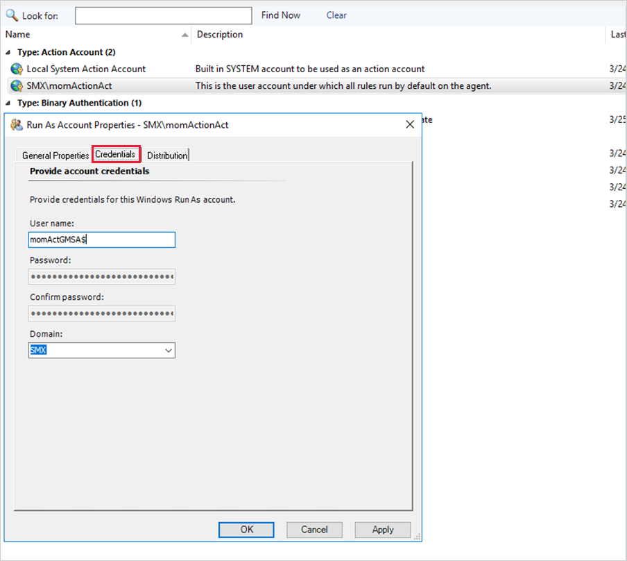
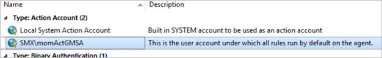
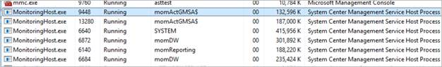
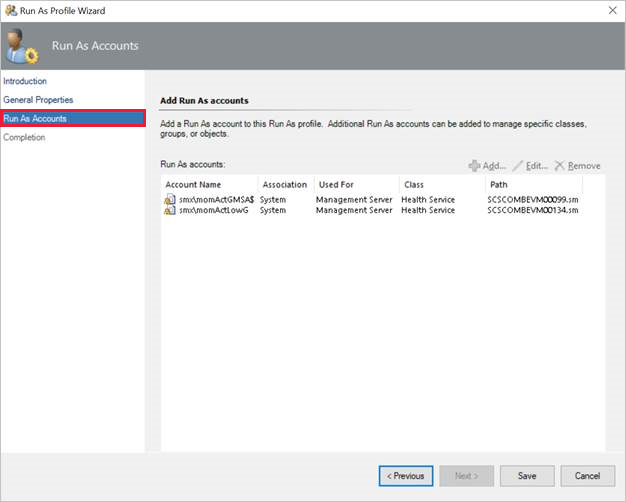
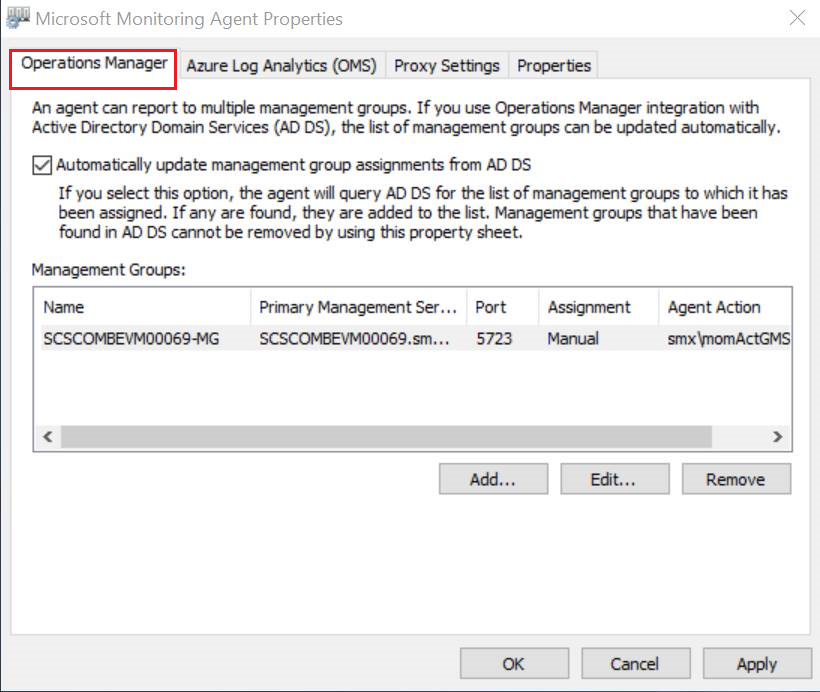
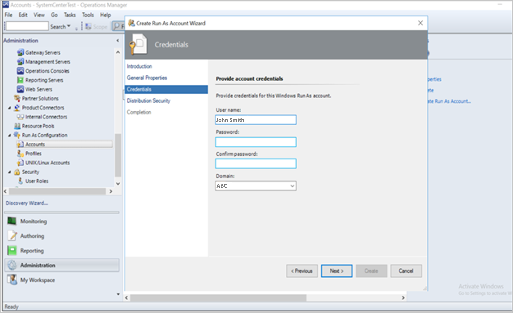

# Console-level changes for group Managed Service Accounts (gMSAs)

This article describes the console-level changes that are required to use group Managed Service Accounts (gMSAs).

::: moniker range="sc-om-2019"

>[!NOTE]
>This article applies to Operations Manager 2019 Update Rollup 1 (UR1) and later.

::: moniker-end

## Change the credentials for Action accounts

In the Operations Manager console, go to **Administration** \> **Run-as configuration** \> **accounts**. Do the following actions for the accounts specified.

### Default Action account

The following images show the default **Action** account.

Change the credentials of the default **Action** account to **gMSA**.

 Validate that *MonitoringHost.exe* runs as gMSA.

### Default Action account Run As profile

 Change the default **Action** account Run As profile to use the **gMSA** Run As default **Action** accounts.

 

## Microsoft Monitoring Agent

To alter the agent **Action** account in the Microsoft Monitoring Agent, change the credentials from the target agent computer, as shown.

### Create Run As accounts

When you create a new Run As account, enter the gMSA in the **User name** box followed by **$**. Don't enter a password. Continue to create the Run As account.

### Discovery and push installation of the agent

When a gMSA is provided during the discovery process, leave the **Password** box blank when you add **$** at the end of the user name. The agent should install without issues on the target computers.

## Known issue and resolution

Post migration to gMSA, you might encounter an error when you export a report in Word, PowerPoint, or Excel format. This error is observed for SQL Server Reporting Services on SQL Server 2017.

This error appears to be a persistent issue with SQL Server Reporting Services in SQL Server 2017. To resolve it, follow these steps.

  1. Grant admin access to the **Execution** account on the report server.
  1. Restart SQL Server Reporting Services, and wait for 5 minutes.
  1. Try to export the reports again.
