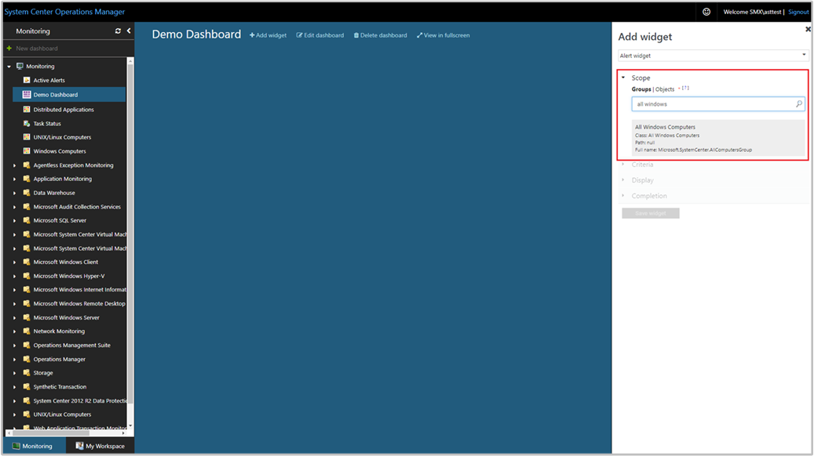
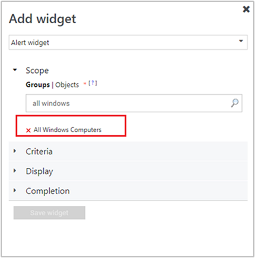
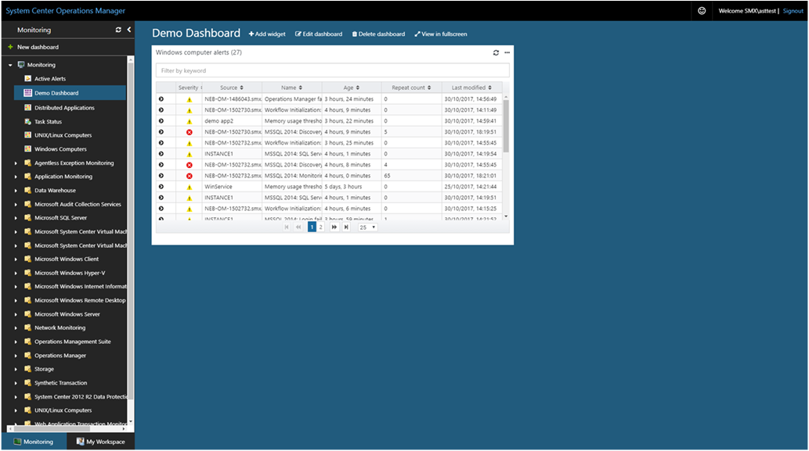

# How to create an Alert dashboard in the new web console
In System Center Operations Manager, the web console provides a monitoring interface for a management group that can be opened on any computer using any browser that has connectivity to the Web console server. The following steps describe how to create an alert dashboard in the new HTML5 web console.

1. Open a web browser on any computer and enter `http://<web host>/OperationsManager`, where *web host* is the name of the computer hosting the web console. 
2. From the left pane in the Web console, click **+ New dashboard**.    
3. On the **Create New Dashboard** page, provide a name and description for the dashboard you want to create.     
4. You can save the dashboard in an existing unsealed management pack by selecting the management pack from the **Management Pack** drop-down list or you can save the dashboard by creating a new management pack by clicking **New** next to the **Management Pack** drop-down list and provide a name, description and optionally a version number.       
5. When you have completed specifying where to save the new dashboard to, click **OK**.
6. Click **Save** after providing a name and description for the new dashboard. 
7. On the blank empty dashboard, you see the dashboard name, **Add Widget**, **Edit Dashboard**, **Delete dashboard** and **View in fullscreen** options on the top of the page.     
8. Select **Alert Widget** from the **Select Widget** drop-down list.
9. In the Alert widget pane, select scope for the alert widget by clicking either **Groups** or **Objects**.
10. Search for the desired scope in the search box and press **Enter**. A result set for the desired search query will be returned, select the scope from the returned results.    
11. Set the criteria to identify the alerts to display.  To narrow the results, you can filter by selecting the following:
   * Severity
   * Priority
   * Resolution state
   * Alert age

    Data matching the defined criteria will only be displayed in the widget.    
  
12. Select **Display** to choose the columns to be displayed in the dashboard.  You can select or search for the columns from the drop-down list.  
13. Complete the configuration by providing a **Name**, **Description** and **Widget reefresh interval** (default interval is 5 minutes) for the widget.  Click **Save Widget** to save your new dashboard.  

After the Alert widget has been created, it displays alerts based on the scope and criteria defined. You see the name of the alert widget along with the number of alerts in the header of widget. Alerts can also be filtered in the widget by searching for a keyword in the Filter box.   

 