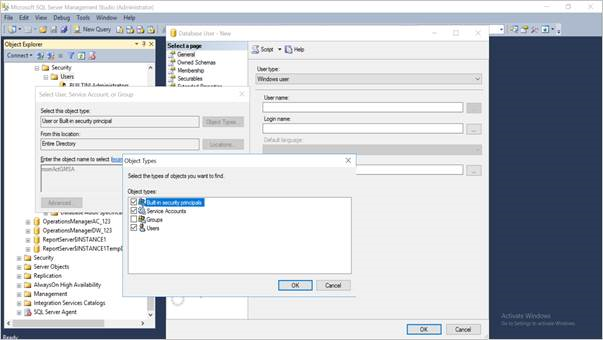
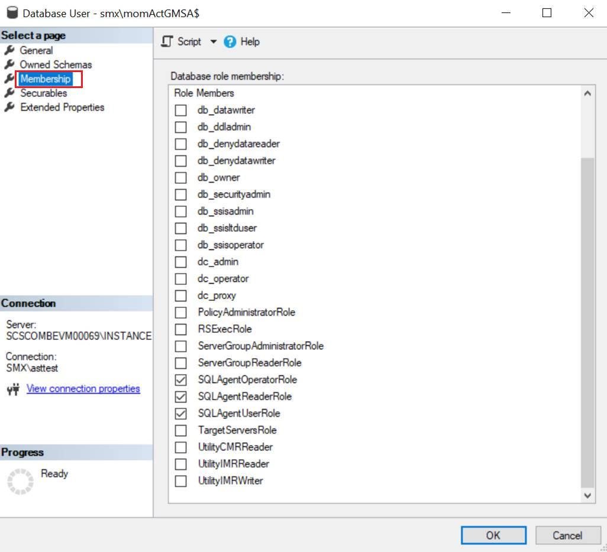

# Change databases

This article provides information on how to create users, assign roles, and membership to group Managed Service Accounts (gMSAs).

::: moniker range="sc-om-2019"

>[!NOTE]
>This article applies to Operations Manager 2019 Update Rollup 1 (UR1) and later.

::: moniker-end

These roles are similar to the roles created for non-gMSA accounts.

>[!NOTE]
>For all gMSA accounts used, you'll also need to create the accounts under the **Security** > **Logins** of the SQL instance directly, and not only under each individual DB. Without this, the other permissions won't take effect as the initial sign in is at the instance level.

## Action account

**System databases: msdb**

1. In the SQL Server Management Studio, go to **Databases** \> **System Databases** \> **msdb** \> **Security** \> **Users**.

1. Create a new user.

1. Select **Windows user** in the **User type** box.

1. Select **Entire Directory** in the **From the location** box. Select **Service Accounts** in the **Object types** box.

    

1. Check names for *momActGMSA*, which is an example gMSA for the Action account, in the directory.
Because *momActGMSA* is an example, use the name of the gMSA that you intend to use as the Action account.

   

1. Assign the following roles for the Action account:

   - SQLAgentOperatorRole
   - SQLAgentReaderRole
   - SQLAgentUserRole

   

Follow steps 1 to 5 from the previous procedure. Assign the roles by using the information in this table.

| Account Type | Database | Roles |
|---|---|---|
| **Action account** |  |  |
|  | Operations Manager DB | db\_datareader, db\_datawriter, db\_ddladmin, dbmodule\_users |
| **Data Access Service account** |  |  |
|  | Systems Database: msdb for Operations Manager DB | SQLAgentOperatorRole, SQLAgentReaderRole, SQLAgentUserRole, db_owner |
|  | Operations Manager DB | ConfigService, db\_accessadmin, db\_datareader,  db\_datawriter, db\_ddladmin, db\_securityadmin, sdk\_users, sql\_dependency\_subscriber |
|  | Operations Manager DW | apm\_datareader, db\_datareader, OpsMgrReader |
| **Data Writer account** |  |  |
|  | Operations Manager DB | apm\_datareader, apm\_datawriter,  db\_datareader, dwsynch\_users |
|  | Operations Manager DW | apm\_datareader, apm_datawriter, db\_owner, OpsMgrWriter |
| **Data Reader account** |  |  |
|  | System Databases: master DB | RSExecRole |
|  | System Databases: msdb for Operations Manager DW | RSExecRole, SQLAgentOperatorRole,  SQLAgentReaderRole, SQLAgentUserRole |
|  | Operations Manager DW | apm\_datareader, db\_datareader, OpsMgrReader |
|  | Report Server Database | db\_owner,  RSExecRole |
|  | Report Server Temp Database | db\_owner, RSExecRole |

## Next steps

[Service-level changes](service-level-changes.md)
