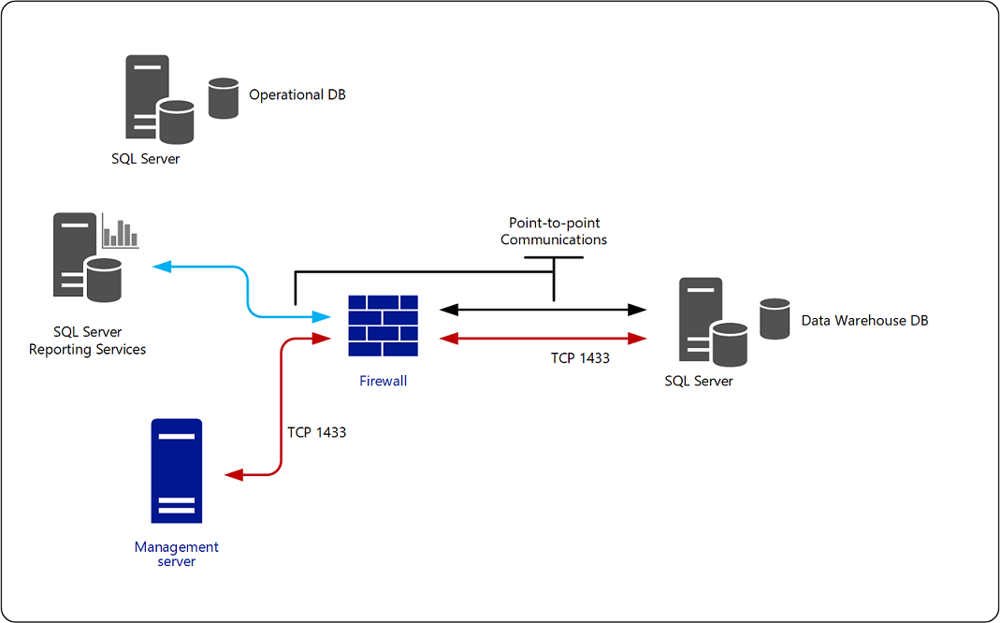

---
ms.assetid:
title: Connect Reporting Data Warehouse across a Firewall
description: This article describes how to configure a System Center Operations Manager Report server behind a firewall.
author: Jeronika-MS
ms.author: v-gajeronika
ms.date: 04/17/2025
ms.custom: UpdateFrequency2, engagement-fy24
ms.service: system-center
ms.subservice: operations-manager
ms.topic: how-to
---

# Connect to the Reporting Data Warehouse across a Firewall

This article describes how to configure your environment to support placing the Report data warehouse behind a firewall for System Center Operations Manager.

In an environment where the Reporting data warehouse is separated from the management server and Reporting server by a firewall, Windows Integrated Authentication can't be used. You need to configure SQL Server Authentication. The following sections explain how to enable SQL Server Authentication between the management server, the Reporting server, and the Reporting data warehouse, as shown in the following illustration:   

## Management Server and Reporting Data Warehouse

The following steps are necessary to enable SQL Server Authentication:

1. On the computer hosting the Reporting data warehouse, create a SQL Server sign-in in the proper role for reader and writer. The credentials you supply for this account must be made a member of the following roles in the data warehouse database on the computer running SQL Server:
   a. OpsMgrWriter  
   b. db_owner (only for the owning management group in the database)  

2. On the computer hosting the management server, create a Run As Account (of type Simple) with the credentials from the previous step.  
3. Associate this Run As Account with the Run As Profile called Data Warehouse SQL Server Authentication Account, targeting this Run As Profile to each management server. For more information, see [How to Change the Run As Account Associated with a Run As Profile] in this guide.

If there's a firewall between the management server and the Reporting data warehouse, you'll have to open port 1433.

## Reporting Server and Reporting Data Warehouse

If there's a firewall or trust boundary between the Reporting Server and the Reporting data warehouse, point-to-point communications will need to be established.  

The account that was specified as the Data Reader Account during setup of Reporting becomes the Execution Account on Reporting Server, and it's this account that will be used to connect to the Reporting data warehouse.

Identify what port number the computer running SQL Server on the Reporting data warehouse is using, and enter this number into the **dbo.MT_DataWarehouse** table in the Operations Manager database. See the article, [How to Configure the Reporting Data Warehouse to Listen on a Specific TCP IP Port](manage-sqlserver-communication.md#configure-settings-for-the-data-warehouse-database).

## Reporting Server and Management Server Separated by a Firewall

A "Could not verify if current user is in sysadmin Role" error message might display when installing the Reporting server role if the reporting server and the management server are separated by a firewall. This error message might display even if the proper firewall ports have been opened. This error occurs after entering the computer name for the management server and selecting **Next**. This error might also display because Reporting Setup was unable to connect to the operational database. In this environment, determine what port number the SQL Server instance is using and configure the Operations Manager database to use the port number. See the article, [How to Configure the Operations Manager Database to Listen on a Specific TCP IP Port](manage-sqlserver-communication.md#configure-settings-for-the-operational-database).

## Next steps

* To understand the different types of reports that are available and their purpose, review the list of [reports installed with Operations Manager](manage-reports-installed-during-setup.md).

* To understand how to preview your reports, save them with specific report parameters to minimize repeated entry of information or to simplify the experience for your report users, and how to export the report to different file formats, review [How to Run, Save, and Export a Report](manage-reports-run-save-export.md).
