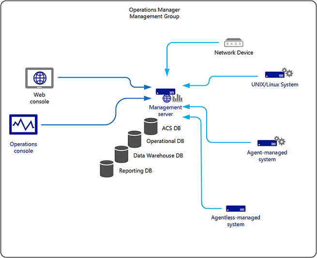

# Single server deployment of Operations Manager

>Applies To: System Center 2016 - Operations Manager

The single server management group scenario combines all the management group roles that can coexist onto a single server running as a member server in an Active Directory domain. This instance can be on dedicated hardware or on a virtual computer. You can deploy the Operations console to computers other than the single server, and access the web console  with a browser.

You deploy Operations Manager in a single-server management group when you want to use it for evaluation, testing, and management pack development, usually in a lab, development, or non-production environment.

## Operations Manager services

The single server management group configuration supports the following services:

1.  Monitoring and alerting

2.  Reporting (available in the Operations console but not in the web console)

3.  Audit collection

4.  Agent-less exception management

5.  Data (accessed by using the web console and the Operations console)

## Operations Manager features

The single server management group configuration combines these features:

-   Audit Collection Services (ACS) collector

-   ACS database

-   ACS forwarder

-   Operational database

-   Operations console

-   Reporting data warehouse database

-   Reporting database

-   Reporting server

-   Web console server

-   Command Shell

## Restrictions

The single server management group configuration is the easiest to deploy, but there are limitations to its capabilities and therefore limitations to what it is commonly used for.

### Gateway server

This configuration does not include the gateway server role. Because of this, all monitored devices must be in the same Active Directory forest as the management server or you must use certificates on both the managed computer and the management server to provide for mutual authentication.

### High availability and redundancy

The single server, single management group resides on a single set of hardware or virtual machine. This configuration supports only one instance of each server role and therefore does not support agent failover between management servers.

## Common Uses

This configuration is most commonly used for evaluation, testing, and management pack development purposes, usually in non-production or pre-production environments. Single-server management group configurations generally lack the robustness and performance to support anything but the smallest production loads.

## Ports Used

In this configuration, you need to make sure that network ports are opened for communication between the agents and the management server, between the Operations console and the management server, and between the Web console and the management server. All other inter-service communication occurs on the management server itself. The ports are as follows:

-   Operations console to management server: TCP 5724

-   Operations console to Reporting server: TCP 80

-   Web console to Web console server: TCP 51908 is the default port when you select Windows Authentication.  If you chose Forms Authentication, the port will be user-defined.  

-   Agent to management server: TCP 5723

-   ACS forwarder to ACS collector: TCP 51909

-   Agentless management: occurs over remote procedure call (RPC) dynamic port

-   Management server to UNIX\Linux computer: TCP 1270

-   Management server to UNIX\Linux computer for special discovery and troubleshooting: TCP 22

For a complete listing of ports used, the direction of the communication, and if the ports can be configured, see [Configuring a Firewall for Operations Manager](plan-security-config-firewall.md).

## Next steps

- To deploy Operations Manager in a single server management group, see [Walkthrough: Installing Operations Manager on a Single Server](quickstart-install-single-server.md).

