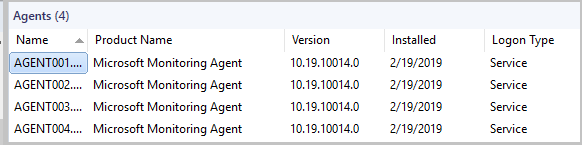
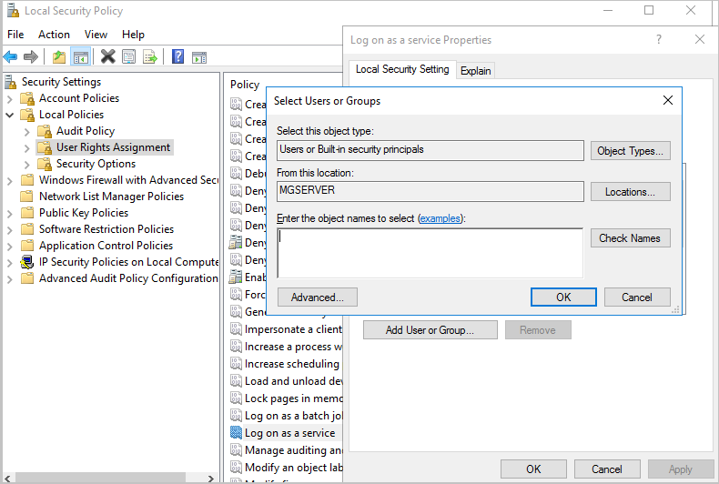

# Enable Service Log on for run as accounts

Security best practice is to disable interactive and remote interactive sessions for service accounts. Security teams across organizations have strict controls to enforce this best practice to prevent theft of credentials and associated attacks.

System Center Operations Manager supports hardening of service accounts and doesn't require granting the *Allow log on locally* user right for several accounts required in support of Operations Manager.

Earlier version of Operations Managers has *Allow log on locally* as the default log on type. Operations Manager uses *Service Log on* by default. This leads to the following changes:

-	Health service uses log on type **Service** by default. For Operations Manager 2016 version, it was **Interactive**.
-	Operations Manager action accounts and service accounts now have **Log on as a Service** permission.
-	Action accounts and Run As accounts must have **Log on as a Service** permission to execute MonitoringHost.exe. [Learn more](plan-security-accounts.md).

## Changes to Operations Manager action accounts

 The following accounts are granted **Log on as a Service** permission during the Operations Manager installation and during upgrade from the previous versions:

- Management Server Action account
- System Center configuration service and System Center data access service accounts  
- Agent action account
- Data Warehouse Write account
- Data Reader account

    

After this change, any **Run As accounts** created by Operations Manager administrators for the management packs (MPs) require the **Log on as a Service** right, which administrators should grant.

## View log on type for management servers and agents

You can view the log on type for management servers and agents from the Operations Manager console.

To view the log on type for management servers, go to
**Administration** > **Operations Manager Products**> **Management servers**.

To view the log on type for agents, go to
**Administration** > **Operations Manager Products**> **Agents**.

> [!NOTE]
> Agent/gateway that is not yet upgraded, display Log on type as *Service* in console. Once the agent/gateway is upgraded, the current log on type will be displayed.

## Enable service log on permission for Run As accounts

Follow these steps:

1. Sign in with administrator privileges to the computer from which you want to provide *Log on as Service* permission to a Run As accounts.
2. Go to **Administrative Tools** and select **Local Security Policy**.
3. Expand **Local Policy** and select **User Rights Assignment**.
4. In the right pane, right-click **Log on as a service** and select **Properties**.
5. Select **Add User or Group** option to add the new user.
6. In the **Select Users or Groups** dialog, find the user you wish to add and select **OK**.
7. Select **OK** in the **Log on as a service Properties** to save the changes.

    

::: moniker range="sc-om-2019"

> [!NOTE]
> If you're upgrading to Operations Manager 2019 from a previous version or installing a new Operations Manager 2019 environment, follow the steps above to provide **Log on as a service** permission to Run As accounts.

::: moniker-end

::: moniker range="sc-om-2022"

> [!NOTE]
> If you're upgrading to Operations Manager 2022 from a previous version or installing a new Operations Manager 2022 environment, follow the steps above to provide **Log on as a service** permission to Run As accounts.

::: moniker-end

::: moniker range="sc-om-2025"

> [!NOTE]
> If you're upgrading to Operations Manager 2025 from a previous version or installing a new Operations Manager 2025 environment, follow the steps above to provide **Log on as a service** permission to Run As accounts.

::: moniker-end

## Change log on type for a health service

If you need to change the log on type of Operations Manager health service to *Allow log on locally*, configure the security policy setting on the local device using the Local Security Policy console.

Here's an example:

::: moniker range="sc-om-2019"

## Coexistence with Operations Manager 2016 agent

With the log on type change that is introduced in Operations Manager 2019, the Operations Manager 2016 agent can coexist and interoperate without any issues. However, there are a couple of scenarios that are affected by this change:  

- Push install of agent from the Operations Manager console requires an account that has administrative privileges and the *Log on as a service* right on the destination computer.
- Operations Manager Management Server action account requires administrative privileges on management servers for monitoring Service Manager.

::: moniker-end

## Troubleshooting

If any of the Run as accounts do have the required **Log on as a Service** permission, a critical monitor-based alert appears. This alert displays the details of the Run As account, which doesn't have **Log on as a Service** permission.

On the agent computer, open Event Viewer. In the Operations Manager log, search for the event ID 7002 to view the details about the Run As accounts that require **Log on as a Service** permission.

|Parameter|Message|
|--------------------|---------------|
|Alert Name|Run As account doesn't have requested log on type.|
|Alert Description|The Run As account must have the requested log on type.|
|Alert Context |Health Service couldn't log on, as the Run As account for management group (group name) hasn't been granted the *Log on as a service* permission.|
|Monitor|(add monitor name)|

Provide **Log on as a Service** permission to the applicable Run As accounts, which are identified in the event 7002. Once you provide the permission, event ID 7028 appears and the monitor changes to healthy state.

