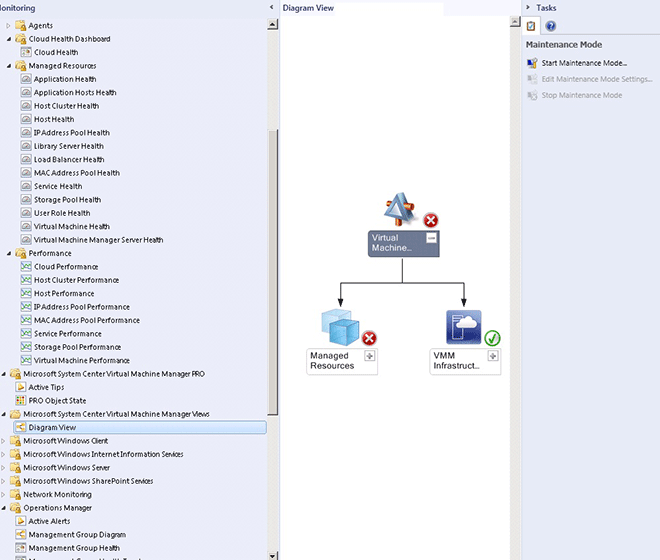

# The Fabric Monitoring Diagram view

The Fabric Monitoring Diagram view gives you a diagram of the entire infrastructure and shows the health state of each part of the fabric. The Diagram view helps you answer questions such as **What is the health of my entire fabric?** Improvements to the diagram ensure that health rolls up and that the relevant fabric components are part of the Diagram View.

## Using Diagram view to locate and investigate problems

Follow these steps:

1. To open the Diagram View, select **Monitoring**, and in **Microsoft System Center Virtual Machine Manager Views**, select **Diagram View** for the environment you want to see displayed as a diagram.

   Diagram View nodes show the health roll up. So if a node is shown as healthy, you know that everything beneath is also healthy. Similarly, if a node is marked unhealthy, something in that node has a problem.

   

2. To see where a problem is occurring, select a node that's marked as unhealthy and expand it until you begin to find unhealthy nodes within that tree. When you find the problem you want to investigate, right-click the node and select **Health Explorer**.

3. In **Health Explorer**, select the monitor you want to investigate, and you can see Knowledge and health for each monitor.

4. To see when and why a monitor became unhealthy, open **State Change Events**.

## Next steps

[Monitor cloud fabric using System Center Advisor.](use-system-center-advisor.md)
