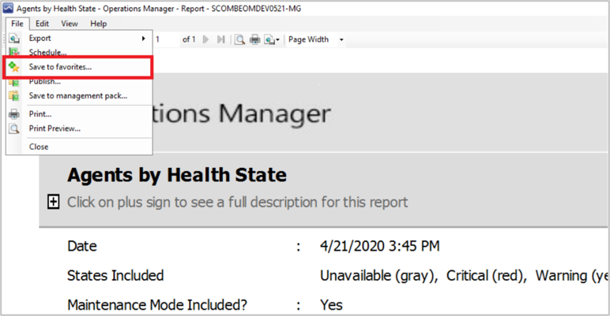
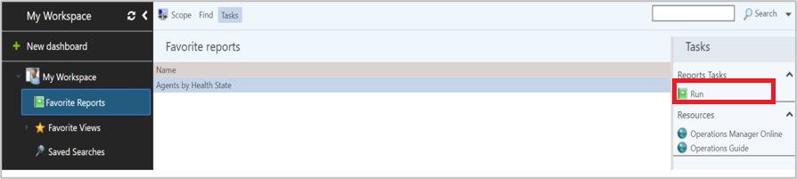
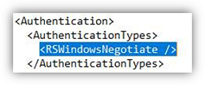

# Favorite reports in Web console

::: moniker range="sc-om-2019"

This article provides information about how to create and view favorite reports in Operations Manager 2019 UR2 and later.

> [!NOTE]
> This feature isn't supported in 2019 RTM/UR1.

In Operations Manager 2019 UR2 and later, you can run and view favorite reports from **Web Console** > **My Workspace**. This feature is available in Operations Manager 2012 web console, which is now supported in 2019 UR2.

::: moniker-end

::: moniker range=">=sc-om-2022"

This article provides information about how to create and view favorite reports in Operations Manager.

You can run and view favorite reports from **Web Console** > **My Workspace**.

::: moniker-end

You can create a report in operations console and view them as *Favorite reports* in the HTML5 web console.

## Before you begin

Here are some considerations before you start creating and viewing favorite reports:

- Ensure you've any of the following five roles to sign in to the web console. These permissions remain the same as in earlier supported versions of Operations Manager.  

   - Administrator
   - Author
   - Advance Operator
   - Operator
   - Read-only Operator

- Ensure you've the following three roles to view reports on Web Console. These permissions remain the same as in earlier supported versions of Operations Manager.  

   - Administrator
   - Report Operator
   - Report Security Administrator

- If Operations Manager Report Server and Management Server are installed on different computers, ensure to set up Windows Authentication (Kerberos) to connect to SQL Reporting Services Web Service, [as detailed in the following section](#configure-windows-authentication).  

    For more information on windows authentication, see [this article](/sql/reporting-services/security/configure-windows-authentication-on-the-report-server).

## Save a report as favorite from Operations console

To save a report from Operations console, follow these steps:

1. Go to operations console and run any report.
2. After the report is generated, go to **File** and select **Save to favorites**.

   

## Run favorite reports in Web console

To run favorite reports in Web console, follow these steps:

1. Open a web browser on any computer and enter http://\<web host>/Operations Manager, where web host is the name of the computer hosting web console.
2. Navigate to **My Workspace** and select **Favorite reports** in the left pane.
3. Select any report and select **Run** in the right panel. Favorite reports will be generated in a new tab.

    

## Configure Windows authentication

Use the following procedure to configure Windows authentication (Kerberos) between Operations Manager Report Server and Management Server:

To configure Windows authentication, follow these steps:

1. On the Operations Manager Report Server, open *rsreportserver.config* file of SSRS, located at \<PATH\>: \Program Files\Microsoft SQL Server Reporting Services\SSRS\ReportServer, in a note pad.

2. Change the authentication type to *\<RSWindowsNegotiate />* from *\<RSWindowsNTLM />*, and recycle the SQL reporting service.

    

3. SPNs' registration: register the SPNs for the account under which the SQL Reporting service is running.

    - To check if the SPN is created, run the following command in Command prompt or PowerShell:

        ```powershell
        setspn -L <domain-user-account-under-which-ssrs-is-running>

        ```

    - If the SPNs aren't set, run the following command to register SPN for both NetBIOS and FQDN with SSRS account (include the port only if it isn't using the default port 80):
        ```
        Setspn -s http/<computer-name> <domain-name>:<port> <domain-user-account-under-which-ssrs-is-running>

        Setspn -s http/<computer-name>:<port> <domain-user-account-under-which-ssrs-is-running>

        ```

        **Example**:
        *setspn -s http/scombeomdev0521.smx.net smx\momReporting*

        - **Report server**:scombeomdev0521
        - **Domain name**:smx.net
        - **Domain user account under which SSRS is running**:smx\momReporting

4. Trust delegation: In case SQL Reporting Services (Operations Manager reporting services) isn't installed on a Management Server, the (computer or domain) account under which the SQL Reporting Service is running needs to be trusted on the Management Server on which it's installed.

    >[!NOTE]
    >The domain administrator can select *Trust this computer for delegation to any service(kerberos only)*, or constraint delegation with protocol transition.

5. Run *klist* purge command on both the report server and the management server or reboot the servers.

### Important notes

- If Operations Management web console is installed on a Standalone server (not an Operations Manager Management  Server), then add the SDK Account SPN (account under which System Center Data Access Service is running) to the *Constraint Delegation* allowed list for the Operations Manager Web Console server as well.
- If you don't want to see the sign in prompt for web console, add the web console URL to the intranet zone (**Internet Options** > **Security** > **Local Intranet**).

## Next steps

[Run, save, and export a report](manage-reports-run-save-export.md).
