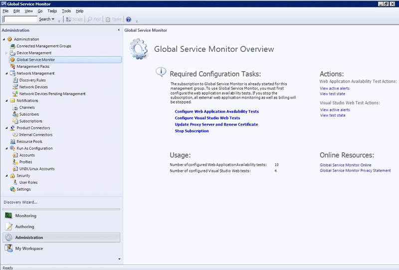

# Configuring Tests in Global Service Monitor
Here are some key concepts and strategies to be aware of as you use [!INCLUDE[gsmshort](../includes/gsmshort-md.md)]:  
  
-   You can do most of your work with [!INCLUDE[gsmshort](../includes/gsmshort-md.md)] on the [!INCLUDE[gsmshort](../includes/gsmshort-md.md)] landing page. Here you can open the Web Application Availability Monitoring template or the Visual Studio Tests template to configure tests, update the proxy server and renew the certificate if you change the proxy server, and stop your [!INCLUDE[gsmshort](../includes/gsmshort-md.md)] subscription. Additionally, you can view active alerts and view tests state from this page. To open the [!INCLUDE[gsmshort](../includes/gsmshort-md.md)] landing page, in the [!INCLUDE[om12short](../includes/om12short-md.md)] console, in the navigation pane, click **Administration**, and then click **[!INCLUDE[gsmshort](../includes/gsmshort-md.md)]**.  
  
     **The [!INCLUDE[gsmshort](../includes/gsmshort-md.md)] landing page**  
  
       
  
-   [!INCLUDE[gsmshort](../includes/gsmshort-md.md)] can monitor applications in addition to individual URLs. Your tests can be authored to optimize for application monitoring or vertical application feature monitoring. For example, a website shopping experience is a vertical application feature. Or, you can monitor horizontal application features, such as all home pages on a site.  
  
-   Give your tests friendly names that you can easily recognize when you monitor them. These names are displayed in state views and alerts.  
  
-   Web Applications State is a defined as the worst of rollup of individual tests for each template that is run. You can use overrides to change what is displayed.  
  
-   Validate each internal test configuration by clicking **Run Test** before exiting the Add Monitoring Wizard so that you can check that the response that you get is the one that you expect for internal watcher nodes.  
  
    > [!NOTE]
    >  You cannot validate test configurations from external locations.  
  
-   If you are monitoring a vertical website or an application, you can focus alerts on application state by setting up a summary alert for an application, rather than choosing to receive an alert for each URL test for an application. This will reduce the number of alerts you receive and keep the focus of your alerts the overall state of the application. You can further reduce alerts by set the threshold for how many failures you want to have before receiving an alert. Together, these two approaches will focus your alerts on what is most important to you: how well the application is running.  
  
## Comparing monitoring types  
 [!INCLUDE[om12short](../includes/om12short-md.md)] has three management pack templates that can be used monitor web applications.  
  
|Monitoring template|When to use|[!INCLUDE[gsmshort](../includes/gsmshort-md.md)] Subscription|  
|-------------------------|-----------------|---------------------------------------------------------------------------|  
|Web Application Availability Monitoring|-   Have to know the availability of a web application -   You have to see how your application webpages respond when they are accessed from external geographic locations around the world -   You are not looking to monitor multi-step transactions|Required|  
|Visual Studio Web Test Monitoring|-   Have to know the availability of a web application and more details -   You have to monitor your applications by using Visual Studio web tests that are running from external geographic locations around the world -   You do have to monitor multi-step or authenticated transactions|Required|  
|Web Application Transaction Monitoring|Have to monitor intranet applications from internal locations. The monitored applications cannot be accessed from the Internet|Not required|  
  
## See Also  
 [How to Configure Web Application Availability Monitoring in Global Service Monitor](how-to-configure-web-application-availability-monitoring-in-gsm.md)   
 [How to Configure Visual Studio Web Test Monitoring in Global Service Monitor](how-to-configure-visual-studio-web-test-monitoring-in-global-service-monitor.md)