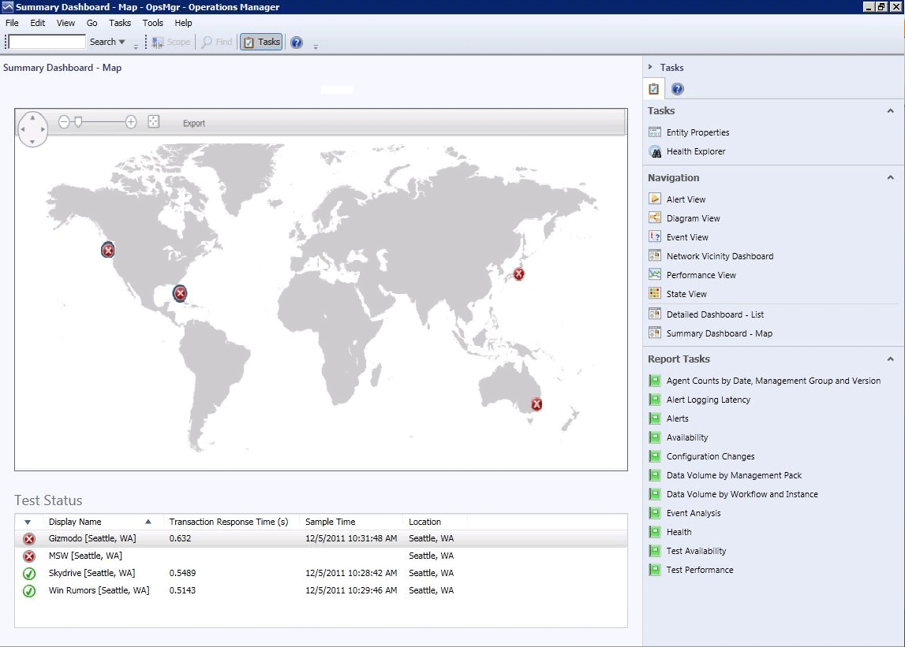
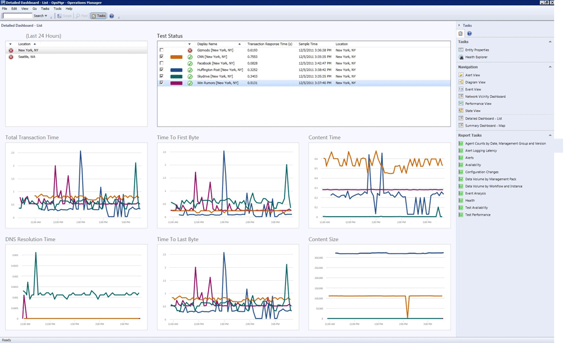

# Dashboard Views in Global Service Monitor
Dashboards in [!INCLUDE[gsmshort](../includes/gsmshort-md.md)] show your test results so that you can more effectively see trends and isolate problems for certain tests, locations, and applications.  
  
## The Summary Dashboard  
 If you want to check whether an application is available, the Summary Dashboard is a helpful view. The Summary Dashboard displays a world map, the locations that you are monitoring from, and the rollup test status from each location. You can then click the location or select several locations to compare.  
  
   
The Summary Dashboard shows where you are monitoring from and the rollup test status from each location.  
  
#### To check the overall status of a web application by using the Summary Dashboard  
  
1.  In the [!INCLUDE[om12short](../includes/om12short-md.md)] console, in the navigation pane, click **Administration**, click **[!INCLUDE[gsmshort](../includes/gsmshort-md.md)]**, and then click **View test state** for either Web Application Availability or Visual Studio Web Test.  
  
2.  Click to highlight an entry for the application that you want to see a summary of. Then, in the **Tasks** pane, in the **Navigation** section, click **Summary Dashboard**. This displays a dashboard for the whole application—a world map that shows all locations the application is being tested from and the worst rollup status of all the tests from each location. For example, red means that at least one test from that location has failed and green means that no tests have failed.  
  
    > [!NOTE]
    >  You can select more than one location in the map. This will display detailed data for the selected locations in the test status section.  
  
    > [!NOTE]
    >  The Summary Dashboard only displays external points of presence. Internal points of presence you might be monitoring are not shown on this dashboard.  
  
3.  To see the test status for all tests from a given location, select that location and the test status displays at the bottom of the page.  
  
    > [!NOTE]
    >  You can select more than one location in the map. This will display detailed data for the selected locations in the test status section.  
  
4.  If you want to investigate a particular test, or group of tests, select the tests that you want to investigate. And then, in the **Tasks** pane, in the **Navigation** section, click **Detailed Dashboard – List**. This opens detailed views for the item that you clicked. For more information, see the details dashboard section here.  
  
## The Detailed Dashboard  
 If you want to investigate a particular test or alert, use the Detailed Dashboard – List. For each web application, you select the location and the tests in that location that you want to investigate. Six key metrics are shown that you can use to pinpoint and isolate issues and compare the performance of pages from your web applications.  
  
> [!NOTE]
>  The Detailed Dashboard is available only for Web Application Availability Monitoring. It is not available for Visual Studio Tests Monitoring.  
  
   
The Detailed Dashboard helps isolate issues from any test and location.  
  
#### To pinpoint problems using the Detailed Dashboard  
  
1. Begin the same way that you opened the Summary Dashboard. In the [!INCLUDE[om12short](../includes/om12short-md.md)] console, in the navigation pane, click **Administration**, click **[!INCLUDE[gsmshort](../includes/gsmshort-md.md)]**, click **View test state**, and then click **Detailed Dashboard**.  
  
2. Click to highlight an entry for the application that you want to see a summary of, and in the **Tasks** pane, in the **Navigation** section, click **Detailed Dashboard - List**.  
  
   > [!TIP]
   >  If you are already viewing the Summary Dashboard, you can go directly to the Detailed Dashboard by clicking to highlight a test or group of tests and then in the **Tasks** pane, in the **Navigation** section, clicking **Detailed Dashboard**.  
  
3. In the section with the name of your application, for example `Bing template` select the locations you want to see more details about.  
  
4. In the **Test Status** section, the check boxes act as a legend for the tests that you want to investigate in the performance graphs. For example, you can select the same page being tested from different locations to see how the pages are performing for the different locations. Selection (blue highlighting) determines which tasks are available and can be run.  
  
   **Known issue for Beta:** When you select a series in the Detailed Dashboard, all performance charts are first cleared of any existing data, and then all series are drawn again.  
  
## Health Explorer  
 As its name implies, Health Explorer lets you see more details about the health status of a web application availability test running against a URL from a particular location. Health Explorer shows you when a test changed state from, for example, healthy to unhealthy.  
  
#### To view the context of a problem by using Health Explorer  
  
1.  To open Health Explorer for a particular test, highlight a message, test state, or web application status item, in the **Tasks** pane, click **Health Explorer**. If you are already in a dashboard view, you can also open Health Explorer in the Summary Dashboard and Detailed Dashboard by right-clicking an entry, and then clicking **Health Explorer**.  
  
2.  In **Health Explorer**, in the pane named with your test, click to highlight an item you want to investigate.  
  
3.  Click the **State Change Events** tab to see details on when a state changed from healthy to unhealthy.  
  
4.  In the **State Change Events Details** pane, you can see the error details that caused the health state change of your test.  
  
    > [!TIP]
    >  It is a good idea to check Health Explorer frequently because it shows you details about the context and sequence of status changes and errors.  
  
## The Test Visualization Dashboard  
 The Test Visualization Dashboard lets you see [!INCLUDE[gsmshort](../includes/gsmshort-md.md)] web test results in [!INCLUDE[om12short](../includes/om12short-md.md)] in a view similar to Visual Studio. It displays performance data (total transaction time over time).  
  
   
The Test Visualization Dashboard  
  
#### To see test results in the Test Visualization Dashboard  
  
1.  In the [!INCLUDE[om12short](../includes/om12short-md.md)] console, in the navigation pane, click **Administration**, click **[!INCLUDE[gsmshort](../includes/gsmshort-md.md)]**, and then click **View test state** for either Web Application Availability or Visual Studio Web Test.  
  
2.  Click to highlight an entry for an application. Then, in the **Tasks** pane, in the **Navigation** section, click **View Test Visualization Dashboard**. This displays the test results that include performance metrics for a test result  
  
3.  If you want to investigate a particular test, or group of tests, click to highlight the tests that you want to investigate. Then in the **Tasks** pane, in the **Navigation** section, click **Detailed Dashboard – List**. This opens detailed views into the item that you clicked.
