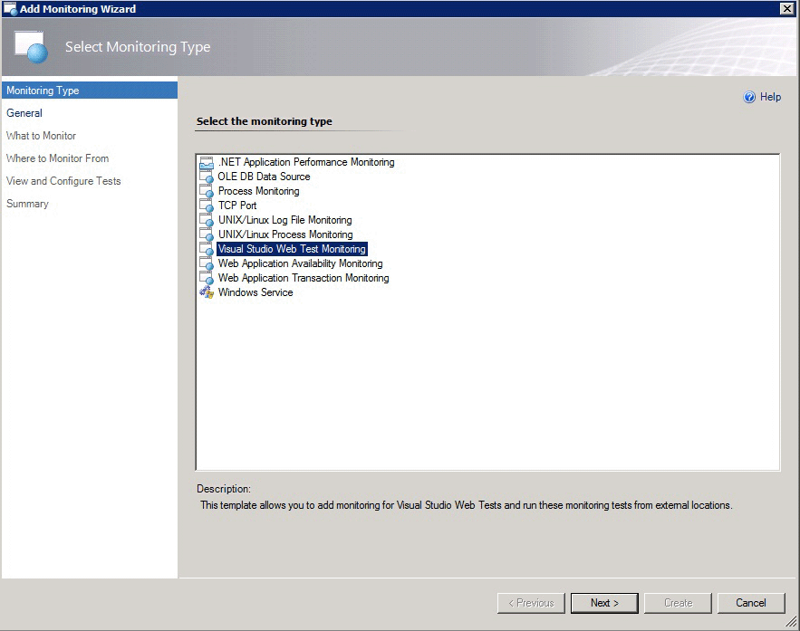
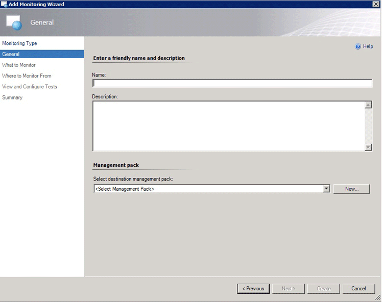
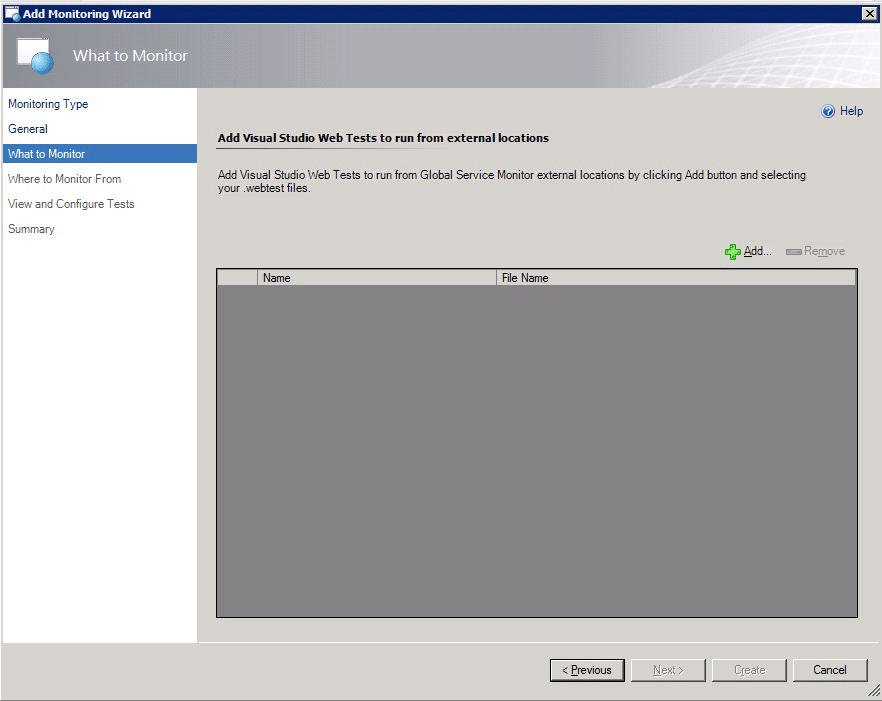
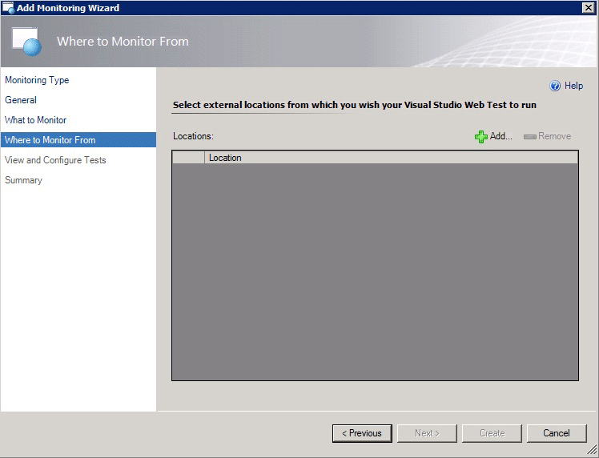
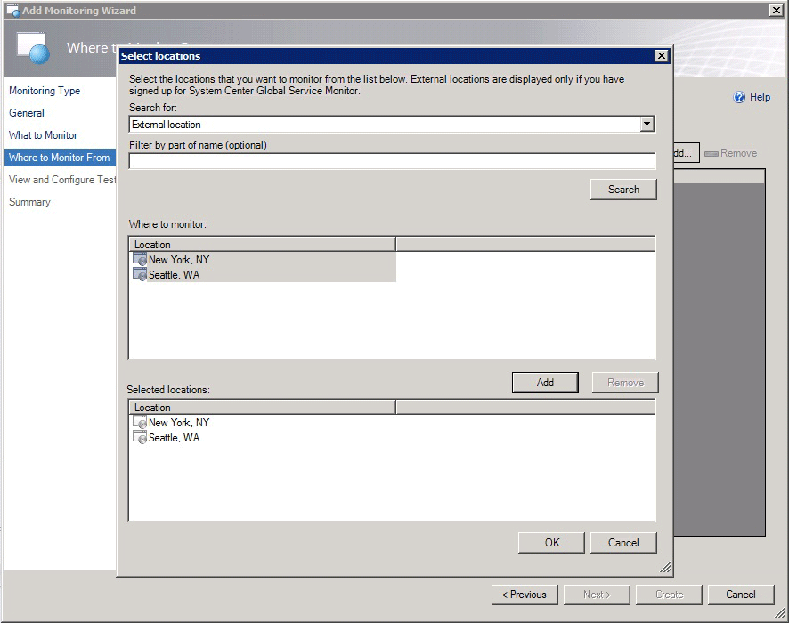

# How to Configure Visual Studio Web Test Monitoring in Global Service Monitor
[!INCLUDE[gsmlong](../includes/gsmlong-md.md)] is a cloud service that provides a simplified way to monitor the availability of external-web-based applications from multiple locations around the world. [!INCLUDE[gsmshort](../includes/gsmshort-md.md)] has two monitoring types. These are the Web Application Availability monitoring that monitors single URLs, and Visual Studio Web Tests monitoring that lets you to run multi-step, authenticated web tests from Microsoft-provided agents in the cloud. Here are the instructions to configure Visual Studio Web Tests.  
  
### To configure Visual Studio Web Tests  
  
1.  To configure Visual Studio Web Tests, open the [!INCLUDE[gsmshort](../includes/gsmshort-md.md)] landing page. In the [!INCLUDE[om12short](../includes/om12short-md.md)] console, in the navigation pane, click **Administration**, click **[!INCLUDE[gsmshort](../includes/gsmshort-md.md)]**, and then click **Configure Visual Studio Web Tests**. This opens the Visual Studio Web Test Monitoring template. This template lets you to add monitoring for Visual Studio Web Tests and run these monitoring tests from external locations.  
  
    > [!NOTE]
    >  If you want to download [!INCLUDE[gsmshort](../includes/gsmshort-md.md)] web test results and have them attached to alerts so that you can more easily give the test results to your engineering team, you also have to install the Alert Attachment management pack. Additionally, to better integrate this with your Development and Operations (DevOps) processes, you can synchronize these alerts and their attached web test results with Team Foundation Server (TFS) work items by downloading the TFS Work Item Synchronization management pack. If you are using [!INCLUDE[sc2012r2_1](../includes/sc2012r2-1-md.md)], see [How to Configure File Attachments for Operations Manager Alerts in System Center 2012 R2](http://go.microsoft.com/fwlink/?LinkId=307114) and [How to Configure Integration with TFS in System Center 2012 R2](http://go.microsoft.com/fwlink/?LinkId=307113). If you are using [!INCLUDE[sc2012sp1_short](../includes/sc2012sp1-short-md.md)], see [How to Configure File Attachments for Operations Manager Alerts in System Center 2012 SP1](http://go.microsoft.com/fwlink/?LinkId=275127) and [How to Configure Integration with TFS in System Center 2012 SP1](http://go.microsoft.com/fwlink/?LinkId=275126).  
  
     **Select Monitoring Type page for Visual Studio Web Tests**  
  
       
  
2.  On the **General** page, enter a friendly name and description for your test and the management pack. This stores settings that are specific to this version of the template. Click **Next**  
  
     **General page for Visual Studio Web Tests**  
  
       
  
    > [!TIP]
    >  You should give your tests names that you can easily recognize as this helps you identify them later when you start to monitor.  
  
3.  On the **What to Monitor** page, click **Add** to add the Visual Studio Web Tests that you want to run from [!INCLUDE[gsmshort](../includes/gsmshort-md.md)] external locations. Browse to a directory where your .webtest files are.  
  
    > [!IMPORTANT]
    >  After you click Next, the page might appear not to change for a few seconds because web tests are being run against certain validation criteria.  
  
     **What to Monitor page for Visual Studio Web Tests**  
  
       
  
4.  On the **Where to Monitor From** page, select the external locations from which you want to want your Visual Studio Web Test to run.  
  
     **Where to Monitor From page for Visual Studio Web Tests**  
  
       
  
    -   To monitor from external locations, in the area above the **External locations** field, click **Add**, and select the external locations that you want to monitor from and add those to your list of **Selected locations**. Click **OK**. For [!INCLUDE[gsmshort](../includes/gsmshort-md.md)], you can test from 16 locations by selecting one of the following:  
  
        -   AU: Sydney  
  
        -   BR: Sao Paulo  
  
        -   CH: Zurich  
  
        -   FR: Paris  
  
        -   HK: Hong Kong  
  
        -   IE: Dublin  
  
        -   JP: Kawaguchi  
  
        -   NL: Amsterdam  
  
        -   RU: Moscow  
  
        -   SE: Stockholm  
  
        -   SG: Singapore  
  
        -   US: CA-San Jose, FL-Miami, IL-Chicago, TX-San Antonio, VA-Ashburn  
  
         **Select external locations page for Visual Studio Web Tests**  
  
           
  
5.  The **View and Validate Tests** page shows a summary of all tests (external and internal) that will be run. You can only validate a configuration of internal tests. To validate an internal test configuration, select a test and then click **Run Test**. If you want to change the default settings for the tests, performance data, and alerts for all tests (external and internal) created in this template, click **Change Configuration**. For more information, see the [To configure alerts and performance data collection](how-to-configure-visual-studio-web-test-monitoring-in-global-service-monitor.md#BKMK_CONFALERT) in this document. When you have validated your tests, click **Next** to see the **Test Results** page of the test configuration that you created by using this template.  
  
6.  You can click **Change Configuration** to change your tests frequency or alerting preferences. Click **Next** to see the **Summary** page.  
  
7.  Review the **Summary** page to make sure that the information accurately reflects the tests that you have configured. If the information is not what you expected, click **Previous** and on the **View and Configure Tests** page, click **Change Configuration**. If the information on the **Summary** page is correct, click **Create** to begin testing.  
  
    > [!TIP]
    >  You can also copy and paste this information and share it as documentation or in an email message.  
  
##   To configure alerts and performance data collection  
  
1.  Configure alerts and performance during test configuration. To configure alerts, on the **View and Configuration Tests** page, click **Change Configuration**. Here you can change your tests frequency or alerting preferences.  
  
2.  In the **Test Frequency** section, you can set your tests’ frequency. For [!INCLUDE[gsmshort](../includes/gsmshort-md.md)], one test every 5 minutes is the minimum supported test interval.  
  
3.  In the **Alerts** section, select the criteria for the number of consecutive times criteria should fail before a message is generated.  
  
    > [!TIP]
    >  If you are monitoring a vertical website or an application, you can focus alerts on application state by setting up a summary message t for an application, instead of choosing to receive a message for each test for an application. To do this, select the **Generate a single summary alert** check box. This reduces the number of messages that you receive and keeps the focus of those on the overall state of the application. You can additionally reduce the number of messages by raising the threshold for how many failures you want to have before receiving notification. Together, these two approaches limit your alerts to what is most important to you; that is, how well the application is running, given the performance that you require.  
  
## See Also  
 [How to Configure Web Application Availability Monitoring in Global Service Monitor](how-to-configure-web-application-availability-monitoring-in-gsm.md)