# How to Configure Web Application Availability Monitoring in Global Service Monitor
[!INCLUDE[gsmlong](../includes/gsmlong-md.md)] is a cloud service that provides a simplified way to monitor the availability of external-web-based applications from multiple locations around the world. [!INCLUDE[gsmshort](../includes/gsmshort-md.md)] has two monitoring types. These are the Web Application Availability monitoring that monitors single URLs, and Visual Studio Web Tests monitoring that lets you to run multi-step, authenticated web tests from Microsoft-provided agents in the cloud. Here are the instructions to configure Web Application Availability Tests.  
  
### To configure Web Application Availability tests  
  
1.  To configure URL tests, open the [!INCLUDE[gsmshort](../includes/gsmshort-md.md)] landing page. In the [!INCLUDE[om12short](../includes/om12short-md.md)] console, in the navigation pane, click **Administration**, click **[!INCLUDE[gsmshort](../includes/gsmshort-md.md)]**, and then click **Configure Web Application Availability Tests**. This opens the Web Application Availability Monitoring template. This template lets you create availability monitoring tests for one or more Web Application URLs. You can run them from internal or external locations and use the template to select the URLs that you want to monitor and where you want to monitor them from. For more information about authoring and the template settings, see [Web Application Availability Monitoring template](http://go.microsoft.com/fwlink/?LinkId=24848)  
  
     **Location of the [!INCLUDE[gsmshort](../includes/gsmshort-md.md)] landing page**  
  
     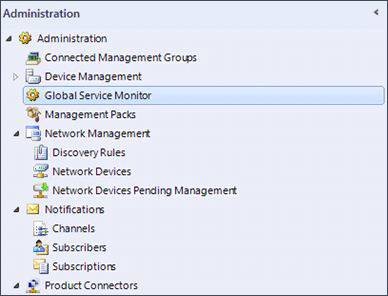  
  
2.  On the **General** page, enter a friendly name and description for your test and the management pack. This stores settings that are specific to this version of the template. Click **Next**  
  
     **General page**  
  
     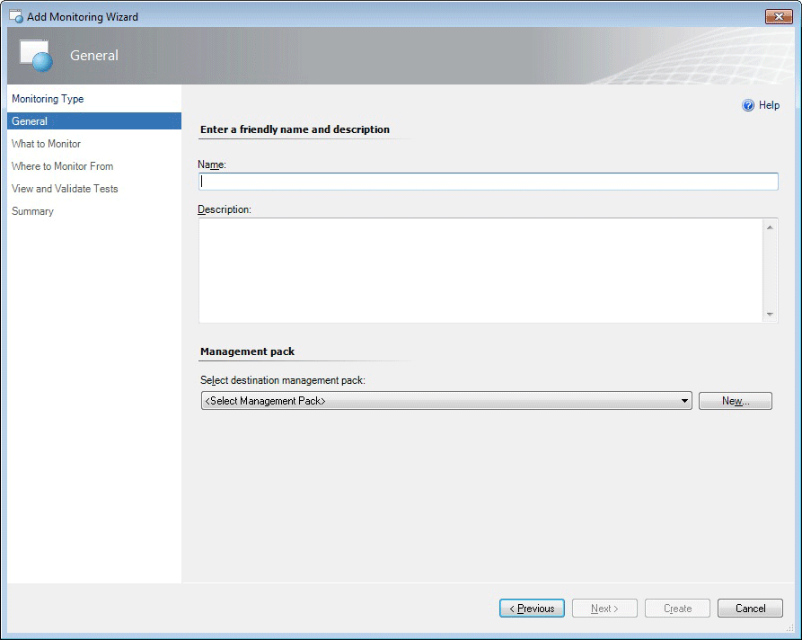  
  
    > [!TIP]
    >  You should give your tests names that you can easily recognize as this can help you identify them later when you start monitoring.  
  
3.  On the **What to Monitor** page, enter the URLs you want to monitor. You can add URLs to the list by typing, pasting, or importing a CSV file (such as a spreadsheet) into the table. This includes the appropriate protocol (http:// or https://). You can paste entire rows as pairs of comma-separated values (CSV) that are in the format “Name, URL”, or you can copy and paste just the list of URLs.  
  
     **What to Monitor page**  
  
     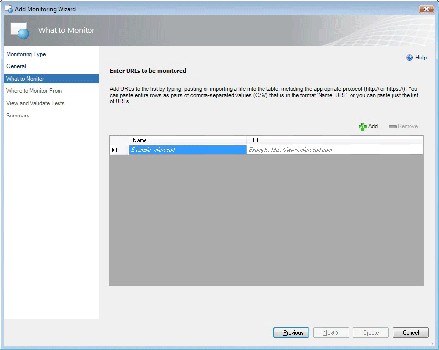  
  
    -   To type or paste a URL, click first in the **Name**, and then click the **URL** boxes. Follow the examples on the page to enter the information.  
  
    -   To import names and URLs from another source, click **Add**. Follow the instructions to browse and select to the file that you want to import.  
  
    > [!NOTE]
    >  URLs cannot contain special characters, such as: !@#$%^&*().  
  
    > [!TIP]
    >  Group URLs by web application. Example: `Microsoft website` would be the name of many URLs to test from various locations. This keeps the application, `Microsoft website`, the focus of the monitoring instead of the many URLs you are testing for this application. This strategy takes advantage of the dashboard monitoring views. These show the **Web application state** by application name and state so that you can easily see the overall health of your monitored application. This lets you separate problems related to external factors, such as Internet or network problems, from application or service problems.  
  
4.  On the **Where to Monitor From** page, select the locations from which you want the URLs monitored. You can choose both external and internal locations.  
  
     **Where to Monitor From page**  
  
     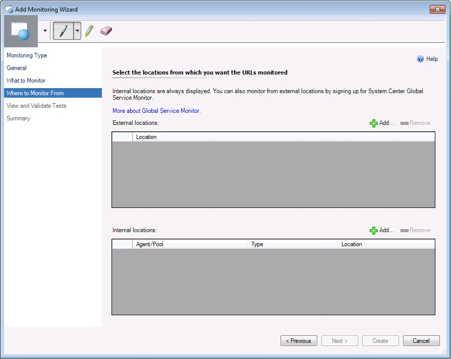  
  
    -   To monitor from external locations, in the line above the **External locations** field, click **Add**, and select the external locations that you want to monitor from and add those to your list of **Selected locations**. Click **OK**. For [!INCLUDE[gsmshort](../includes/gsmshort-md.md)], you can test from 16 locations by selecting from the following:  
  
        -   AU: Sydney  
  
        -   BR: Sao Paulo  
  
        -   CH: Zurich  
  
        -   FR: Paris  
  
        -   HK: Hong Kong  
  
        -   IE: Dublin  
  
        -   JP: Kawaguchi  
  
        -   NL: Amsterdam  
  
        -   RU: Moscow  
  
        -   SE: Stockholm  
  
        -   SG: Singapore  
  
        -   US: CA-San Jose, FL-Miami, IL-Chicago, TX-San Antonio, VA-Ashburn  
  
         **Select external locations page**  
  
         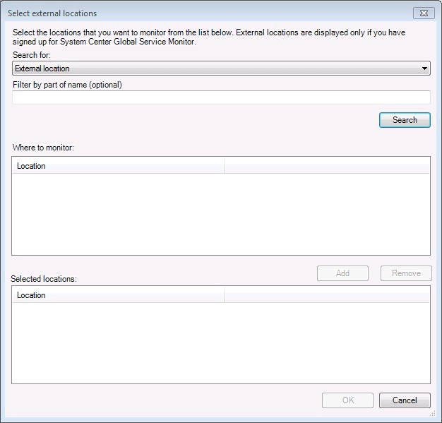  
  
    -   To monitor from internal locations, use the dropdown menu to select to run tests from a server agent or a resource pool. In the area above the **Internal locations** field, click **Add** and select the internal locations (server names) you want to monitor from and add those to your list of **Selected locations**. Click **OK**.  
  
         **Select internal locations page**  
  
         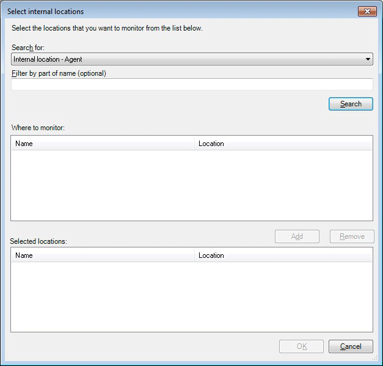  
  
5.  The **View and Validate Tests** page shows a summary of all tests (external and internal) that are to be run. You can only validate a configuration of internal tests. To validate an internal test configuration, select a test and then click **Run Test**.  If you want to change the default settings for the tests, performance data, and alerts for all tests (external and internal) created in this template, click **Change Configuration**. For more information, see the “Configuring alerts and performance data collection” in this document. When you have validated your tests, click **Next** to see the **Test Results** page of the test configuration that you created by using this template.  
  
     **View and Validate Tests page by using internal and external locations**  
  
     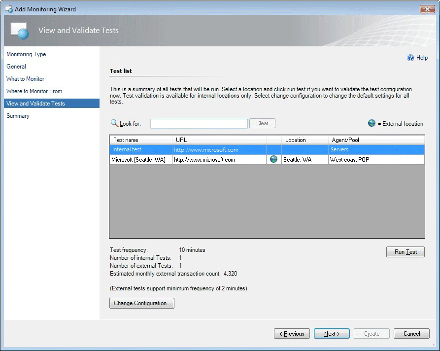  
  
    > [!TIP]
    >  Validate internal test configurations before you exit the wizard so that you can make sure that the response you receive is the one that you expect. To do this, select the test, and then click **Run Test**.  
  
6.  On the **Test Results** page, the **Summary** tab shows if your test succeeded and whether any of your error criteria failed. To see more details, click through the **Details**, **HTTP Request**, and **HTTP Response** tabs. Click **Close** to return to the **View and Validate Tests** page where you can either click **Change Configuration** to reconfigure your tests, or, if the test results look good, click **Next** to see the **Summary** page.  
  
     **Test Results page for internal tests**  
  
     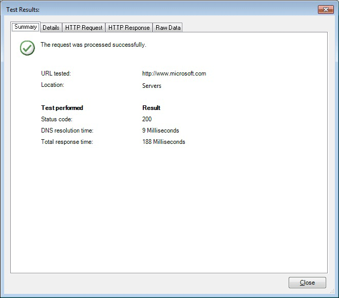  
  
7.  **Summary page**  
  
     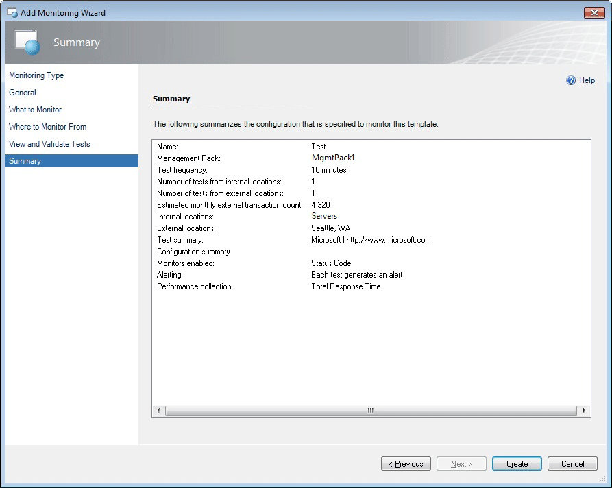  
  
     Review the **Summary** page to make sure that the information accurately reflects the tests that you have configured. If they do not, click **Previous**, and on the **View and Validate Tests** page, click **Change Configuration**. If the information on the **Summary** page is correct, click **Create** to begin testing.  
  
    > [!TIP]
    >  You can also copy and paste this information and share it as documentation or in an email message.  
  
### To configure alerts and performance data collection  
  
1.  You should configure alerts and performance during test configuration. To configure alerts, on the **View and Validate Tests** page, click **Change Configuration**. This is where you can set the criteria that are most important for you to monitor. These are the URL monitoring performance counters that you can set and a description of what each tracks. Most of these are collected by default.  
  
     For more information about test configuration settings and other template settings, see Authoring the Web Application Availability Monitoring Template.  
  
     Base page (the page served by the request URL)  
  
     **Change Configuration page**  
  
     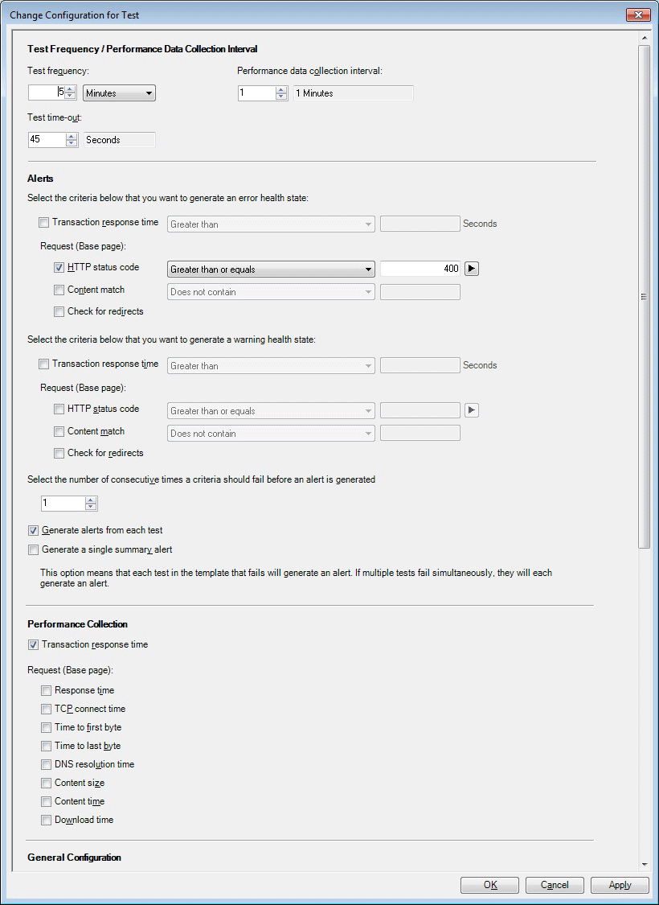  
  
     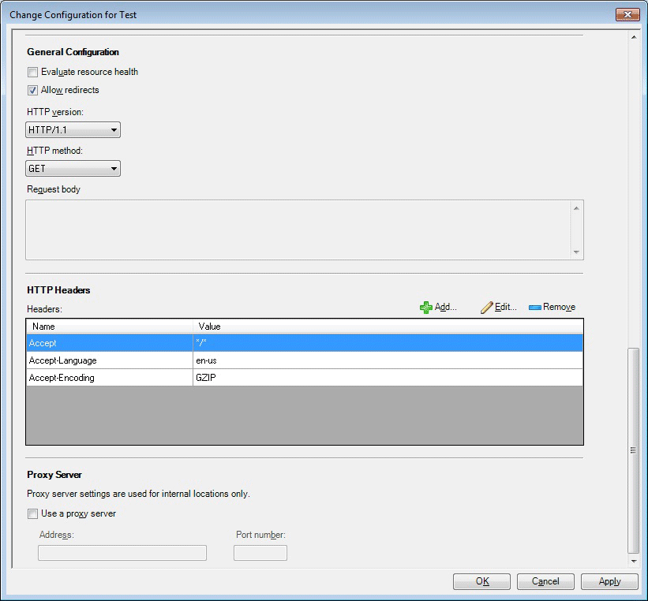  
  
    -   Content size: Size of the response body received.  
  
    -   DNS resolution time: Time elapsed to resolve the URL domain name to the IP address.  
  
    -   Content time: Base page download time (base page only).  
  
    -   Download time (cumulative): Processing time for the request, such as opening a browser and waiting for all resources to load.  
  
    -   TCP connect time: Time elapsed to establish a TCP connection to the target server and receive the initial greeting from the service.  
  
    -   Time to first byte: Time elapsed since the TCP connection is established until the first byte of response is received.  
  
    -   Time to last byte (cumulative): Time from when TCP connection is established until the last byte of response is completely received.  
  
    -   Response time (cumulative): DNS_RESOLUTION_TIME + TCP_CONNECT_TIME + TIME_TO_LAST_BYTE.  
  
     Total data  
  
    -   Total transaction time: Same a download time for the single URL case. In multi-step (transaction) case, this is the sum of download times for all requests in the transaction (cumulative).  
  
2.  In the **Test Frequency/Performance Data Collection Interval** section, you can set your tests’ frequency, how frequently you want performance data to be collected, and when the test should time out. For [!INCLUDE[gsmshort](../includes/gsmshort-md.md)], one test every five minutes is the minimum supported test interval.  
  
    > [!IMPORTANT]
    >  The option not to collect performance data during every collection interval applies to internal URL tests only. For external URL tests, data is collected every interval.  
  
3.  In the **Alerts** section, select the criteria that you want to use to generate an error health state, a warning health state, and the number of consecutive times criteria should fail before a message is generated. When you monitor your alerts, this is how they are displayed, based on your alert configuration.  
  
    -   Healthy state=Green  
  
    -   Error state=Yellow  
  
    -   Warning state=Red  
  
    > [!TIP]
    >  If you are monitoring a vertical website or an application, you can focus alerts on application state by setting up a summary warning for an application, instead of choosing to receive a message for each URL test for an application. To do this, select the **Generate a single summary alert** check box. This reduces the number of alerts that you receive and keeps the focus of your alerts the overall state of the application. You can additionally reduce alerts by raising the threshold for how many failures you want to have before receiving an alert. Together, these two approaches help focus your messages on what is most important to you; that is, how well the application is running given the performance you require.  
  
4.  You can also change settings for **Http Headers**, designate a **Proxy Server** (used for internal locations only), and change other general settings. When you have finished configuring the settings for your tests, click **OK** to return to the **View and Validate Tests** page.  
  
## See Also  
 [How to Configure Visual Studio Web Test Monitoring in Global Service Monitor](how-to-configure-visual-studio-web-test-monitoring-in-global-service-monitor.md)