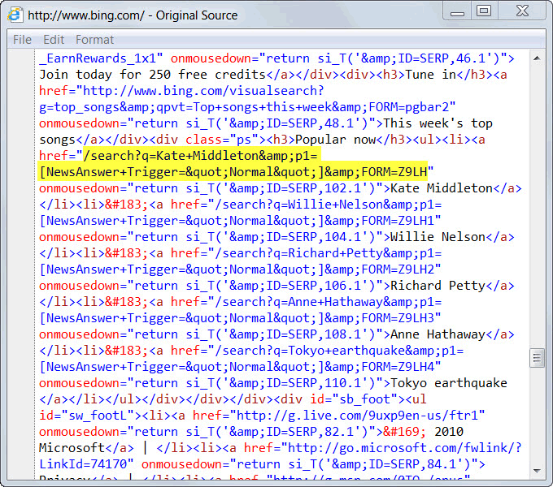

# Replace parameters in a URL request

When you capture a web application by using the Web Application Editor, it can include unique information in one or more requests that changes each time you connect to the application. This information is typically included in the response to a request and then used by one or more subsequent requests.

For example, an application might create a unique session ID when a user signs in. This session ID must be included in each request after the sign-in process. Without the correct session ID, each of these requests fails. Because you don't know what this value is until the first request is run, it can't be explicitly included in the configuration of the request. If you create the web application by recording a browser session, the session ID is collected in the URL of each request. However, when the application is run, the requests fail because the session ID will have a value that's different from the recorded session ID.

To configure such an application, you can extract a context parameter from the body of the response of one request and use the value of that parameter in one or more subsequent requests. You then replace the explicit value in the subsequent requests with a variable that represents the parameter. Each time the synthetic transaction is run, the parameter is populated in the request where it's defined. When the variable is used in the subsequent requests, it's replaced with the collected value before the request is sent to the application.

A single application can use any number of context parameters. Any number of requests can use a single parameter but must be run after the request where the parameter is defined.

## Session ID example

Consider the example where an application creates a session ID when a user signs in. This session ID is required in each request after the sign-in page. To implement this scenario, you have to capture the session ID when it's first generated, and then use that value in each subsequent request.

You start by using the process described in [How to Capture Web Application Recording](/previous-versions/system-center/system-center-2012-R2/hh457597%28v%3dsc.12%29) to capture the sign-in and subsequent actions. The recorded session for signing in to the application and performing some actions might look similar to the following example.

```

http://www.myapp.com/home.aspx

http://www.myapp.com/search.aspx?query=testing&amp;sessionid=32793279321721

http://www.myapp.com/results.aspx?sessionid=32793279321721

http://www.myapp.com/submit.aspx?sessionid=32793279321721

```

In this request sequence, the session ID is created by the first request and used in the second, third, and fourth requests. When you run this monitor, it fails because the first request generates a new session ID that couldn't match the session ID that was used when the session was captured.

To configure this request sequence with parameter replacement, you've to create an extraction rule on the first request to create a context parameter for the session ID. The extraction rule inspects the body of the request to locate the value for the sessionid variable. You would then modify the subsequent requests to use this parameter instead of the value for the session ID.

The modified requests look similar to the following example.

```

http://www.myapp.com/home.aspx

http://www.myapp.com/search.aspx?query=testing&amp;sessionid=$ParametersContext/sessionID$

http://www.myapp.com/results.aspx?sessionid=$ParametersContext/sessionID$

http://www.myapp.com/submit.aspx?sessionid=$ParametersContext/sessionID$

```

## Create an extraction rule

Context parameters are collected by an _extraction rule_, and each extraction rule collects a single context parameter. You create an extraction rule in the  **Properties**  dialog of the request that initially generates the required data. To identify the value to extract, you must view the body of the response returned from the particular request. You can either view the source of the page returned in the browser or use a tool that lets you inspect the details of the HTTP responses. You can't view the text by using the Web Application Editor.

When you've identified the request that contains the information you have to extract, you view the  **Extraction Rules**  tab in the properties of that request and create one or more extraction rules. The details of each extraction rule are shown in the following table.

| Option | Description |
| --- | --- |
| Context parameter name | Enter the name to give the context parameter. |
| Starts with | Enter the text in the body of the response that identifies the start of the parameter value. You should specify enough characters to ensure that the string is unique. The value for the parameter starts immediately after the last specified character. |
| Ends with | Enter the text in the body of the response that identifies the end of the parameter value. The value for the parameter ends immediately before the first specified character. |
| Index | If the text in the  **Starts with**  box occurs more than one time, this value indicates which value to use. If the text only appears one time, or the first occurrence of it shows the text to extract, the value should be 0. If the second value should be extracted, the value should be 1, and so on. |
| Ignore case during search for matching text | Specifies whether to ignore the case of the characters being searched by the  **Starts with**  and  **Ends with**  boxes. |
| Perform URI encoding of extracted strings | Specifies whether to encode the extracted string after it's collected. |

## Insert a parameter into a request

You use a parameter in a request by replacing the explicit value with a variable representing the parameter. The format of the variable is $ParametersContext/\<ContextParameterName>$. When the request is run, the variable is replaced with the data extracted by the parameter.

You can insert the variable into the request by using one of the two following methods:

- In the  **Request Properties**  dialog, select the  **General**  tab, and then select  **Request URL**  to modify the request URL for the request.
- In the  **Request Properties**  dialog, select the  **General**  tab, and then select the  **Insert parameter**  button. Use the  **Insert Parameter**  dialog for the request. This is accessed from the  **Insert parameter**  button on the  **General**  tab in the  **Request Properties**  dialog for the request.

## Sample web application Using parameter extraction

The following procedure provides an example of using parameter extraction in a web application. This example performs a query for the first entry in the  **Popular Now**  section of the Bing home page. Because this value changes regularly, you've to first connect to the main page and collect the search term from the body of the response. You then use this term to build the request to perform the actual search.

The main Bing page is shown below with the  **Popular Now**  section highlighted.


To determine where in the response body the search term appears, you can view the source of the page. A portion of the source is shown below with the HTML code of the  **Popular Now**  section. In this HTML code, you only need the search string, which is highlighted in the following illustration. The request is formed from [**https://www.bing.com**](https://www.bing.com/) followed by this string.



You could just pull out the term itself, but it's more straightforward to include the entire string in the parameter. This string is preceded by the characters  **\<h3>Popular now\</h3>\<ul>\<li>\<a href=>**  and ends with the next occurrence of  **"**. Those are the values that you'll use when you define the parameter extraction.

### Record a sample web application

To record a sample web application, follow these steps:

1. Use the procedure in [How to Capture Web Application Recording](/previous-versions/system-center/system-center-2012-R2/hh457597%28v%3dsc.12%29) to record a web application.
2. While recording, connect to [**https://www.bing.com**](https://www.bing.com/).
3. Optionally, use the option on your browser to view the source of the Bing home page and locate the  **Popular Now**  section of the HTML code.
4. Select the first search term under **Popular Now**.
5. Save the recording to the web application.
6. Remove the last request because this isn't required. To remove the last request, select the request, and then select  **Delete**  in the  **Actions**  pane. The resulting requests should look similar to the following URLs:


### Create an extraction rule

To create an extraction rule, follow these steps:

1. Select the first request, and then select  **Properties**  in the  **Actions**  pane.
2. Select the  **Extraction Rules**  tab.
3. Select  **Add**. The  **Add Extraction Rule**  dialog opens.
4. In the  **Add Extraction Rule**  dialog, in the  **Context parameter name**  box, enter  **SearchString**.
5. In the  **Starts with**  box, enter  **\<h3>Popular now\</h3>\<ul>\<li>\<a href=>**.
6. In the  **Ends with**  box, enter  **"**. The extraction rule should look similar to the following illustration.

   

7. Select  **OK**  to save and close the extraction rule.
8. Select **OK**  to save and close the request.

### Insert a parameter into a request

To insert a parameter into a request, follow these steps:

1. Select the second request, and then select  **Properties**  in the  **Actions**  pane.
2. On the  **General**  tab, select  **Insert parameter**.
3. In the  **String**  box, delete all text after [**www.bing.com/**](https://www.bing.com/).
4. With the cursor positioned at the end of the URL, just after [**www.bing.com**](https://www.bing.com/), select  **SearchString**  in the  **Parameters**  box, and then select  **Insert**. This inserts the variable $ParametersContext/SearchString$. The final request looks similar to the following illustration.

   

5. Select  **OK**  to close the dialog.
6. Select  **OK**  to save and close the request. The modified request sequence should look similar to the following illustration.

   

7. Select  **Apply**  to apply the changes, and then close the  **Web Application Editor**.
