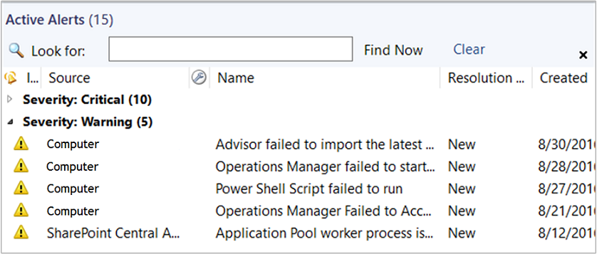
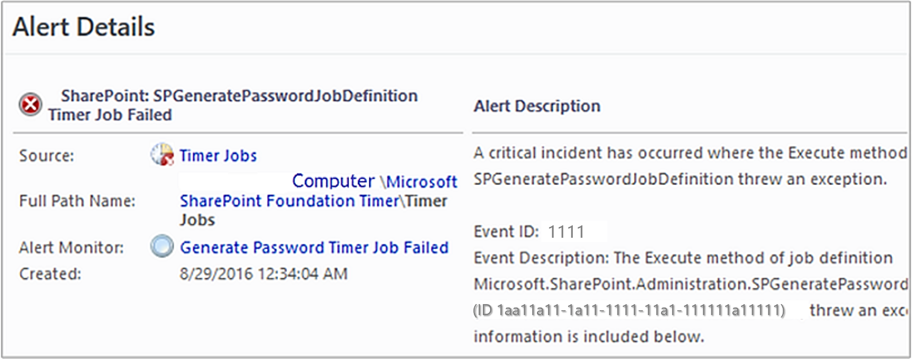
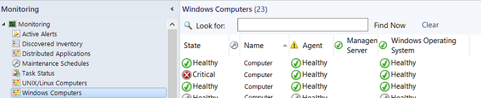
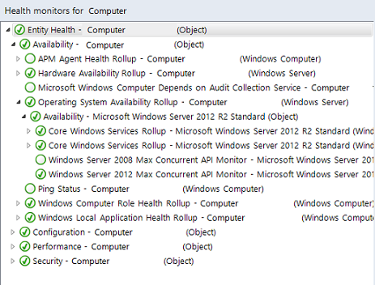

# Identifying the computer experiencing a problem

This topic helps you answer questions such as "I see an alert that says logical disk defragmentation is high. Where is it high?"  
  
## How to identify the computer experiencing a problem  
  
1.  Select the alert in the Active Alerts view.  
  
      
  
2.  Look in the **Details** section for the **Path**.  
  
      
  
    Notice that this alert also includes the affected computer in the **Description**.  
  
3.  Click **Windows Computers** to view the state of the computer.  
  
      
  
4.  Right-click the computer, point to **Open**, and click **Health Explorer**:  
  
      
  
In this illustration, you see that the logical disk fragmentation levels for C: and D: on this computer are in a warning state. Notice that the state rolls up to the **Performance** state for each disk, then to **Hardware Performance** for the computer, then to **Performance** for the computer, and finally to **Entity Health** for the computer.  
  
## Next steps
  
- To help you investigate and resolve the issues that caused the alerts, review [Viewing Active Alerts and Details](manage-alert-view-alerts-details.md)

