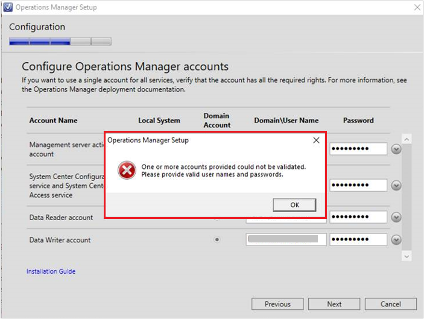
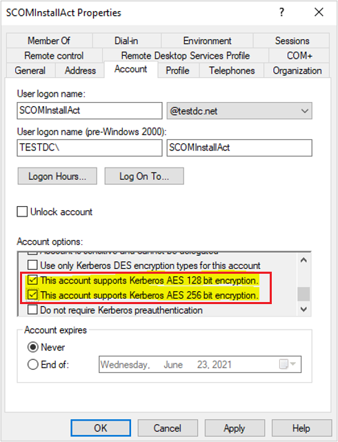
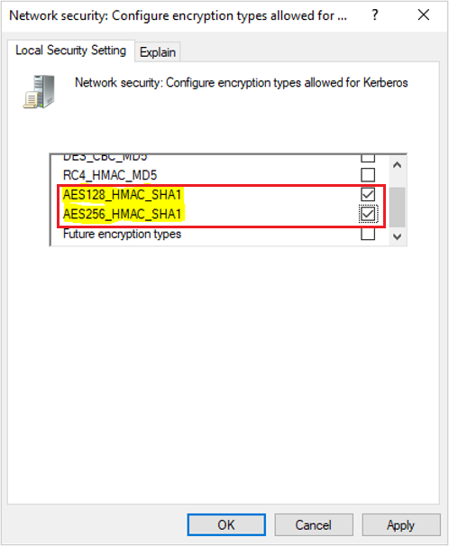
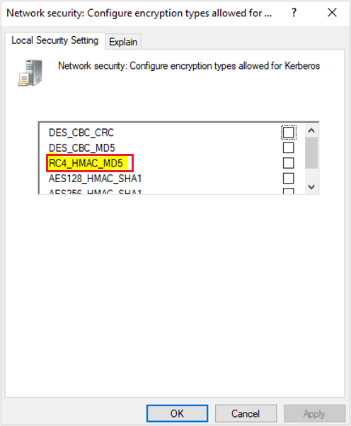

# Disable RC4 while installing Operations Manager

This article describes how to disable RC4 while installing Operations Manager.

When you install Operations Manager in a security hardened environment, the setup tends to fail at the account configuration step if the appropriate permissions aren't configured properly.

[!INCLUDE [ntauthority-note-operations-manager.md](../includes/ntauthority-note-operations-manager.md)]

## Important information

In a disabled RC4 environment, when you try to install Operations Manager, you can't pass the Account Validation stage if the steps in the [Before you Begin](#before-you-begin) section aren't implemented, and you'll see the following error in the Operations Manager setup:

Operations Manager internally uses a Windows Security API as part of its credential validation process and the requested encryption type isn't supported by the KDC. The client and service should support the same type of encryption for communication.

When a service ticket is requested, the domain controller selects the ticket encryption type based on the **msDS-SupportedEncryptionTypes** attribute of the account associated with the requested SPN.

By default, user accounts don't have a value set, unless you've manually enabled AES on them; tickets for service accounts are encrypted with RC4. For more information, see [Decrypting the Selection of Supported Kerberos Encryption Types - Microsoft Tech Community](https://techcommunity.microsoft.com/t5/core-infrastructure-and-security/decrypting-the-selection-of-supported-kerberos-encryption-types/ba-p/1628797).

For more information on registry entries about Kerberos version 5 authentication protocol, see [Kerberos protocol registry entries and KDC configuration keys in Windows](/troubleshoot/windows-server/windows-security/kerberos-protocol-registry-kdc-configuration-keys).

## Before you begin

Before you begin, implement the steps in the section below:

### Configure the encryption types allowed for Kerberos

For information about how to configure the encryption types allowed for Kerberos, see [Network security Configure encryption types allowed for Kerberos - Windows security | Microsoft Docs](/windows/security/threat-protection/security-policy-settings/network-security-configure-encryption-types-allowed-for-kerberos).

In an environment that has RC4 disabled, ensure the following steps are implemented:

1. The user account used to install Operations Manager has **AES Attributes** enabled on the **Domain Controller**. Navigate to the user object in Active Directory and verify that the **Account options** have the following:
   - Check **This account supports Kerberos AES 128 bit encryption.**
   - Check **This account supports Kerberos AES 256 bit encryption.**

   

2. AES Encryption type is allowed for Kerberos on the computer where Management Server needs to be installed. On the Management Server, go to **Local Group Policy Editor** > **Computer Configuration** > **Windows Settings** > **Security Settings** > **Local Policies** > **Security Options** > **Network security: Configure encryption types allowed for Kerberos** > **Enable AES Encryption**
   - Check **AES128_HMAC_SHA1**
   - Check **AES256_HMAC_SHA1**

   

> [!NOTE]
> If the Agent and Management Server are in different domains from the same forest (Child/Parent domain), follow [Method 3: Configure the trust to support AES128 and AES 256 encryption instead of RC4 encryption](/troubleshoot/windows-server/windows-security/unsupported-etype-error-accessing-trusted-domain).

## Disable RC4 in Operations Manager

To disable RC4 in an Operations Manager Management Server, follow these steps:

1. On the Management Server, go to **Local Group Policy Editor** > **Computer Configuration** > **Policies** > **Windows Settings** > **Security Settings** > **Local Policies** > **Security Options** > **Network security: Configure encryption types allowed for Kerberos** > **Disable RC4**.
   - Uncheck **RC4_HMAC_MD5**

   

2. Run a `gpupdate /force` command in an elevated command prompt to ensure that the changes are done.

## Install Operations Manager

Install Operations Manager using the following information:

- [Install Operations Manager on a Single Server](quickstart-install-single-server.md)

- [Install Operations Manager from the Command Prompt](install-using-cmdline.md)
