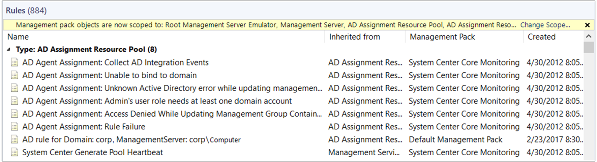
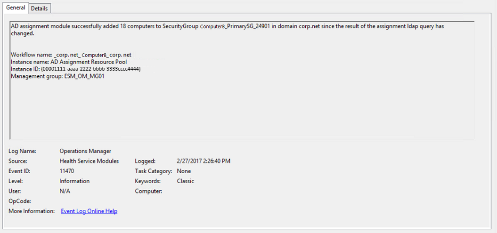
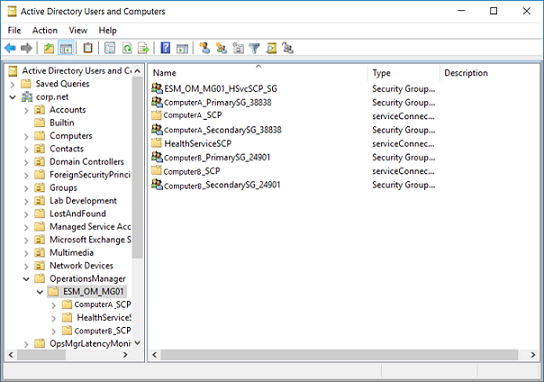

# How to configure and use Active Directory Integration for agent assignment

>Applies To: System Center 2016 - Operations Manager

System Center 2016 – Operations Manager allows you to take advantage of your investment in Active Directory Domain Services (AD DS) by enabling you to use it to assign agent-managed computers to management groups. This topic will help you create and manage the configuration of the container in Active Directory, and agent assignment of management servers agents should report to.

## Create an Active Directory Domain Services Container for a management group
You can use the following command-line syntax and procedure to create an Active Directory Domain Service (AD DS) container for a System Center 2016 - Operations Manager management group. MOMADAdmin.exe is provided for this purpose and is installed with the Operations Manager management server. MOMADAdmin.exe must be run by an administrator of the specified domain.  
  
**Command line syntax:**  
  
`<path>\MOMADAdmin.exe <ManagementGroupName> <MOMAdminSecurityGroup> <RunAsAccount> <Domain>`
  
> [!IMPORTANT]  
> You must put a value inside quotation marks if the value contains a space.  
  
* **ManagementGroupName** is the name of the management group for which an AD container is being created.  
  
* **MOMAdminSecurityGroup** is a domain security group, **domain\security_group** format, which is a member of the Operations Managers Administrators security role for the management group.  

* **RunAsAccount**: This is the domain account which will be used by the management server to read, write, and delete objects in AD. Use the format domain\username.  
  
* **Domain** is the name of the domain in which the management group container will be created. MOMADAdmin.exe can be run across domains only if a two-way trust exists between them.  
  
For Active Directory integration to work, the security group must be either a global security group (if Active Directory integration needs to function in multiple domains with two-way trusts) or a local domain group (if Active Directory integration is only used in one domain)  
  
To add a security group to the Operations Manager Administrators group, use the following procedure.
  
1.  In Operations console, select **Administration**.  
  
2.  In the **Administration** workspace, select **User Roles** under **Security**.  
  
3.  In **User Roles**, select **Operations Manager Administrators** and click the **Properties** action or right click **Operations Manager Administrators** and select **Properties**.  
  
4.  Click **Add** to open the **Select Group** dialog box.  
  
5.  Select the desired security group, and then click **OK** to close the dialog box.  
  
6.  Click **OK** to close **User Role Properties**.  
  
> [!NOTE]  
> We recommend one security group, which might contain several groups, be used for the Operations Manager Administrators role. That way, groups and members of groups can be added and removed from groups without a domain administrator needing to perform manual steps to assign them Read and Delete Child permissions to the Management Group container.  

Use the following procedure to create the AD DS container.
  
1.  Open a command prompt as an administrator.  
  
2.  At the prompt, for example, type the following:  
  
     `"C:\Program Files\Microsoft System Center 2016\Operations Manager\Server\MOMADAdmin.exe" "Message Ops" MessageDom\MessageOMAdmins MessageDom\MessageADIntAcct MessageDom**` 
  
3.  The preceding command-line example will:  
  
      1.  Run the MOMADAdmin.exe utility from the command line.  
  
      2.  Create the **"Message Ops"** Management Group AD DS container in the AD DS schema root of the **MessageDom** domain. To create the same Management Group AD DS container in additional domains, run MOMADAdmin.exe for each domain.  
  
      3.  Add the **MessageDom\MessageADIntAcct** domain user account to the **MessageDom\MessageOMAdmins** AD DS security group and assign the security AD DS group the rights necessary to manage the AD DS container.  

## How to Use Active Directory Domain Services to assign computers to management servers
The Operations Manager Agent Assignment and Failover Wizard creates an agent assignment rule that uses Active Directory Domain Services (AD DS) to assign computers to a management group and assign the computers' primary management server and secondary management servers. Use the following procedures to start and use the wizard.  
  
> [!IMPORTANT]  
> The Active Directory Domain Services container for the management group must be created prior to running the Agent Assignment and Failover Wizard.  
  
The Agent Assignment and Failover Wizard does not deploy the agent. You must manually deploy the agent to the computers using MOMAgent.msi.  
  
Changing the agent assignment rule can result in computers no longer being assigned to, and therefore monitored by, the management group. The state of these computers will change to critical, because the computers no longer send heartbeats to the management group. These computers can be deleted from the management group and, if the computer is not assigned to other management groups, the Operations Manager agent can be uninstalled.  
  
### To start the Operations Manager Agent Assignment and Failover Wizard  
  
1.  Log on to the computer with an account that is a member of the Operations Manager Administrators role.  
  
2.  In the Operations console, click **Administration**.  
  
3.  In the Administration workspace, click **Management Servers**.  
  
4.  In the **Management Servers** pane, right-click the management server or gateway server to be **Primary Management Server** for the computers returned by the rules you will create in the following procedure, and then click **Properties**.  
  
    > [!NOTE]  
    > Gateway servers work like management servers in this context.  
  
5.  In the **Management Server Properties** dialog box, click the **Auto Agent Assignment** tab, and then click **Add** to start the Agent Assignment and Failover Wizard.  
  
6.  In the **Agent Assignment and Failover Wizard**, on the **Introduction** page, click **Next**.  
  
    > [!NOTE]  
    > The **Introduction** page does not appear if the wizard has been run and **Do not show this page again** was selected.  
  
7.  On the **Domain** page, do the following:  
  
    > [!NOTE]  
    > To assign computers from multiple domains to a management group, run the **Agent Assignment and Failover Wizard** for each domain.  
  
    -   Select the domain of the computers from the **Domain name** drop-down list. The management server and all computers in the AD Agent Assignment resource pool must be able to resolve the domain name.  
  
        > [!IMPORTANT]  
        > The management server and the computers that you want to manage must be in two-way trusted domains.  
  
    -   Set **Select Run As Profile** to the Run As profile associated with the Run As account provided when MOMADAdmin.exe was run for the domain. The default account used to perform agent assignment is the default action account specified during Setup, also referred to as the **Active Directory Based Agent Assignment Account**. This account represents credentials used when connecting to the specified domain's Active Directory and modifying Active Directory objects, and should match the account specified when running MOMAdmin.exe. If this was not the account used to run MOMADAdmin.exe, select **Use a different account to perform agent assignment in the specified domain,** and then select or create the account from the **Select Run As Profile** drop-down list. The **Active Directory Based Agent Assignment Account** profile must be configured to use an Operations Manager administrator account which is distributed to all servers in the AD Agent Assignment resource pool.  
  
        > [!NOTE]  
        > For more information about Run As profiles and Run As accounts, see [Managing Run As Accounts and Profiles](manage-security-maintain-runas-profiles.md).  
  
8.  On the **Inclusion Criteria** page, either type the LDAP query for assigning computers to this management server in the text box and then click **Next,** or click **Configure**. If you click **Configure**, do the following:  
  
    1.  In the **Find Computers** dialog box, type the desired criteria for assigning computers to this management server or type in your specific LDAP query.
    
        The following LDAP query will only return computers running the Windows Server operating system and exclude domain controllers - `(&(objectCategory=computer)(operatingsystem=*server*))`.  This example LDAP query will only return computers running the Windows Server operating system and excludes domain controllers and servers hosting the Operations Manager or Service Manager management server role - `(&(objectCategory=computer)(operatingsystem=*server*)(!(userAccountControl:1.2.840.113556.1.4.803:=8192)(!(servicePrincipalName=*MSOMHSvc*))))`.  
  
        For more information about LDAP queries, see  [Creating a Query Filter](http://go.microsoft.com/fwlink/?LinkId=73366) and [Active Directory: LDAP Syntax Filters](https://social.technet.microsoft.com/wiki/contents/articles/5392.active-directory-ldap-syntax-filters.aspx). 

    2.  Click **OK,** and then click **Next**.  
    
9.  On the **Exclusion Criteria** page, type the FQDN of computers that you explicitly want to prevent from being managed by this management server, and then click **Next**.  
  
    > [!IMPORTANT]  
    > You must separate the computer FQDNs that you type with a semicolon, colon, or a new line (CTRL+ENTER).  
  
10.  On the **Agent Failover** page, either select **Automatically manage failover** and click **Create** or select **Manually configure failover**. If you select **Manually configure failover**, do the following:  
  
    1.  Clear the check boxes of the management servers to which you do not want the agents to failover.  
  
    2.  Click **Create**.  
  
        > [!NOTE]  
        > With the **Manually configure failover** option, you must run the wizard again if you subsequently add a management server to the management group and want the agents to failover to the new management server.  
  
11.  In the **Management Server Properties** dialog box, click **OK**.  
  
    > [!NOTE]  
    > It can take up to one hour for the agent assignment setting to propagate in AD DS. 

When complete, the following rule is created in the management group and targets the **AD Assignment Resource Pool** class.     This rule includes the agent assignment configuration information that you specified in the **Agent Assignment and Failover Wizard**, such as the LDAP query.

To confirm if the management group successfully published its information in Active Directory, search for Event ID 11470 from source Health Service Modules in the Operations Manager event log on the management server the agent assignment rule was defined on.  In the description it should state that it successfully added all the computers that were the added to the agent assignment rule.   . 

In Active Directory, under the OperationsManager\<ManagementGroupName> container, you should see the service connection point (SCP) objects created similar to the following example.   .   

The rule also creates two security groups with the name of the management server NetBIOS name, the first one with the suffix “_PrimarySG<random number>” and the second one “_SecondarySG<random number>”.  In this example, there are two management servers deployed in the management group and the primary security group **ComputerB_Primary_SG_24901** membership includes computers which matched the include rule defined in your agent assignment rule and the security group **ComputerA_Secondary_SG_38838** membership includes the primary group  **ComputerB_Primary_SG-29401** security group containing the machine account of agents that would failover to this secondary management server in the event the primary management server is unresponsive.  The SCP name is the management server NetBIOS name with the suffix “_SCP”.
  
> [!NOTE] 
> In this example, it is only showing objects from a single management group and not other management groups that may exist and also configured with AD integration.      

## Manual agent deployment with Active Directory Integration Setting
Below is an example of the command line to manually install the Windows agent with Active Directory Integration enabled.

`%WinDir%\System32\msiexec.exe /i path\Directory\MOMAgent.msi /qn USE_SETTINGS_FROM_AD=1 USE_MANUALLY_SPECIFIED_SETTINGS=0 ACTIONS_USE_COMPUTER_ACCOUNT=1  AcceptEndUserLicenseAgreement=1`

## Changing the Active Directory Integration Setting for an agent
You can use the following procedure to change the Active Directory integration setting for an agent.  
  
1.  On the agent-managed computer, in Control Panel, double-click Microsoft Monitoring Agent.   
  
2.  On the **Operations Manager** tab, clear or select **Automatically update management group assignments from AD DS**. If you select this option, on agent startup, the agent will query Active Directory for a list of management groups to which it has been assigned. Those management groups, if any, will be added to the list. If you clear this option, all management groups assigned to the agent in Active Directory will be removed from the list.  
  
3.  Click **OK**.  

## Next steps

To understand how to install the Windows agent from the Operations console, see [Install Agent on Windows Using the Discovery Wizard](~/scom/manage-deploy-windows-agent-console.md) or to install the agent from the command line, see [Install Windows Agent Manually Using MOMAgent.msi](manage-deploy-windows-agent-manually.md). 
