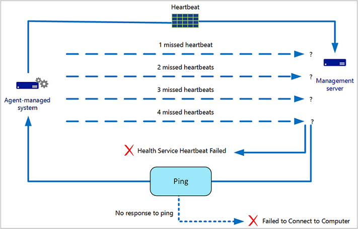
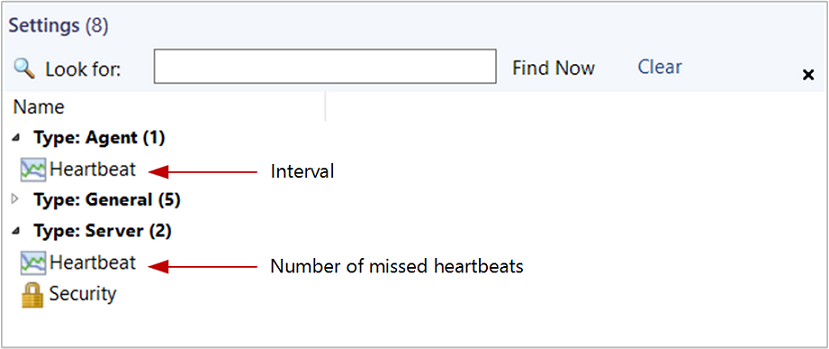

# How heartbeats work in Operations Manager

System Center - Operations Manager uses *heartbeats* to monitor communication channels between an agent and the agent's primary management server. A heartbeat is a packet of data sent from the agent to the management server regularly, by default every 60 seconds, using port 5723 (TCP).  

When an agent fails to send a heartbeat four times, a **Health Service Heartbeat Failure** alert is generated and the management server attempts to contact the computer by using ping. If the computer doesn't respond to the ping, a **Failed to Connect to Computer** alert is generated. The following illustration shows this process.  

When you see both alerts, you know the computer can't be contacted by the management server. When you see only the heartbeat failure alert, you know the computer can be contacted but there's a problem with the agent. Both alerts are closed automatically when heartbeats resume.  

> [!NOTE]  
> By default, alerts for missed heartbeats and response to ping are disabled for client operating systems. To receive alerts for client operating systems, override the **Health Service Heartbeat Failure** and **Computer Not Reachable** monitors for the class **Windows Client Operating System** and set the **Generates Alert** parameter to **True**.  

For agents reporting to a gateway server, you need to configure the **Automatic Agent Management Account** that is used to automatically diagnose agent failures (for example, heartbeat failures and failure to receive data) so the Run As account has privileges to both the Management Server and the gateway.  Otherwise, the recovery task will fail on a gateway server. This scenario is only supported if:

1. The gateway server is a member of an Active Directory trusted forest, but outside the Kerberos trust boundary of the management group.
2. The gateway server is a member of the same Active Directory forest as the Operations Manager management servers.  The gateway server in this case is used because of a firewall or member of a local resource pool.

The health state for the agent-managed computer will change to critical (red) when the **Health Service Heartbeat Failure** alert is generated. To view details for the health state, right-click the computer in **Active Alerts**, point to **Open**, and select **Health Explorer**. The Availability node will be expanded to display the critical item. Select **Health Service Heartbeat Failure**, and select the **State Change Events** tab. You'll see a list of state changes with the date and time of occurrence. Select any occurrence to display information in the **Details** pane. The health state will change to healthy (green) when heartbeats resume.  

You can change the heartbeat interval for all agents and number of missed heartbeats for all management servers in **Settings** in the **Administration** workspace, as shown in the following illustration.    

You can also override the global heartbeat interval for individual agents and the number of missed heartbeats for individual management servers by opening the properties for the computer in **Agent Managed** or **Management Servers** in the **Administration** workspace. For example, you might increase the heartbeat interval for a computer that has a slow connection to the network.  

## Next steps  

- To learn more about how to investigate an agent heartbeat failure and ways to resolve them, review [Resolving Heartbeat Alerts](manage-agent-resolve-heartbeat.md). 

- Review [Configure Computer Not Reachable Recovery Task for Gateway Servers](manage-heartbeat-failure-gateway-config.md) when agents report to a gateway server in a secure network environment.
