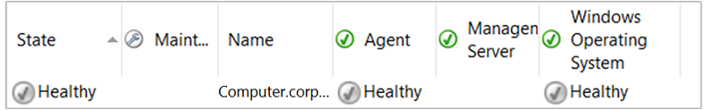

# Not monitored and gray agents

>Applies To: System Center 2016 - Operations Manager

In System Center 2016 - Operations Manager, you may see discovered objects in the Operations console displayed as not monitored or gray, as shown in the following illustration.  
  
  
  
The state view in the previous illustration contrasts two "unknown" states.  
  
-   The agent is shown as healthy, but the indicator is gray.  
  
-   The operating system is shown as not monitored.  
  
 The gray icon indicates that the health service watcher on the management server that is watching the health service on the monitored computer is not receiving heartbeats from the agent anymore.  The health service watcher had received heartbeats previously and the state was reported as healthy.  This also means that the management servers are no longer receiving any information from the agent.  
  
 The not monitored icon indicates that there are no monitors for the object. In the previous illustration, the view tells you that there are no monitors for the operating system on this computer. In this case, this is because the management packs for the Windows Server operating systems have not been imported in this management group.  
  
## What to do for a gray state  
Some of the common reasons for a gray state are:  
  
-   Heartbeat failure  
  
-   Health service is not running  
  
-   Incorrect configuration  
  
-   System workflows failure  
  
-   Operational or data warehouse database performance  
  
-   Management server or gateway server performance  
  
-   Network or authentication issues  

-   Computer name changed after agent installation
  
The **Show Gray Agent Connectivity Data** task will help you identify why an agent is gray.  
  
## Check a gray agent for connectivity  
  
1.  Open the Operations console and click **Monitoring**.  
  
2.  Navigate to the Operations Manager\Agent Details\Agent Health State view.  
  
3.  In **Agent State from Health Service Watcher**, click the agent you want to check connectivity for.  
  
4.  In the **Tasks** pane, select the task **Show Gray Agent Connectivity Data**.  
  
5.  The **Run Task - Show Gray Agent Connectivity Data** dialog box appears. Click **Run**.  
  
6.  The Task Status dialog box appears. When the task is completed, you can click **Copy Text** or **Copy HTML** and paste the task output in the appropriate tool for further review.  
  
    The task output will identify the following information:  
  
    -   The last time a heartbeat was received from the agent.  
  
    -   Whether the System Center Management Health service is running on the agent.  
  
    -   Whether the agent responds to ping.  
  
    -   The last time the configuration on the agent was updated.  
  
    -   Possible reasons that the agent is unavailable.  
  
    -   The management server that the agent reports to.  
  
For information on troubleshooting, see the Knowledge Base article [Troubleshooting gray agent state](https://support.microsoft.com/kb/2288515). Although the article was written for Operations Manager 2007 and 2012, the troubleshooting steps will also be helpful for Operations Manager 2016.  
  
## What to do for a not monitored state  
When an object shows as not monitored, check whether the appropriate management pack for monitoring the object is imported. Ensure that the appropriate monitors are enabled.  
  
Sometimes restarting the Microsoft Monitoring Agent service on the agent-managed computer or clearing the agent cache can resolve the issue. You can also try placing the object in maintenance mode for several minutes. For more information, see [How to Suspend Monitoring Temporarily by Using Maintenance Mode](manage-maintenance-mode-overview.md).  
  
Next, check the DNS configuration for the computer, both FQDN and DNS suffix.  
  
An agent can also show as not monitored because the new agent has the same NetBIOS name as a previously installed agent. When the agent is deleted from Operations Manager, the grooming of the deleted agent is occurs after two days. Therefore, the agent is not immediately groomed out of the database completely. To work around this limitation, wait three days after deleting the agent to install the new agent.  
  
## Next steps

-  Review [Viewing Active Alerts and Details](manage-alert-view-alerts-details.md) to understand how it can help you review alerts that have been generated by rules and monitors which are still active.  

-  To understand how Operations Manager monitors the communication channel between an agent and it's primary management server to ensure it is responsive and available, see [How Heartbeats Work in Operations Manager](manage-agent-heartbeat-overview.md). 

- In the Operations console, you view monitoring data, manage monitoring configuration, create your own custom views and dashboards that are personalized for your experience, and perform management group configuration administration by [Using the Operations Manager Operations console](manage-consoles-overview.md). 
  
