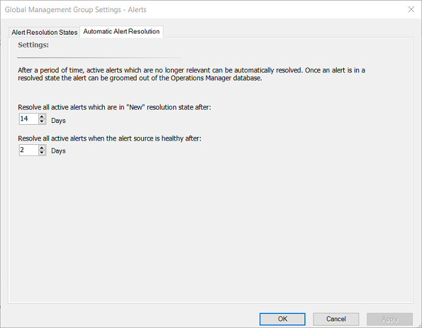

# Configure automatic alert resolution

This article describes how to configure the setting for automatic alert resolution in the Operations Manager management group.

In System Center Operations Manager, alerts are resolved automatically after a specific number of days. You can change the automatic alert resolution settings globally for the management group. Using automatic alert resolution, you can configure all active alerts with a resolution state of **New** to be changed to **Closed** after a specific number of days. You can also configure all active alerts with a resolution state of **New** to be changed to **Closed** after a specific number of days when the alert source is healthy.  

## Change the global settings for automatic alert resolution  

To change the global settings for automatic alert resolution, follow these steps:

1. In the Operations console, select **Administration**.  

2. Select **Settings**.  

3. Double-click **Alerts**.  

4. Select the **Automatic Alert Resolution** tab.  

5. Change the days for either or both of the following settings:  

      

6. Select **OK**.  

## Next steps

- To get better visibility with the alerts being generated in your environment and determine which are the candidates for additional configuration to reduce alert noise and improve alert accuracy, see [Data-driven alert management](manage-alert-data-driven-management.md) from the Operations console.
- To understand how alerts are generated for monitored objects in your management group, see [How an alert is produced](manage-alert-generation-overview.md).
- To understand how it can help you review alerts that have been generated by rules and monitors which are still active, review [View active alerts](manage-alert-view-alerts-details.md).
