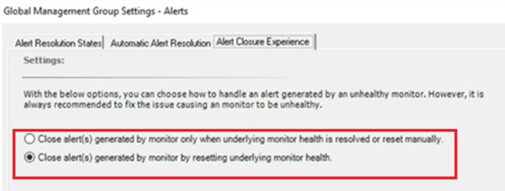
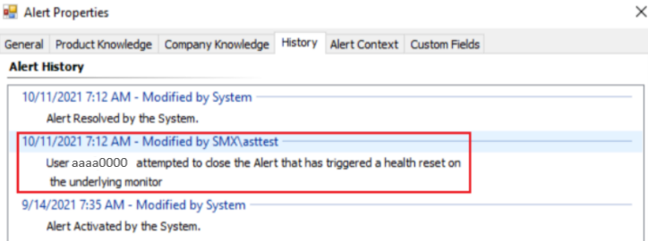

# Close an alert generated by a monitor

Monitors define the health states of objects. An object can have one of three health states: green (successful or healthy), yellow (warning), or red (critical or unhealthy). For example, a monitor for disk drive capacity might define green as less than 85 percent full, yellow as over 85 percent full, and red as over 90 percent full. A monitor can be configured to generate an alert when a state change occurs.

When you receive an alert, you can see in the alert details whether the alert was generated by a rule or a monitor. If the alert was generated by a monitor, as a best practice, you should allow the monitor to auto-resolve the alert when the health state returns to healthy. If you close the alert while the object is in a warning or unhealthy state, the problem remains unresolved, but no further alerts will be generated.

If the monitor generates an alert when the health state changes to red and you do resolve the alert, you must also reset the health state for the monitor. If the monitor isn't reset, the same condition that generated an alert can occur again, but no alert will be generated because the health state hasn't changed.

::: moniker range=">=sc-om-2019"

In Operations Manager prior to 2019, if you close the alert while the object is in a warning or unhealthy state, the problem remains unresolved, but no further alerts are generated. This behavior, which often led to a scenario where there's no active alert in the system, while an underlying problem exists, is fixed in Operations Manager 2019.

With Operations Manager 2019, an alert that's generated by a monitor can't be closed unless the health state of the corresponding monitor is *healthy*. If you try to close an alert generated by an unhealthy monitor, an error message appears, and the alert won't be closed.

You can check this new behavior from both Operations console and Web console.

## Operations console

Follow these steps:

1. Open the Operations Manager console and select **Monitoring**

    **Monitoring Overview** displays a summary of health states of the monitors and the current alerts.
2. Select **Active Alerts** in the navigation pane.
3. Right-click an alert, which is generated by a monitor in unhealthy state.
4. Set the resolution state as **Closed**.

    The following message appears to state the reason for non-closure of the alert:

    **Alert(s) in the current selection cannot be closed as the monitor(s), which generated these alerts are still unhealthy. For more details on the alert that could not be closed, view the “Alert Closure Failure” dashboard in the Operations Manager Web Console**

    

    >[!NOTE]
    > To close this alert, the health state of the corresponding monitor has to be manually reset to healthy state. If **autoresolve** for this monitor is set to *true*, then the alert will be auto closed after the health state is reset. Else, the alert has to be manually closed after the health state is reset.

## Web Console

1. Open the Web Console and select **Monitoring**.
    **Monitoring Overview** displays a summary of health states of the monitors and the current alerts.
2. Select **Active Alerts** in the navigation pane.
3. Open an alert, which has been generated by a monitor in unhealthy state.
4. Set the resolution state as **Closed** and **Save** changes.

    The following message appears to state the reason for non-closure of the alert:

    **The current alert cannot be closed as the monitor that has generated this alert is still unhealthy**

    

    > [!NOTE]
    > To close this alert, you must manually reset the health of the corresponding monitors that generated this alert.

## Manually reset the health state of a monitor for a corresponding alert

Follow these steps:

1. Select **Alert Closure Failure** dashboard in the navigation pane.
   The dashboard lists the alerts, which Operations Manager was unable to close because the monitor, which has generated the alert is **unhealthy**.
2. You can reset the health state of the monitor for the corresponding alert, in the following two ways:
   - Select an alert in the dashboard and then select the dashboard action **Reset Health for Alert**.
   Or
   - Select an alert in this dashboard to navigate to the alerts drill-down page (where you can visualize all the relevant information for an alert), and select the **Reset Health task** in the task pane.

   

## Alert update APIs

If an alert closure is triggered from external systems like incident management and the alert wasn't closed due to the corresponding monitor being unhealthy, then an exception would be passed with the alert details, which may be consumed by external systems.

The following existing alert update APIs can be used for externalizing alert update data. These two APIs have been enhanced to enable externalization of this new behavior:

- Alert update [API 1]( https://msdn.microsoft.com//library/microsoft.enterprisemanagement.monitoring.monitoringalert.update.aspx)

- Alert update [API 2]( https://msdn.microsoft.com//library/hh327241.aspx)

The following sample shows the details on how to use the exception *AlertMonitorUnhealthyException*.

```
namespace MonitorAlertClosureFailureExample
{
    class Program
    {
        static void Main(string[] args)
        {
            ManagementGroup mg = new ManagementGroup("localhost");

            // Get database availability alerts.
            MonitoringAlertCriteria alertCriteria = new MonitoringAlertCriteria(
                "Name LIKE '%DBStatusMonitor' AND Category = 'AvailabilityHealth'");
            IList<MonitoringAlert> alerts =
                mg.OperationalData.GetMonitoringAlerts(alertCriteria, default(DateTime));

            // Find the "Closed" resolution state that is defined
            // for this Management Group.
            IList<MonitoringAlertResolutionState> alertStates = mg.OperationalData.GetMonitoringAlertResolutionStates();
            MonitoringAlertResolutionState closedState = null;
            foreach (MonitoringAlertResolutionState thisState in alertStates)
            {
                if (thisState.Name == "Closed")
                {
                    closedState = thisState;
                }
            }

            // Close all alerts not already in the "Closed" resolution state.
            foreach (MonitoringAlert a in alerts)
            {
                a.ResolutionState = closedState.ResolutionState;
                string comment = "Closing the Alert";
                try
                {
                    a.Update(comment);
                }
                catch (AlertMonitorUnhealthyException e)
                {
                    // It mean the alert being closed is a monitor alert and the monitor which generated this alert is still unhealthy
                    // take an appropriate action. Here an error message is being displayed at console
                    Console.WriteLine("The alert with Alert Name" + a.Name + "cannot be closed as the monitor which genrated the alert is still unhealthy.")
                }
                catch (Exception e)
                {
                    // generic exception during the update of the alert
                    Console.WriteLine("Closing the alert with alert name" + a.Name + "is failing because" + e.Message)
                }

            }

    }
}
```

```


namespace MonitorAlertClosureFailureExample
{
    class Program
    {
        static void Main(string[] args)
        {
            ManagementGroup mg = new ManagementGroup("localhost");

            // Get database availability alerts.
            MonitoringAlertCriteria alertCriteria = new MonitoringAlertCriteria(
                "Name LIKE '%DBStatusMonitor' AND Category = 'AvailabilityHealth'");
            IList<MonitoringAlert> alerts =
                mg.OperationalData.GetMonitoringAlerts(alertCriteria, default(DateTime));

            // Find the "Closed" resolution state that is defined
            // for this Management Group.
            IList<MonitoringAlertResolutionState> alertStates = mg.OperationalData.GetMonitoringAlertResolutionStates();
            MonitoringAlertResolutionState closedState = null;
            foreach (MonitoringAlertResolutionState thisState in alertStates)
            {
                if (thisState.Name == "Closed")
                {
                    closedState = thisState;
                }
            }

            // Close all alerts not already in the "Closed" resolution state.
            string comment = "Closing the alert";
            foreach(MonitoringAlert a in alerts)
            {
                a.ResolutionState = closedState.ResolutionState;
            }

            IList<MonitoringAlertUpdateFailure> updateFailures = mg.OperationalData.UpdateMonitoringAlerts(alerts, comment);

            if (updateFailures != null && updateFailures.Count > 0)
            {
                foreach (MonitoringAlertUpdateFailure failure in updateFailures)
                {
                    if(failure.Exception is AlertMonitorUnhealthyException)
                    {
                        // It means the alert being closed is a monitor alert and the monitor which generated this alert is still unhealthy
                        // take an appropriate action. Here an error message is being displayed at console
                        Console.WriteLine("The alert with Alert Name" + a.Name + "cannot be closed as the monitor which genrated the alert is still unhealthy.")
                    }
            }           
        }

    }
}
```

::: moniker-end

## Determine if an alert is resolved automatically

Follow these steps:

1. Select the alert, and then in the alert details, select the name of the alert monitor. The properties dialog for the monitor opens.

2. In the monitor properties, select the **Alerting** tab to see if the option **Automatically resolve the alert when the monitor returns to a healthy state** is selected.

## Close an alert that is generated by a monitor

Follow these steps:

1. Read the alert and examine its properties. Check the alert details to determine if the alert was generated by a monitor or a rule. Use the product knowledge for the alert to help determine the cause of the alert.

2. Troubleshoot the cause(s) of the alert and take the actions needed to resolve the problem.

3. When the problem is resolved, select **Source** in the alert details. This will open the **State** view for the object associated with the alert.

4. Right-click the object, point to **Open**, and select **Health Explorer for** *object name*.

5. Select the monitor that generated the alert, and select **Reset Health** on the toolbar. Close the Health Explorer and the **State** view.

6. Refresh the alerts view. If the alert is still listed, select the alert and select **Close Alert** in the Actions pane.

::: moniker range="=sc-om-2019"

>[!NOTE]
> The following update (Closure of orphan alerts) is applicable for Operations Manager 2019 UR3 and later.

::: moniker-end

::: moniker range=">=sc-om-2019"

## Closure of orphan alerts

In Operations Manager 2019 RTM, UR1 and UR2, active alerts aren't getting closed after non-persistent health state in certain scenarios, as detailed below:

1. Failover:
   - The failover that might get triggered when the management server goes offline.
   - Due to addition of new management servers to the resource pool, leading to load-balancing.  
   - When an agentless computer fails over and is to be monitored by another management server, hence the new health status.

2. Agent disconnected and connected again after some time, in which the health status change isn't aware of the previous state.

3. Management server disconnected and connected again.

4. Health service cache cleared.  

Overall, health service doesn’t hold the last state of the monitor; alerts aren't closed while resetting the monitor to healthy.

With Operations Manager 2019 UR3, all of the orphan alerts are closed, eventually, depending on the type of monitor, as detailed below:

- **Service monitor**: close immediately.
- **All monitors with immediate on demand module**: close immediately.
- **All monitors without on demand modules**: close on the second run, depending on the frequency.
- **Event-based monitor**: close with a healthy event that occurs after initialization.

Health state transition shows a minor change when monitor is initializing; sample below:


As shown in the figure above, during initialization, monitor first turns healthy. Then it again calculates and turns healthy. You'll see two state change transitions from *hollow state to healthy*.

::: moniker-end

::: moniker range=">=sc-om-2022"

## Changes in Alert closure experience

Admin can opt to choose the alert closure of a Health Monitor, which is in Unhealthy state.  

In release 2019, an alert that is generated by a monitor couldn't be closed unless the health state of the corresponding monitor is healthy.  If you try to close an alert generated by an unhealthy monitor, an error message appears, and the alert wouldn't be closed.

Admin can change this behavior by navigating to **Administration** > **Settings** and select any of the below options:

- **Close alert(s) generated by monitor only when underlying monitor health is resolved or reset manually**  
- **Close alert(s) generated by monitor by resetting underlying monitor health**: This option allows you to close alerts of unhealthy monitors programmatically and on the UI.  This resets the underlying monitor health, which will implicitly close its corresponding alert. This option also allows bulk closure of alerts generated by the monitors.

You can also track how the alert was closed by viewing **Alert Properties** > **History**.





::: moniker-end

## Next steps

- When an alert is generated, you can [View Active Alerts and Details](manage-alert-view-alerts-details.md) in the Operations and Web console to identify possible issues and help identify the next steps towards resolving them.

- After investigating and resolving the issue detected by one or more monitors, review [How to Reset Health](manage-health-reset-health.md) to manually reset health if the monitor isn't configured to auto-resolve or you don't want to wait for the monitor to detect the health state.
