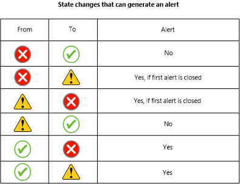

# How an alert is produced

>Applies To: System Center 2016 - Operations Manager

In System Center 2016 - Operations Manager, an alert can be generated by a rule or a monitor. (For an explanation of rules and monitors, see [What is in an Operations Manager Management Pack?](what-is-in-an-operations-manager-management-pack.md).) Some rules and monitors are configured to send an alert when specific conditions are met, such as a certain event occurring or an operation failing. Every rule and monitor does not generate an alert. When the default configuration of a monitor is to not send alerts, you can configure an override on the monitor to enable alerts. (For information about configuring overrides, see [How to Override a Rule or Monitor](../../scom/manage-mp-override-rule-monitor.md).)  
  
A monitor can be configured to generate an alert when health state changes to warning (yellow) or critical (red), or only when state changes to critical. For example, a monitor for free disk space detects that disk space on a computer is below the configured threshold. The monitor changes the health state to critical and sends a single alert. After the monitor has sent the alert, it will not generate future alerts so long as the health state does not change from critical to healthy (green). If, however, the health state is reset to healthy and then the disk space drops below the threshold again, another alert will be sent when the health state changes to critical.  
  
If a monitor sends an alert for warning or critical, and the monitor sent an alert when the state changed to warning, it will only send a second alert when the stage changes from warning to critical if the first alert has been closed. If the alert that was sent when the state changed to warning remains open, no alert will be sent when the state changes from warning to critical.  
  
The following illustration shows the state changes that can generate an alert.  
  
  
  
Most alerts generated by monitors will be automatically resolved when the health state returns to healthy. If a monitor is not configured to automatically resolve its alert, you can configure an override on the parameter **Auto-Resolve Alert** for the monitor.  
  
> [!NOTE]  
> Rules cannot automatically resolve alerts.  
  
Unlike monitors, rules can continue to send alerts as long as the condition that caused the alert persists or repeats. Depending on what the rule is checking for, a single issue could possibly generate a huge number of alerts. To prevent the noise of too many alerts, alert suppression can be enabled for a rule.  
  
> [!NOTE]  
> Alert suppression can only be enabled when the rule is created. You cannot enable alert suppression by using an override.  
  
When alert suppression is enabled for a rule, only the first alert is sent and further alerts are suppressed. A suppressed alert is not displayed in the Operations console. Operations Manager suppresses only duplicate alerts as defined by the alert suppression criteria. Fields stated in the suppression criteria must be identical for the alert to be considered a duplicate and suppressed. An alert must be created by the same rule and be unresolved to be considered a duplicate.  
  
You can personalize the **Active Alerts** view to add the **Repeat Count** column. The repeat count for an alert with suppression enabled will be incremented for each suppressed alert. You can also view the repeat count in the properties for an alert.  
  
> [!IMPORTANT]  
> By default, all alerts that are generated by monitors and that use the same instance ID are suppressed, however nothing in the alert properties as viewed in a console will indicate that suppression is enabled. Alerts that are generated by rules will also be suppressed by default if the rule definition in the management pack contains an empty Suppression Value tag, however nothing in the alert properties as viewed in a console will indicate that suppression is enabled. You will only be aware of the suppression if you view the **Repeat Count** column for the alert.  
  
## Next steps

- Review [How to Close an Alert Generated by a Monitor](manage-alert-created-by-monitor.md) to understand the behavior of alerts generated by monitors and how to approach managing alerts from them.  

- After investigating and resolving the issue detected by one or more monitors, review [How to Reset Health](manage-health-reset-health.md) to manually reset health if the monitor isn't configured to auto-resolve or you don't want to wait for the monitor to detect health state.  
  
- To help investigate health issues detected with monitors, review [Using Health Explorer to Investigate Problems](using-health-explorer-to-investigate-problems.md).  

