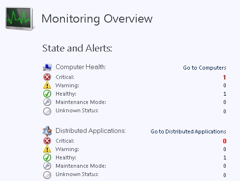
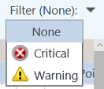
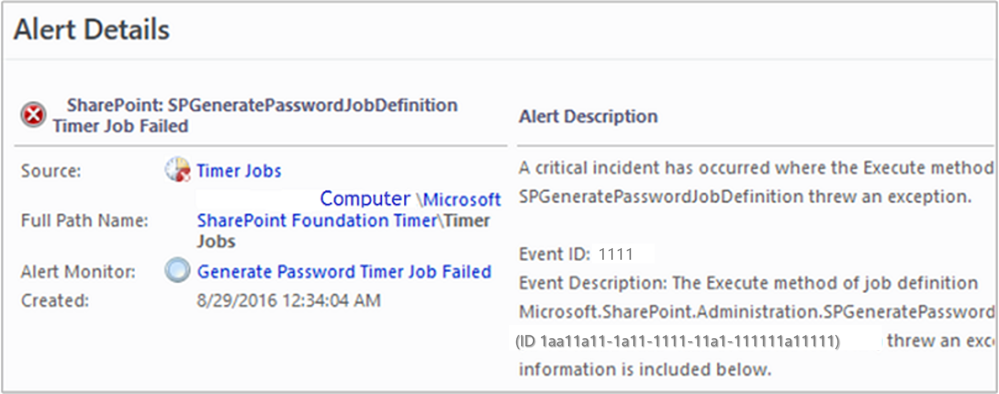

# Viewing active alerts and details

In the Operations Manager console, alerts matching a specific criteria and related to an object or group of objects, are presented in an alerts view.  From this view, you can review alerts that have been generated by rules and monitors which are still active and have not been closed automatically or manually by an operator.  

## Viewing active alerts

To view active alerts, open the Operations console and click **Monitoring**. The Monitoring Overview displays a summary of health states and alerts:  
  
  
  
To view the actual alerts, click **Active Alerts** in the navigation pane.  
  
**Tip**: If you are using the web console, you can filter the view of alerts by severity:  
  
  
  
The list of alerts in the Results pane includes the severity, source, maintenance mode status, name, resolution state, and when the alert was created:  
  
  
  
The following folders in the Monitoring workspace include a standard Active Alerts view scoped to the objects for that folder.  
  
-   Data Warehouse  
  
-   Network Monitoring  
  
-   Operations Manager  
  
-   Operations Manager\Agent Details  
  
-   Operations Manager\APM Agent Details  
  
-   Management Server  
  
-   Notification  
  
-   UNIX/Linux Servers  
  
-   Web Application Availability Monitoring  

Management packs that you import typically include a standard Active Alerts view in its folder or within a dashboard included.    

## Viewing alert details

Alerts in System Center 2016 - Operations Manager include information to help you investigate and resolve the issues affecting your IT services that caused the alerts.  
  
To view the details for an alert, in the **Monitoring** workspace, click **Active Alerts**, and then click an alert in the results pane.    
  
### Tips
  
-   Locate and investigate monitors in the **Warning** and **Error** states in the Health Explorer of the computer that was the source of the alert. (To open Health Explorer, right-click the alert, point to **Open**, and click **Health Explorer**.) If there are unhealthy monitors, they may correlate with the alert you are researching. Check out the **Context** pane of the **State Change Events** tab for possible additional clues to the root cause.  
  
-   Read all text in the alert properties. (Right-click the alert, and select **Properties**.) In particular, carefully review the **Alert Description** field on the **General** tab and the **Description** field on the **Alert Context** tab.  
  
-   Right-click the alert, and open the **Event** view. Sort the events by the **Level** column, and then locate the events with the **Error** and **Warning** event levels. Events may correlate with the alert you are investigating and provide insight to its resolution.  
  
## Next steps

- Before changing the number of missed heartbeats allowed, first review [How Heartbeats Work in Operations Manager](manage-agent-heartbeat-overview.md).  

- To understand how alerts are generated for monitored objects in your management group, see [How an Alert is Produced](manage-alert-generation-overview.md).

- Review [How to Close an Alert Generated by a Monitor](manage-alert-created-by-monitor.md) to understand the behavior of alerts generated by monitors and how to approach managing alerts from them.  

- After investigating and resolving the issue detected by one or more monitors, review [How to Reset Health](manage-health-reset-health.md) to manually reset health if the monitor isn't configured to auto-resolve or you don't want to wait for the monitor to detect health state.  
