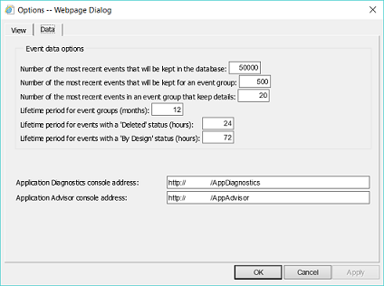
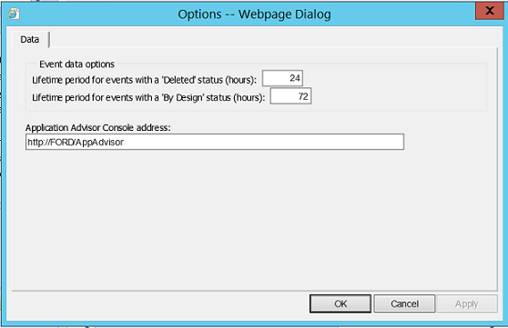
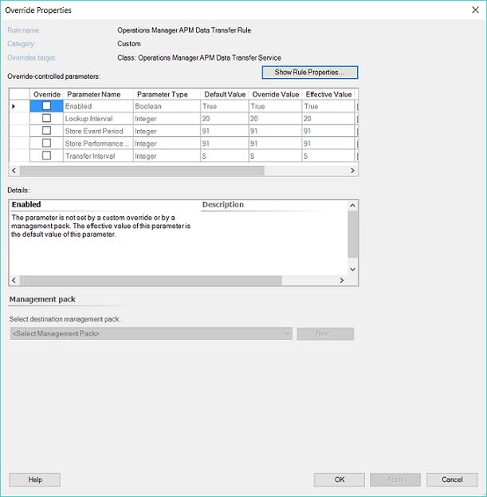

# How to configure grooming settings for .NET Application performance monitoring events
When you have been monitoring applications using .NET Application Performance Monitoring (APM), a new data type, APM events, will begin to take up space. Eventually, you will want to groom your database for APM events. Changing the grooming settings for your database for APM events requires the following procedures. You can groom APM events in three locations:  
  
-   In Application Diagnostics you can configure grooming settings for APM events in the Operations Manager Database  
  
-   In Application Advisor you can configure grooming settings for APM events in the Data Warehouse  
  
-   Using the Data Transfer rule, you can override parameters related to time-based APM event grooming in the Data Warehouse  
  
## Using Application Diagnostics to configure grooming settings for APM events in the Operations database  
In Application Diagnostics you can select how many APM events you want in the Operations database and how long you want to keep them.  
  
  
  
1.  Application Diagnostics is installed along with the Operations Manager web console. To find the web address of the Operations Manager web console, open the Operations console. In the navigation pane, select **Administration**, click **Settings**, and then double-click **Web Addresses**. The Operations Manager web console URL will be specified as: `http(s)://<web host>/OperationsManager`. Using this URL format and the same web host, the Application Diagnostics console address is: `http(s)://<web host>/AppDiagnostics` 
  
    To open Application Diagnostics, paste the Application Diagnostics URL into your browser. Application Diagnostics opens in the web browser window.  
  
    > [!NOTE]  
    > If you are running Operations Manager on a server rather than a client computer, you can access Application Diagnostics from the **Start** menu.  
  
    Access to Application Diagnostics is controlled through the Application Monitoring Operator and Administrator roles. You must be a member of one of these roles to have rights to the console. For more information, see [User roles for Application Performance Monitoring](manage-working-with-the-application-diagnostics-console.md#user-roles-for-application-performance-monitoring).   
  
2.  In Application Diagnostics, click **Tools**, select **Options**, and then click the **Data** tab.  
  
3.  Change the **Event data options** to define how you want to groom the database, and then click **OK**.  
  
## Using Application Advisor to configure grooming settings for "Deleted" or "By Design" APM events in Data Warehouse  
In Application Advisor you can choose the how long you want to keep APM events that have a Deleted or By Design status in Data Warehouse.  
  
  
  
1.  Application Advisor is installed along with the Operations Manager web console. To find the web address of the Operations Manager web console, open the Operations console. In the navigation pane, select **Administration**, click **Settings**, and then double-click **Web Addresses**. The Operations Manager web console URL will be specified as: `http(s)://<web host>/OperationsManager`. Using this URL format and the same web host, the Application Advisor console address is: `http(s)://<web host>/AppAdvisor`  
  
    To open Application Advisor, paste the Application Advisor URL into your browser. Application Advisor opens in the web browser window. Different application monitoring reports display in the context of the application features and services you configured when you created application groups to monitor.  
  
    Access to Application Advisor is controlled through the Application Monitoring Operator, Report Operator and Administrator roles. You must be a member of Application Monitoring Operator and Report Operator roles or the Administrator role. For more information, see [User roles for Application Performance Monitoring](manage-working-with-the-application-diagnostics-console.md#user-roles-for-application-performance-monitoring).
  
    > [!NOTE]  
    > Application Advisor requires SQL Server Report Services (SSRS). You must have Operations Manager Reporting server installed before using Application Advisor.  
  
2.  In Application Advisor, click **Tools**, select **Options**, and then click the **Data** tab.  
  
3.  Change the **Event data options** to define how you want to groom the database, and then click **OK**.  
  
## Using the Data Transfer rule to configure grooming settings for APM events and performance data from the Data Warehouse  
The Data Transfer rule lets you override time-based grooming for the Data Warehouse. This rule triggers the Data Transfer, Aggregation, and Grooming activities related to APM events on the Operations or Data Warehouse databases. It provides overrides control to the retention settings for APM events in the Data Warehouse database.  
  
> [!WARNING]  
> Disabling this rule or overriding any other setting will have an adverse negative impact on the overall health, functionality, and consistency of the APM feature, the Data Warehouse, and Application Advisor reports, among other things.  
  
The Operations Manager APM Data Transfer Rule is targeted to the Operations Manager APM Data Transfer Service object and has two overrides for those settings: for events and for counters. The setting for Events applies to events that had not been previously marked as "Deleted" or "By Design", for which grooming is controlled by Advisor, as described in the previous paragraph. If events have been left in status "New", then they will be retained in the Data Warehouse for as many days as this setting indicates.  
  
The Performance Counter setting is intended for hourly performance aggregations, which potentially can take a lot of space. There is no configurable setting for daily performance aggregations. The default for this is 182. Typically, daily aggregations consume a lot less disk space.  
  
  
  
#### To use the Data Transfer Rule to configure grooming settings for APM events in the Data Warehouse  
  
1.  In the Operations Manager Operations console, in the navigation pane, select **Authoring**, click **Management Pack Objects**.  
  
2.  Click **Rules**, click **Change Scope**, click **View All Targets**, search for **Operations Manager APM Data Transfer Service**, and then click **OK**.  
  
3.  Right-click and select **Overrides**, select **Override the Rule**, and then select **For all objects of class**. You see the **Override Properties** page.  
  
4.  On the **Override Properties** page, make your changes to **Store Event Period** and **Store Performance Counters Interval**, and then click **OK**.  
  
    Store Event Period lets you determine how many days you want to keep APM events. Store Performance Counters Interval lets you determine how many days of performance counters you want to keep in Data Warehouse.  
  
## Next steps

* To learn more about the default retention period for the different data types stored in the Operations Manager operational database and how to modify those settings, please see [How to configure grooming settings for the Operations Manager database](manage-omdb-grooming-settings.md).
  
* To learn more about the default retention period for the different data types stored in the Operations Manager Reporting data warehouse database and how to modify those settings, please see [How to configure grooming settings for the Operations Manager Reporting data warehouse database](manage-omdwdb-grooming-settings.md).