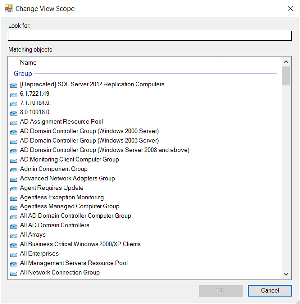

# Find data and objects in the Operations Manager consoles

System Center Operations Manager, with the appropriate management packs imported, will provide you with a comprehensive view of what is going on with your monitored applications, hardware, and processes. This can result in a large volume of data being displayed in the Operations console. Learning how to quickly locate the data you need is essential to efficient interaction with the console. You can use the **Scope**, **Find**, and **Search** buttons on the Operations console toolbar to filter your view of monitoring data so that you can find the exact monitoring object or group of objects that you need. You can also filter your data based on the number of hours or days you would like to show.  

> [!NOTE]  
> Any time that you don't see the information you expect in the results pane, check the scope and time filters to ensure that the correct objects and time period are set for the results you need.  

The **Scope**, **Search**, **Find**, and **Time** tools apply a temporary filter to the data you're viewing in the console. While you can locate a specific object using Search or Find, you can also use Scope or Time to display a set of objects that meet a set of criteria. The following table shows the differences between the different filtering options.  

|Filter|When to use|For more information, see|  
|----------|---------------|-----------------------------|  
|Scope|Use to limit the data in a view to only those objects that meet your criteria. This scope remains in place until you clear it.|[Change Scope](manage-console-finding-data.md#change-scope) [Use Groups to Scope Views](manage-console-scope-views.md)|  
|Search|Use to display a list of objects that meet your criteria. You can then act on those objects; however, when you navigate away from this list, the filter is removed, and any view will show all objects (not just those from your search criteria).|[Use Find and Search](manage-console-finding-data.md#use-find-and-search) [Use Advanced Search](manage-console-using-adv-search.md) [Examples of Using Advanced Search in Operations Manager](~/scom/manage-console-using-adv-search.md#examples-of-using-advanced-search-in-operations-manager)|  
|Find|Use to display a known single object.|[Use Find and Search](manage-console-finding-data.md#use-find-and-search)|  

## Change scope  

Changing the scope of the monitoring view enables you to view only those objects that meet a certain criteria, such as management servers.

::: moniker range=">=sc-om-2016 <=sc-om-2019"
For example, if you want to view only those computers in your environment that are running Windows server 2016, you can apply a scope that uses **Windows server 2016** as the criteria; no other computers are displayed.  
::: moniker-end

::: moniker range="sc-om-2022"
For example, if you want to view only those computers in your environment that are running Windows server 2022, you can apply a scope that uses **Windows server 2022** as the criteria; no other computers are displayed.  
::: moniker-end

::: moniker range="sc-om-2025"
For example, if you want to view only those computers in your environment that are running Windows server 2025, you can apply a scope that uses **Windows server 2025** as the criteria; no other computers are displayed.  
::: moniker-end

1. In the Operations console, select **Monitoring** to display the objects in your monitoring environment.  

2. Select the **Scope** button on the Operations Manager toolbar. If this button isn't available, check to ensure that you've an object, not a folder, selected in the Monitoring pane. The **Change View Scope** dialog displays a list of existing groups and distributed applications.  

      

3. If the list is too long, you can find a specific group or distributed application by entering a word or phrase in the **Look for** field. After you make a selection, select **OK**. Now only the objects that meet the scope criteria are shown in the Results pane.  

## Use Find and Search

Use the **Find** button when the list of objects in the Results pane is too long to quickly pick out a particular object. Use the **Search** button when you want to find all objects that meet a certain criteria.  

### Use Find to create a list of objects

To use Find to create a list of objects, follow these steps:

1. In the Operations console, select **Monitoring**.  

2. Select a view that is available in the Monitoring workspace. This displays a list of objects in the Results pane.  

3. Check to see whether a **Look for** box is at the top of the Results pane. If there's no **Look for** box, select the **Find** button on the toolbar. In **Look for**, enter a word, such as the name of an object, that you want to find in the list, and then select **Find**.  

    The object that you're looking for is displayed.  

4. Select **Clear** to go back to the original list of objects.  

### Use Search to create a list of objects

To use Search to create a list of objects, follow these steps:

1. In the Operations console, select **Monitoring**.  

2. Select the **Search** button on the toolbar.  

3. In the **Search** window, enter the word or phrase that describes the set of objects you want to find. A list of objects that meet your criteria is displayed. The list is sorted by object type.  

## Next steps

To learn how to search for a specific object type that meets your specified criteria, see [Use Advanced Search](manage-console-using-adv-search.md).  
