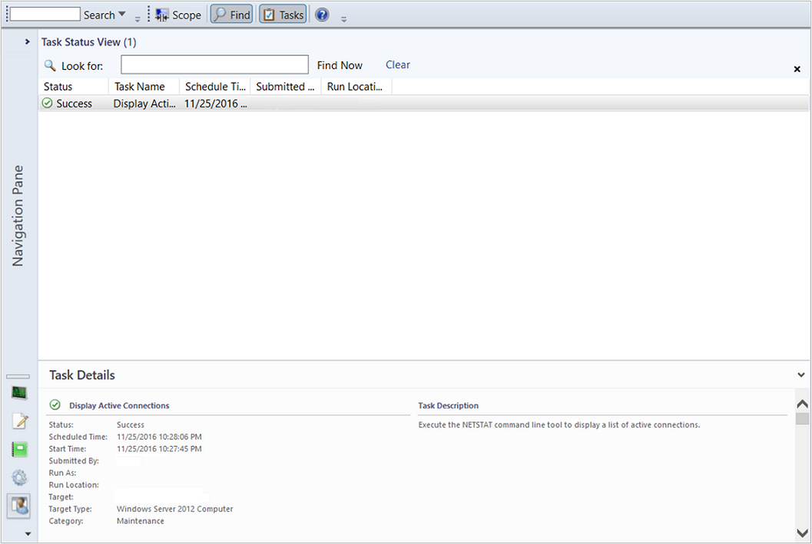

# View types in Operations Manager

In Operations Manager, views provide insight into the performance of your service, its health state, or the issues detected and presented in an alerts view. Views return independent data based on specific criteria, whereas dashboards are a way to view operational data in a condensed, single pane of glass, which your operations, engineering, and the business can use to make meaningful decisions. There are various types of dashboards that can accommodate the various roles in your IT organization. You may have a data storage Manager that wants to see the percentage of SQL servers using more than the allocated amount of disk space; you may have systems engineers managing a website with high traffic who want to know what average requests per/sec are for all their Web servers. Dashboards convey information succinctly and in a compact format so that the end-users can decide if they need to take action immediately.

After you identify the IT services to monitor the configuration of how to monitor them, you need to configure how that data will be visualized and provided to the different personas in the organization who are responsible for sustaining and maintaining the service, the end-users who want to see a summarized availability status of critical services provided, and management who are interested in determining if IT is meeting its service objectives to the business.

Each view type in System Center - Operations Manager displays a different aspect of monitoring data. Each view type has a different icon as shown in the following image.

## Alert view type

The alert view displays alerts that meet your specific criteria, such as alert severity, resolution state, or alerts that are assigned to you. For information on creating an alert view, see [How to Create an Alert View](manage-console-scope-views.md#create-an-alert-view).  

  

## Event view type  

The event view queries the event logs and displays events that are based on criteria specified in the event view properties. For information on creating an event view, see [How to Create an Event View](manage-console-scope-views.md#create-an-event-view).  

  

## State view type  

The state view displays relationships between components, computers, and computer groups.

::: moniker range=">=sc-om-2019"

2019 UR4 and later include new fields for **Class Technical Name** in the **State Views**. Also included these in the wizard for creating a new Alert, Event, Performance, or State View.

::: moniker-end

For information on creating a state view, see [How to Create a State View](manage-console-scope-views.md#create-a-state-view).  

  

## Performance view type  

The performance view allows you to customize how you want to view performance data collected from performance objects and counters. This includes the ability to view historical and current operational data together. You must select **Show** in the Details pane to display data from a rule in the graph in the Results pane.

::: moniker range=">=sc-om-2019"

2019 UR4 and later include **Target Class Display Name** to help identify the target of a rule while selecting rules during the creation of a new **Performance View**.

:::image type="performance view" source="media/web-application-availability-monitoring-template/performance-view.png" alt-text="A screenshot showing the performance view.":::

::: moniker-end

For information on creating a performance view, see [How to Create a Performance View](manage-console-scope-views.md#create-a-performance-view).  

  

## Diagram view type  

The Diagram view displays a graphical view of a set of managed objects and how they relate to one another. For information on creating a diagram view, see [How to Create a Diagram View](manage-console-scope-views.md#create-a-diagram-view).  

  

## Task status view type  

The task status view displays tasks that meet criteria specified in the properties, such as only those tasks that apply to certain object types. For information on creating a task status view, see [How to Create a Task Status View](manage-console-scope-views.md#create-a-task-status-view).  

  

> [!NOTE]  
> Users that are members of the Read-only Operator role can't view or run any tasks. For this reason, no tasks appear in a task status view that's opened by a Read-only Operator.  

## Web page view type  

The Web page view displays a Web page in a separate window in the Operations console. For information on creating a Web page view, see [How to Create a Web Page View](manage-console-scope-views.md#create-a-web-page-view).  

  

## Overrides summary view type  

You can only create an overrides summary view in My Workspace.  

You can view all rule and monitor overrides in the overrides summary view. The overrides summary view can be used for both sealed and unsealed management packs. You can customize this view by grouping items by multiple column headers. For information on creating an overrides summary view, see [How to Create an Overrides Summary View](manage-console-scope-views.md#create-an-overrides-summary-view).  

  

## Dashboard view type  

The dashboard view allows you to present multiple types of data in a single view.  

> [!IMPORTANT]  
> When a dashboard view uses data from the data warehouse database, operators might be able to view data that they wouldn't otherwise have access to in views that use data from the operational database.  

  

For information on creating a dashboard view, see [How to Create a Dashboard View](manage-console-scope-views.md#create-a-dashboard-view).  

## Next steps

- You can use views and dashboards to visualize operational data from different perspectives to make meaningful decisions. To understand how to do this, see [Using Views and Dashboards in Operations Manager](manage-console-using-views-dashboards.md).

- To understand how to create your own custom views and dashboards in Operations Manager, see [Creating and scoping views in Operations Manager](~/scom/manage-console-scope-views.md).

- Views included in sealed management packs can be modified to include other monitored object properties. To customize a view, see [How to personalize a View in Operations Manager](manage-console-personalize-views.md).
