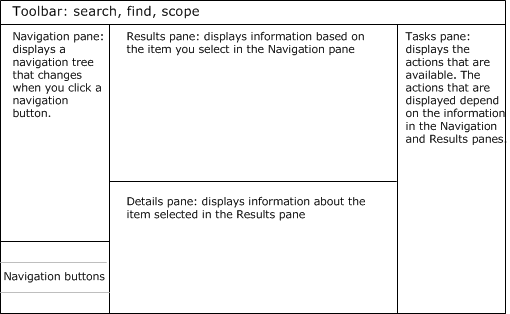
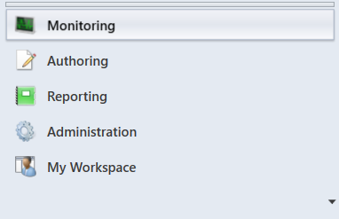
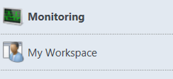

# Comparing the Operations and Web console

>Applies To: System Center 2016 - Operations Manager
  
System Center 2016 – Operations Manager includes two consoles, the Operations console and Web console.  The Operations console is the primary tool used for managing your Operations Manager deployment. In the Operations console, you view and interact with alerts and monitoring data, manage and edit monitoring configuration, generate and view reports,  administer management group settings, and build a personal workspace that is customized to your needs.

The Web console is a web-based user interface which provides access to all the monitoring data and tasks that are actions that can be run against monitored computers from the Operations console.  It does not have the full functionality of the Operations console, however, and provides access to only the Monitoring and My Workspace views. 

Both consoles share a similar layout:  
  
  
  
Each navigation button opens a specific workspace, such as Monitoring or Administration. In the Operations console, the following navigation buttons may be available, depending on the user role you are assigned:  
  
  
  
In the web console, only Monitoring and My Workspace are available:  
  
  
  
> [!TIP]  
> In the Operations console, you can change the navigation buttons into small icons and increase the space available in the navigation pane by clicking on the top border of the navigation buttons and dragging downward. You can also hide and reveal the navigation and task panes.  
  
There are a few differences between the Operations console and Web console that you should be aware of:  
  
-   There are minor differences in sort. For example, in the Web console, when you sort alerts, only the alerts visible on the page are sorted rather than all alerts.  
  
-   Fewer alerts display per page in the Web console.  
  
-   You cannot run tasks that require elevated access in the Web console.  

-   You cannot access event views.

-   Informational alerts are not presented in an alerts view.  
  
-   You do not have the options to show, hide, personalize, or create views in the Web console, although you can create a dashboard view in My Workspace in the Web console.  
  
-   There are no subscription options in the Web console.  

-   Dashboard views are not supported.  You need to access the Operations Manager 2012 R2 Web console to interact with dashboards.  

## Next steps

* Learn [How to Connect to the Operations and Web Console](manage-consoles-how-to-connect.md) in order to access and interact with the operational data or perform administrative tasks.  

- In the Operations console, you view monitoring data, manage monitoring configuration, create your own custom views and dashboards that are personalized for your experience, and perform management group configuration administration by [Using the Operations Manager Operations console](manage-consoles-overview.md).   
  
