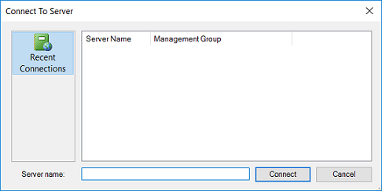
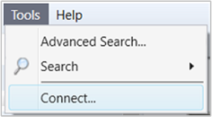

# How to connect to the Operations and Web Console

>Applies To: System Center 2016 - Operations Manager

System Center 2016 - Operations Manager includes two consoles, the Operations console and Web console. To view operational data and administer the management group configuration, you use the Operations console.  The Web console provides a light-weight interface with  essential functionality to view the monitoring data, which avoids having to manage the lifecycle deployment of the Operations console.  

In this section we provide information on how to connect to the Operations and Web console.    

## How to connect to the Operations console

The System Center 2016 - Operations Manager Operations console can be installed on any computer that meets the [system requirements](plan-system-requirements.md). When you open the Operations console on a management server, the console connects to that management server, however you can use the following procedure to connect to a different management server. When you initially open the Operations console on a computer that is not a management server, you must specify the management server to connect to. The following image shows the **Connect To Server** dialog box.  
  
  
  
### To connect an Operations console to a management server  
  
1.  Click **Start**, click **Microsoft System Center 2016**, and click **Operations Console** to open the Operations console.  
  
2.  In the **Connect To Server** dialog box, type in the server name or select a server from the list. (In the image above, the console has not yet connected to any management group. If the console has previously connected to any management servers, the servers will be listed in **Recent Connections**.)  
  
The Operations console opens with the focus on the Monitoring workspace. 
  
### To change the management server that the Operations console is connected to  
  
1.  In the Operations console, click **Tools** and then click **Connect...** as shown in the following image, which will open the **Connect To Server** window.  
  
      

## How to Connect to the Web console

In System Center 2016 - Operations Manager, the web console provides a monitoring interface for a management group that can be opened on any computer that has connectivity to the Web console server. The Web console is limited to My Workspace and the Monitoring workspace.  
  
> [!NOTE]  
> You must use Internet Explorer 11 to connect to the Operations Manager web console. In addition, the Operations Manager web console requires that JavaScript be enabled and Silverlight version 5 is installed on the client computer. To enable JavaScript in Internet Explorer, open **Internet Options**, and click the **Security** tab. Select the zone for the Web console (Internet, Local intranet, or Trusted sites), and then click **Custom level**. Enable **Active scripting**, click **OK**, click **OK**, and then connect to the Web console.  
  
By default, the web console session is limited to 30 minutes. You can change this limit by editing the web.config file (C:\Program Files\Microsoft System Center 2016\Operations Manager\\WebConsole\WebHost is the default path) and changing the *autoSignOutInterval* value from "30" to a shorter or longer interval, or disable the session limit by changing the value to "0", as shown in the following example.  
  
```  
<connection autoSignIn="true" autoSignOutInterval="0">  
```  
  
> [!NOTE]  
> After you change the web.config file, you must open a new Web console session for the changes to take effect.  
  
### To connect to a Web console  
  
-   Open a web browser on any computer and enter `http://<web host>/OperationsManager`, where *web host* is the name of the computer hosting the web console.  
  
For information on installing the Web console, see [Install the Operations Manager Web console](~/scom/deploy-install-web-console.md).  
 
## Next steps
  
- In the Operations console, you view monitoring data, manage monitoring configuration, create your own custom views and dashboards that are personalized for your experience, and perform management group configuration administration by [Using the Operations Manager Operations console](welcome.md).  
  