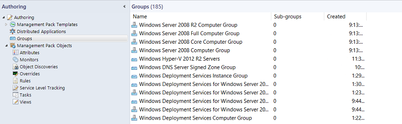
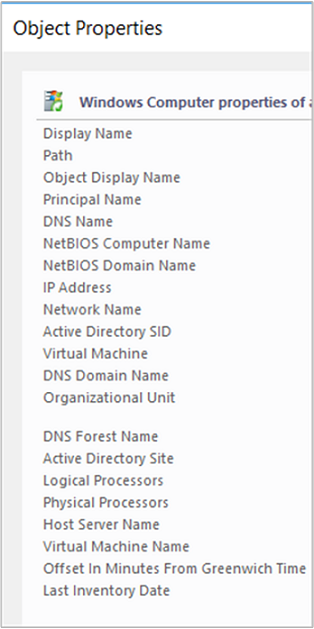

# Create and manage groups

In System Center Operations Manager, groups are logical collections of objects, such as Windows-based computers, hard disks, or instances of Microsoft SQL Server. You can create a group by using the Create Group Wizard. You can explicitly assign membership to a group, or you can create rules that will generate a dynamic group membership.  

::: moniker range=">=sc-om-2019"

2019 UR4 and later includes new column for **Management Pack Display Name** in the **Authoring** pane > **Create Group wizard**.

:::image type="create group wizard" source="media/manage-create-manage-groups/create-group-wizard.png" alt-text="A screenshot showing create group wizard.":::

::: moniker-end

Some of the purposes of using groups are to:  

- Scope overrides to a specific subset of computers.

- Scope alert notifications or product connector subscriptions for a specific set of computers.

- Scope user consoles, so the user role only sees the servers they're responsible for.  

- Scope a set of computers that need to go into a scheduled maintenance mode.  

- Scope application views only to computers that host a given application.

- Create a rollup health state view of an otherwise unrelated set of computers.

- Create a set of computers for a report.  

Using the Operations console in the **Authoring** workspace, you can only create instance groups. To create a computer group, you must use the Authoring console or work directly in the XML of a management pack.  The following image shows the display of groups in the Operations console.

::: moniker range="sc-om-2016"
  
::: moniker-end

Computer groups only contain computers. Instance groups can contain all object types, such as an instance of a health service or an instance of a SQL database. Both computer groups and instance groups can contain other computer and instance groups. Another way to view the difference between the group types is:  

- An instance group is populated with objects that match your criteria.  

- A computer group is populated by computers that host objects that match your criteria.  

To create a group based on a hosting relationship, such as all computers that are running SQL Server, you must use the Visual Studio Authoring Extensions for Operations Manager or work directly in the XML of a management pack.

The most common objects you'll place in your groups are **Windows Computer** objects. The most common way to dynamically assign computers to the groups is by using a *property* of the **Windows Computer** class. For example, **Organizational Unit** is a property of the **Windows Computer** class, so you can create a group that makes all computers in a specific organizational unit members of the same group. The following image shows the properties of an object in the **Windows Computer** class, which you can view in the details pane of the **Monitoring** workspace by selecting the **Windows Computers** state view.  

  

You can assign both explicit and dynamic members in the same group definition, and you can exclude explicit members. For examples of group queries and formulas, see [Operations Manager Group Examples](/troubleshoot/system-center/scom/regular-expression-support).  

## Create a group in Operations Manager  

1. Sign in to the computer with an account that's a member of the Operations Manager Administrators role.  

2. In the Operations console, select **Authoring**.  

3. Right-click **Groups**, and select **Create a new Group** to start the Create Group Wizard.  

4. On the **Enter a name and description for the new group** page, do the following:  

    1. Enter the **Name** for the group.  

    2. Optionally, enter the **Description** for the group. A description of the group membership makes it easier to select the right group for views, overrides, and so forth.  

    3. Select a **destination management pack** from the list, or select **New** to create a management pack with the Create a Management Pack Wizard.  

    4. Select **Next**.  

5. On the **Explicit Members** - **Choose Members from a List**  page, you can add explicit objects to the group or select **Next** to continue to the **Dynamic Members** configuration. To add explicit group members, select **Add/Remove Objects** and then perform the following steps:  

    1. In the **Search for** list, select an object type, such as **Windows Computer**.  

    2. Optionally, in the **Filter by part of the name** box, enter all or part of the object name, and select **Search**.  

    3. In the **Available items** box, select the desired objects, select **Add**, and select **Next**.  

6. On the **Dynamic Members** - **Create a Membership Formula** page, you can add a dynamic membership formula to the group or select **Next** to continue to the **Subgroups** page. To add a dynamic membership formula, select **Create/Edit rules** and then perform the following steps:  

    > [!WARNING]  
    > This procedure tells you how to create a query for Windows computers based on NetBIOS computer name.  

    1. In the **Query Builder** dialog, leave the default **Windows Computer** and select **Add**.  

    2. In the **Property** list, select **NetBIOS computer name**.  

    3. In the **Operator** list, select **Contains**.  

    4. Set **Value** to part of the name of the computers you want in the group, such as **NY** or **MKTG**.  

        > [!NOTE]  
        > Select **Insert** to add an **Expression** or group expressions with **OR** or **AND** operators. Repeat the preceding steps to add additional object types to the rule.  

    5. Select **OK**, review the **Query formula**, and select **Next**.  

7. On the **Choose Optional Subgroups** page, either select **Next** to not add groups to the group, or select **Add/Remove Subgroups** to add groups, for example.  

    1. In the **Group Selection** dialog, in **Filter by part of name**, you can optionally enter part or the all of the group's names, and select **Search**.  

    2. In the **Available items** text box, select the desired groups, select **Add**, select **OK**, and select **Next**.  

8. On the **Excluded Members** - **Specify Exclude List** page, select **Finish** to not exclude objects from the group, or select **Exclude Objects**, and then perform the following steps:  

    1. In the **Object Exclusion** dialog, from the **Search for** list, select an object type, such as **Windows Computer**.  

    2. Optionally, in the **Filter by part of the name** box, enter all or part of the object name, and select **Search**.  

    3. In the **Available items** text box, select the objects you want to exclude, select **Add**, select **OK**, and select **Finish**.  

    > [!NOTE]  
    > It can take approximately one minute to populate the membership of a group.  

## View members, state, and diagram of a group

1. In the **Authoring** workspace, select **Groups**.

2. In the results pane, select the group you want to view.

3. In the **Tasks** pane, select:

   - **View Group Members** to view a list of all members of the group with the health state of each member.

   - **View Group State** to view a state view of the group.

   - **View Diagram** to view a diagram of the group.

## Next steps

- To understand the differences between classes and groups in Operations Manage and how workflows apply to each, review [Using Classes and Groups for Overrides in Operations Manager](~/scom/manage-mp-overview-override-targets.md).

- Before making changes to the monitoring settings defined in an Operations Manager management pack, review [How to Override a Rule or Monitor](~/scom/manage-mp-override-rule-monitor.md) to understand how to configure the change.
